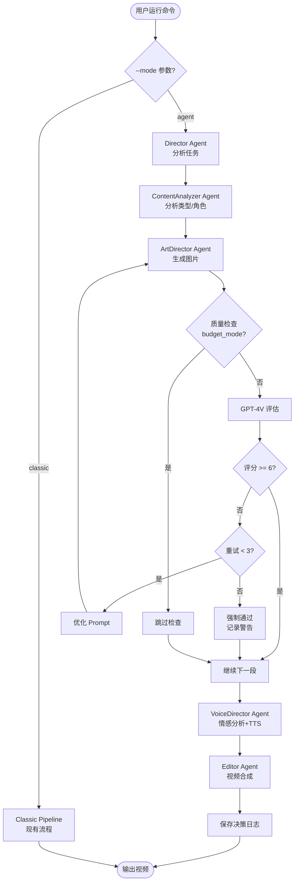

# LangGraph 多 Agent 架构改造 - 技术设计文档

## 1. 架构概览

### 1.1 总体架构

```
┌─────────────────────────────────────────────────────────────────┐
│                         CLI Layer (main.py)                      │
│  ┌──────────────────┐              ┌─────────────────────────┐  │
│  │ Classic Pipeline │              │  Agent Pipeline         │  │
│  │  (现有流程)      │  --mode -->  │  (LangGraph 新增)       │  │
│  └──────────────────┘              └─────────────────────────┘  │
└─────────────────────────────────────────────────────────────────┘
                                            │
                ┌───────────────────────────┴───────────────────────────┐
                │         LangGraph StateGraph (orchestrator)           │
                │                                                        │
                │  ┌──────────┐   ┌──────────┐   ┌──────────┐          │
                │  │Director  │→→│Content   │→→│Art       │          │
                │  │Agent     │   │Analyzer  │   │Director  │          │
                │  └──────────┘   └──────────┘   └──────────┘          │
                │                       ↓              ↓                │
                │                 ┌──────────┐   ┌──────────┐          │
                │                 │Voice     │→→│Editor    │          │
                │                 │Director  │   │Agent     │          │
                │                 └──────────┘   └──────────┘          │
                │                                                        │
                │              Shared State (AgentState)                │
                │  {segments, prompts, images, audio, decisions, ...}   │
                └────────────────────────────────────────────────────────┘
                                            │
                        ┌───────────────────┴───────────────────┐
                        │         Tool Layer (LangChain)         │
                        │                                         │
                        │  SegmentTool  PromptGenTool ImageGenTool│
                        │  VideoGenTool TTSTool  VideoAssembleTool│
                        │  EvaluateImageQualityTool  ...          │
                        └─────────────────────────────────────────┘
                                            │
                ┌───────────────────────────┴───────────────────────────┐
                │          Execution Layer (现有模块，保持不变)          │
                │                                                        │
                │  src/segmenter/  src/promptgen/  src/imagegen/        │
                │  src/videogen/   src/tts/        src/video/           │
                │  src/llm/        src/utils/                           │
                └────────────────────────────────────────────────────────┘
```

### 1.2 设计原则

1. **分层解耦**: Agent 层（智能决策）与 Tool 层（执行）严格分离
2. **渐进式改造**: 复用 100% 现有代码，仅在上层加 orchestration
3. **配置驱动**: Agent 行为（省钱模式、质量阈值）通过配置控制
4. **状态持久化**: State 可序列化，支持断点续传
5. **可观测性优先**: 所有决策记录结构化日志

---

## 2. 数据模型设计

### 2.1 AgentState（共享状态）

```python
from typing import TypedDict, Annotated, Sequence
from pathlib import Path
from langgraph.graph import add_messages

class AgentState(TypedDict):
    """LangGraph 全局状态对象，各 Agent 通过读写此对象通信"""

    # ========== 输入参数 ==========
    input_file: Path                    # 原始小说文件路径
    config: dict                        # 完整配置（config.yaml + CLI 参数）
    workspace: Path                     # 工作目录

    # ========== 流程控制 ==========
    mode: str                           # "agent" | "classic"
    budget_mode: bool                   # 是否启用省钱模式
    resume: bool                        # 是否断点续传

    # ========== 内容分析结果 ==========
    full_text: str                      # 完整小说文本
    genre: str | None                   # 小说类型（武侠/都市/玄幻...）
    era: str | None                     # 时代背景（古代/现代/未来）
    characters: list[dict] | None       # 角色列表 [{"name": str, "desc": str}]
    suggested_style: str | None         # 推荐视觉风格

    # ========== 各阶段中间结果 ==========
    segments: list[dict]                # 分段结果 [{"text": str, "index": int}]
    prompts: list[str]                  # 图片 prompts
    images: list[Path]                  # 生成的图片路径
    video_clips: list[Path] | None      # AI 视频片段路径（可选）
    audio_files: list[Path]             # TTS 音频路径
    srt_files: list[Path]               # 字幕文件路径
    final_video: Path | None            # 最终视频路径

    # ========== 质量控制 ==========
    quality_scores: list[float]         # 各图片质量评分 (0-10)
    retry_counts: dict[int, int]        # {segment_index: retry_count}

    # ========== Agent 决策日志 ==========
    decisions: Annotated[Sequence[dict], add_messages]  # 决策记录列表
    # 每条记录格式: {
    #   "agent": str,
    #   "step": str,
    #   "decision": str,
    #   "reason": str,
    #   "timestamp": str
    # }

    # ========== 错误处理 ==========
    errors: list[dict]                  # 错误记录
```

### 2.2 决策日志结构

```python
class Decision(TypedDict):
    """单条决策记录"""
    agent: str              # Agent 名称 (Director/ContentAnalyzer/...)
    step: str               # 步骤名称 (classify_genre/check_quality/...)
    decision: str           # 决策内容（简短描述）
    reason: str             # 决策理由
    data: dict | None       # 附加数据（如评分、prompt 对比等）
    timestamp: str          # ISO 格式时间戳
```

### 2.3 质量评估结果

```python
class QualityEvaluation(TypedDict):
    """图片质量评估结果"""
    score: float            # 总分 0-10
    composition: float      # 构图 0-2
    clarity: float          # 清晰度 0-2
    text_match: float       # 文本匹配 0-3
    color: float            # 色彩 0-2
    consistency: float      # 角色一致性 0-1（如有角色）
    feedback: str           # 文字反馈（用于优化 prompt）
    passed: bool            # 是否通过（>= 6 分）
```

---

## 3. LangGraph StateGraph 设计

### 3.1 节点定义

```python
from langgraph.graph import StateGraph, END

def create_agent_graph(config: dict) -> StateGraph:
    """构建 Agent 工作流图"""

    graph = StateGraph(AgentState)

    # 添加节点
    graph.add_node("director", director_node)
    graph.add_node("content_analyzer", content_analyzer_node)
    graph.add_node("art_director", art_director_node)
    graph.add_node("voice_director", voice_director_node)
    graph.add_node("editor", editor_node)

    # 定义边（流程）
    graph.set_entry_point("director")
    graph.add_edge("director", "content_analyzer")
    graph.add_edge("content_analyzer", "art_director")
    graph.add_conditional_edges(
        "art_director",
        should_generate_video,  # 判断是否需要 AI 视频
        {
            "video": "voice_director",  # 有视频则继续配音
            "skip": "voice_director"    # 无视频也继续配音
        }
    )
    graph.add_edge("voice_director", "editor")
    graph.add_edge("editor", END)

    return graph.compile()
```

### 3.2 节点实现模式

每个节点遵循统一模式：

```python
def director_node(state: AgentState) -> AgentState:
    """Director Agent 节点"""

    # 1. 记录开始
    log_decision(state, agent="Director", step="start",
                 decision="开始分析任务", reason="用户启动 Agent 模式")

    # 2. 执行决策逻辑
    analysis = analyze_task(state)

    # 3. 更新 State
    state["pipeline_plan"] = analysis["plan"]

    # 4. 记录决策
    log_decision(state, agent="Director", step="plan",
                 decision=f"预计生成 {analysis['segment_count']} 个片段",
                 reason=f"基于文本长度 {analysis['char_count']} 字")

    return state
```

### 3.3 条件边示例

```python
def should_generate_video(state: AgentState) -> str:
    """判断是否启用 AI 视频生成"""
    if state["config"].get("videogen", {}).get("backend"):
        log_decision(state, agent="ArtDirector", step="video_check",
                     decision="启用 AI 视频生成",
                     reason="检测到 videogen.backend 配置")
        return "video"
    else:
        log_decision(state, agent="ArtDirector", step="video_check",
                     decision="跳过 AI 视频生成",
                     reason="未配置 videogen.backend")
        return "skip"
```

---

## 4. Agent 详细设计

### 4.1 Director Agent

**文件位置**: `src/agents/director.py`

```python
class DirectorAgent:
    """导演 Agent - 总控"""

    def __init__(self, config: dict):
        self.config = config
        self.llm = None  # Director 不需要 LLM，纯逻辑决策

    def analyze_task(self, state: AgentState) -> dict:
        """分析任务，编排流程"""
        text = state["full_text"]
        char_count = len(text)

        # 预估分段数
        max_chars = self.config["segmenter"]["max_chars"]
        estimated_segments = (char_count // max_chars) + 1

        # 判断是否需要深度内容分析
        analysis_needed = (
            not state["budget_mode"] and
            char_count > 500  # 短文本无需分析
        )

        # 判断是否启用 AI 视频
        video_enabled = bool(self.config.get("videogen", {}).get("backend"))

        return {
            "char_count": char_count,
            "segment_count": estimated_segments,
            "analysis_needed": analysis_needed,
            "video_enabled": video_enabled,
        }

    def plan_pipeline(self, state: AgentState) -> dict:
        """编排流程计划"""
        analysis = self.analyze_task(state)

        return {
            "stages": [
                "content_analyzer" if analysis["analysis_needed"] else None,
                "art_director",
                "voice_director",
                "editor",
            ],
            "estimated_time": self._estimate_time(analysis),
            "estimated_cost": self._estimate_cost(analysis, state["budget_mode"]),
        }

    def _estimate_cost(self, analysis: dict, budget_mode: bool) -> float:
        """预估 API 成本（美元）"""
        segment_count = analysis["segment_count"]

        if budget_mode:
            # DeepSeek: $0.0014/1K tokens, 每段约 500 tokens
            prompt_cost = segment_count * 0.0007
            return prompt_cost
        else:
            # GPT-4o-mini: $0.15/1M input, $0.60/1M output
            prompt_cost = segment_count * 0.0001
            # GPT-4V: $0.01/image
            quality_check_cost = segment_count * 0.01 * 1.5  # 平均 1.5 次重试
            return prompt_cost + quality_check_cost
```

**节点函数**:

```python
def director_node(state: AgentState) -> AgentState:
    """Director 节点入口"""
    agent = DirectorAgent(state["config"])

    # 分析任务
    analysis = agent.analyze_task(state)
    log_decision(state, "Director", "analyze",
                 f"文本 {analysis['char_count']} 字, 预计 {analysis['segment_count']} 段",
                 f"基于 max_chars={state['config']['segmenter']['max_chars']}")

    # 编排流程
    plan = agent.plan_pipeline(state)
    log_decision(state, "Director", "plan",
                 f"预估耗时 {plan['estimated_time']}s, 成本 ${plan['estimated_cost']:.2f}",
                 "基于配置和文本长度计算")

    state["pipeline_plan"] = plan
    return state
```

---

### 4.2 ContentAnalyzer Agent

**文件位置**: `src/agents/content_analyzer.py`

```python
from langchain.chat_models import ChatOpenAI
from langchain.prompts import ChatPromptTemplate

class ContentAnalyzerAgent:
    """内容分析 Agent - 分析小说类型、角色、风格"""

    def __init__(self, config: dict, budget_mode: bool):
        self.config = config
        self.budget_mode = budget_mode

        # LLM 初始化
        if not budget_mode:
            self.llm = ChatOpenAI(model="gpt-4o-mini", temperature=0.3)
        else:
            # 省钱模式：使用 DeepSeek
            self.llm = ChatOpenAI(
                base_url="https://api.deepseek.com/v1",
                api_key=os.getenv("DEEPSEEK_API_KEY"),
                model="deepseek-chat",
                temperature=0.3
            )

        # 工具
        self.segment_tool = SegmentTool(config)
        self.genre_classifier = self._init_genre_classifier()
        self.character_extractor = self._init_character_extractor()

    def _init_genre_classifier(self):
        """初始化类型分类链"""
        if self.budget_mode:
            # 省钱模式：使用关键词规则
            return None  # 改用 _classify_genre_by_rules

        prompt = ChatPromptTemplate.from_messages([
            ("system", """你是小说类型分析专家。分析以下文本，判断其所属类型。
可选类型：武侠、玄幻、都市、言情、科幻、悬疑、历史、其他
同时判断时代背景：古代、现代、未来、架空

输出 JSON 格式：
{
  "genre": "类型",
  "era": "时代",
  "confidence": 0.0-1.0,
  "keywords": ["关键词1", "关键词2"]
}"""),
            ("human", "{text}")
        ])
        return prompt | self.llm

    def _classify_genre_by_rules(self, text: str) -> dict:
        """规则分类（省钱模式）"""
        rules = [
            (r"修炼|法宝|灵气|宗门|渡劫", "玄幻", "架空"),
            (r"江湖|剑气|武功|内力|掌门", "武侠", "古代"),
            (r"公司|手机|互联网|地铁|外卖", "都市", "现代"),
            (r"星际|宇宙飞船|机器人|AI", "科幻", "未来"),
            (r"爱情|恋爱|男朋友|女朋友", "言情", "现代"),
        ]

        for pattern, genre, era in rules:
            if re.search(pattern, text):
                return {"genre": genre, "era": era, "confidence": 0.8}

        return {"genre": "其他", "era": "现代", "confidence": 0.5}

    def classify_genre(self, text: str) -> dict:
        """分类小说类型"""
        if self.budget_mode:
            return self._classify_genre_by_rules(text)
        else:
            # 取前 1000 字分析
            sample = text[:1000]
            result = self.genre_classifier.invoke({"text": sample})
            return json.loads(result.content)

    def extract_characters(self, text: str) -> list[dict]:
        """提取角色信息"""
        if self.budget_mode:
            # 简单正则提取人名（省钱模式）
            names = re.findall(r"([「『""].*?[」』""]|[A-Z][a-z]+|[\\u4e00-\\u9fa5]{2,3})(说道|问道|笑道|道)", text)
            return [{"name": n[0], "desc": ""} for n in set(names[:5])]

        # LLM 提取
        prompt = f"""分析以下小说片段，提取主要角色。

文本：
{text[:2000]}

输出 JSON 数组，每个角色包含：
{{"name": "姓名", "desc": "外貌/服装/特征简述"}}

最多 5 个主要角色。"""

        result = self.llm.invoke(prompt)
        return json.loads(result.content)

    def suggest_style(self, genre: str, era: str) -> str:
        """根据类型推荐视觉风格"""
        style_map = {
            ("武侠", "古代"): "chinese_ink",
            ("玄幻", "架空"): "anime",
            ("都市", "现代"): "realistic",
            ("科幻", "未来"): "cyberpunk",
            ("言情", "现代"): "watercolor",
        }
        return style_map.get((genre, era), "anime")  # 默认 anime
```

**节点函数**:

```python
def content_analyzer_node(state: AgentState) -> AgentState:
    """ContentAnalyzer 节点入口"""
    agent = ContentAnalyzerAgent(state["config"], state["budget_mode"])

    # 1. 文本分段
    segments = agent.segment_tool.invoke(state["full_text"])
    state["segments"] = segments
    log_decision(state, "ContentAnalyzer", "segment",
                 f"分段完成：{len(segments)} 段",
                 f"使用 {state['config']['segmenter']['method']} 方法")

    # 2. 类型分析
    genre_info = agent.classify_genre(state["full_text"])
    state["genre"] = genre_info["genre"]
    state["era"] = genre_info["era"]
    log_decision(state, "ContentAnalyzer", "classify",
                 f"类型={genre_info['genre']}, 时代={genre_info['era']}",
                 f"置信度={genre_info['confidence']}, 关键词={genre_info.get('keywords', [])}")

    # 3. 角色提取
    if not state["budget_mode"]:
        characters = agent.extract_characters(state["full_text"])
        state["characters"] = characters
        log_decision(state, "ContentAnalyzer", "extract_characters",
                     f"提取 {len(characters)} 个角色",
                     f"角色列表: {[c['name'] for c in characters]}")

    # 4. 风格推荐
    style = agent.suggest_style(state["genre"], state["era"])
    state["suggested_style"] = style
    log_decision(state, "ContentAnalyzer", "suggest_style",
                 f"推荐风格={style}",
                 f"基于类型={state['genre']}, 时代={state['era']}")

    return state
```

---

### 4.3 ArtDirector Agent（核心）

**文件位置**: `src/agents/art_director.py`

```python
from langchain_openai import ChatOpenAI
from langchain.schema.messages import HumanMessage

class ArtDirectorAgent:
    """美术指导 Agent - 管理视觉生成和质量控制"""

    MAX_RETRIES = 3
    QUALITY_THRESHOLD = 6.0

    def __init__(self, config: dict, budget_mode: bool):
        self.config = config
        self.budget_mode = budget_mode

        # 工具
        self.prompt_gen_tool = PromptGenTool(config)
        self.image_gen_tool = ImageGenTool(config)

        # 质量评估 LLM（GPT-4V 或 Gemini Vision）
        if not budget_mode:
            vision_provider = config.get("agent", {}).get("vision_provider", "openai")
            if vision_provider == "openai":
                self.vision_llm = ChatOpenAI(model="gpt-4o", temperature=0)
            elif vision_provider == "gemini":
                from langchain_google_genai import ChatGoogleGenerativeAI
                self.vision_llm = ChatGoogleGenerativeAI(model="gemini-2.0-flash-exp")
        else:
            self.vision_llm = None  # 省钱模式不做质量检查

    def generate_with_quality_control(
        self,
        segment_text: str,
        segment_index: int,
        state: AgentState
    ) -> tuple[Path, float, int]:
        """生成图片并进行质量控制

        Returns:
            (image_path, quality_score, retry_count)
        """
        retry_count = 0
        best_image = None
        best_score = 0.0

        while retry_count <= self.MAX_RETRIES:
            # 生成 prompt
            prompt = self.prompt_gen_tool.invoke(
                segment_text,
                segment_index,
                characters=state.get("characters"),
                style=state.get("suggested_style")
            )

            # 生成图片
            image_path = self.image_gen_tool.invoke(prompt, segment_index)

            # 质量评估
            if self.budget_mode:
                # 省钱模式：跳过评估，直接返回
                log_decision(state, "ArtDirector", f"image_gen_seg{segment_index}",
                             f"生成图片（省钱模式，跳过质量检查）",
                             f"Prompt: {prompt[:100]}...")
                return image_path, -1.0, 0

            evaluation = self.evaluate_quality(image_path, segment_text, prompt)
            score = evaluation["score"]

            log_decision(state, "ArtDirector", f"quality_check_seg{segment_index}_try{retry_count}",
                         f"质量评分={score:.1f}/10, 通过={'是' if evaluation['passed'] else '否'}",
                         f"反馈: {evaluation['feedback']}",
                         data=evaluation)

            if score > best_score:
                best_image = image_path
                best_score = score

            # 判断是否通过
            if score >= self.QUALITY_THRESHOLD:
                return image_path, score, retry_count

            # 未通过且未达重试上限
            if retry_count < self.MAX_RETRIES:
                log_decision(state, "ArtDirector", f"retry_seg{segment_index}",
                             f"重试第 {retry_count + 1} 次",
                             f"优化 prompt 基于反馈: {evaluation['feedback']}")

                # 优化 prompt（简单实现：追加质量约束关键词）
                self._optimize_prompt_based_on_feedback(evaluation, state, segment_index)
                retry_count += 1
            else:
                # 达到重试上限，使用最佳结果
                log_decision(state, "ArtDirector", f"retry_limit_seg{segment_index}",
                             f"达到重试上限，使用最佳结果（评分={best_score:.1f}）",
                             "警告：质量未达标但继续流程",
                             data={"warning": True})
                return best_image, best_score, retry_count

        return best_image, best_score, retry_count

    def evaluate_quality(self, image_path: Path, text: str, prompt: str) -> QualityEvaluation:
        """使用 GPT-4V/Gemini Vision 评估图片质量"""

        # 读取图片
        import base64
        with open(image_path, "rb") as f:
            image_data = base64.b64encode(f.read()).decode()

        eval_prompt = f"""你是专业的图片质量评估专家。请评估以下 AI 生成的图片质量。

原始文本：{text}

生成 Prompt：{prompt}

评估维度（总分 10 分）：
1. 构图合理性 (0-2分): 画面布局、主体突出
2. 清晰度/锐度 (0-2分): 是否模糊、细节丰富度
3. 与文本匹配度 (0-3分): 是否准确表达文本内容
4. 色彩协调性 (0-2分): 配色是否和谐
5. 角色一致性 (0-1分): 如有角色，外观是否符合描述

输出 JSON 格式：
{{
  "score": 总分(float),
  "composition": 构图分(float),
  "clarity": 清晰度分(float),
  "text_match": 匹配度分(float),
  "color": 色彩分(float),
  "consistency": 一致性分(float),
  "feedback": "具体反馈，说明扣分原因和改进建议"
}}"""

        message = HumanMessage(
            content=[
                {"type": "text", "text": eval_prompt},
                {"type": "image_url", "image_url": {"url": f"data:image/png;base64,{image_data}"}}
            ]
        )

        result = self.vision_llm.invoke([message])
        evaluation = json.loads(result.content)
        evaluation["passed"] = evaluation["score"] >= self.QUALITY_THRESHOLD

        return evaluation

    def _optimize_prompt_based_on_feedback(self, evaluation: QualityEvaluation,
                                           state: AgentState, segment_idx: int):
        """根据质量反馈优化 prompt（简单规则）"""
        feedback = evaluation["feedback"].lower()

        # 简单关键词映射
        if "模糊" in feedback or "clarity" in feedback:
            # 追加清晰度关键词到配置
            pass  # 在下次生成时 PromptGenTool 会读取

        if "角色" in feedback or "consistency" in feedback:
            # 强化角色描述
            pass

        # 更复杂的优化可以调用 LLM 重写 prompt
```

**节点函数**:

```python
def art_director_node(state: AgentState) -> AgentState:
    """ArtDirector 节点入口"""
    agent = ArtDirectorAgent(state["config"], state["budget_mode"])

    segments = state["segments"]
    images = []
    quality_scores = []
    retry_counts = {}

    log_decision(state, "ArtDirector", "start",
                 f"开始生成 {len(segments)} 张图片",
                 f"风格={state.get('suggested_style', 'default')}")

    for i, seg in enumerate(segments):
        image_path, score, retries = agent.generate_with_quality_control(
            seg["text"], i, state
        )
        images.append(image_path)
        quality_scores.append(score)
        if retries > 0:
            retry_counts[i] = retries

    state["images"] = images
    state["quality_scores"] = quality_scores
    state["retry_counts"] = retry_counts

    # 汇总统计
    avg_score = sum(s for s in quality_scores if s >= 0) / len([s for s in quality_scores if s >= 0]) if quality_scores else 0
    total_retries = sum(retry_counts.values())

    log_decision(state, "ArtDirector", "summary",
                 f"图片生成完成：平均质量={avg_score:.1f}, 总重试={total_retries}",
                 f"详情：{len([s for s in quality_scores if s >= 7])} 张优秀, "
                 f"{len([s for s in quality_scores if 6 <= s < 7])} 张良好, "
                 f"{len([s for s in quality_scores if 0 <= s < 6])} 张警告")

    # 可选：AI 视频生成
    if state["config"].get("videogen", {}).get("backend"):
        video_clips = agent.generate_videos(segments, images, state)
        state["video_clips"] = video_clips

    return state
```

---

### 4.4 VoiceDirector Agent

**文件位置**: `src/agents/voice_director.py`

```python
class VoiceDirectorAgent:
    """配音导演 Agent - 管理 TTS 和情感"""

    EMOTION_TTS_PARAMS = {
        "平静": {"rate": "+0%", "volume": "+0%"},
        "紧张": {"rate": "+10%", "volume": "+5%"},
        "悲伤": {"rate": "-15%", "volume": "-5%"},
        "欢快": {"rate": "+20%", "volume": "+10%"},
        "激动": {"rate": "+15%", "volume": "+10%"},
    }

    def __init__(self, config: dict, budget_mode: bool):
        self.config = config
        self.budget_mode = budget_mode
        self.tts_tool = TTSTool(config)

        if not budget_mode:
            self.llm = ChatOpenAI(model="gpt-4o-mini", temperature=0.3)
        else:
            self.llm = None  # 省钱模式使用规则

    def analyze_emotion(self, text: str) -> str:
        """分析文本情感"""
        if self.budget_mode:
            # 规则分析
            return self._analyze_emotion_by_rules(text)

        # LLM 分析
        prompt = f"""分析以下文本的情感基调，从以下选项中选择一个：
平静、紧张、悲伤、欢快、激动

文本：{text}

仅输出一个词。"""

        result = self.llm.invoke(prompt)
        return result.content.strip()

    def _analyze_emotion_by_rules(self, text: str) -> str:
        """规则情感分析"""
        rules = [
            (r"危险|杀|血|恐怖|紧张|心跳", "紧张"),
            (r"哭|泪|悲|伤心|难过|死", "悲伤"),
            (r"笑|高兴|快乐|欢|喜", "欢快"),
            (r"怒|吼|爆发|愤怒|激动", "激动"),
        ]
        for pattern, emotion in rules:
            if re.search(pattern, text):
                return emotion
        return "平静"

    def get_tts_params(self, emotion: str) -> dict:
        """根据情感获取 TTS 参数"""
        return self.EMOTION_TTS_PARAMS.get(emotion, self.EMOTION_TTS_PARAMS["平静"])
```

**节点函数**:

```python
def voice_director_node(state: AgentState) -> AgentState:
    """VoiceDirector 节点入口"""
    agent = VoiceDirectorAgent(state["config"], state["budget_mode"])

    segments = state["segments"]
    audio_files = []
    srt_files = []
    tts_params_list = []

    for i, seg in enumerate(segments):
        # 分析情感
        emotion = agent.analyze_emotion(seg["text"])
        params = agent.get_tts_params(emotion)

        log_decision(state, "VoiceDirector", f"emotion_seg{i}",
                     f"情感={emotion}, rate={params['rate']}, volume={params['volume']}",
                     f"基于文本: {seg['text'][:50]}...")

        # 生成 TTS
        audio, srt = agent.tts_tool.invoke(seg["text"], i, params)
        audio_files.append(audio)
        srt_files.append(srt)
        tts_params_list.append(params)

    state["audio_files"] = audio_files
    state["srt_files"] = srt_files
    state["tts_params"] = tts_params_list

    return state
```

---

### 4.5 Editor Agent

**文件位置**: `src/agents/editor.py`

```python
class EditorAgent:
    """剪辑 Agent - 最终合成"""

    def __init__(self, config: dict):
        self.config = config
        self.video_tool = VideoAssembleTool(config)

    def assemble(self, state: AgentState) -> Path:
        """合成最终视频"""
        return self.video_tool.invoke(
            images=state["images"],
            audio_files=state["audio_files"],
            srt_files=state["srt_files"],
            video_clips=state.get("video_clips"),
            output_path=state["workspace"].parent / "output" / f"{state['input_file'].stem}.mp4"
        )
```

**节点函数**:

```python
def editor_node(state: AgentState) -> AgentState:
    """Editor 节点入口"""
    agent = EditorAgent(state["config"])

    log_decision(state, "Editor", "start", "开始视频合成", "")

    final_video = agent.assemble(state)
    state["final_video"] = final_video

    log_decision(state, "Editor", "complete",
                 f"视频合成完成：{final_video}",
                 f"分辨率={state['config']['video']['resolution']}")

    return state
```

---

## 5. Tool 层设计

所有现有模块封装为 LangChain Tool，统一接口：

```python
from langchain.tools import BaseTool
from pydantic import BaseModel, Field

class SegmentToolInput(BaseModel):
    """SegmentTool 输入模型"""
    text: str = Field(description="待分段的完整文本")

class SegmentTool(BaseTool):
    """文本分段工具"""
    name = "segment_text"
    description = "将小说文本分段为多个片段"
    args_schema = SegmentToolInput

    def __init__(self, config: dict):
        super().__init__()
        self.config = config

    def _run(self, text: str) -> list[dict]:
        """执行分段"""
        from src.segmenter.text_segmenter import create_segmenter
        segmenter = create_segmenter(self.config["segmenter"])
        return segmenter.segment(text)

# 类似定义其他工具：
# - PromptGenTool
# - ImageGenTool
# - VideoGenTool
# - TTSTool
# - VideoAssembleTool
# - EvaluateImageQualityTool (特殊，使用 GPT-4V)
```

---

## 6. 配置设计

### 6.1 config.yaml 新增部分

```yaml
# Agent 模式配置（可选，仅 --mode agent 时生效）
agent:
  # 质量控制
  quality_check:
    enabled: true                    # 是否启用质量检查
    threshold: 6.0                   # 通过阈值（0-10）
    max_retries: 3                   # 最大重试次数
    vision_provider: openai          # openai | gemini

  # 省钱模式
  budget_mode:
    disable_quality_check: true      # 关闭质量检查
    use_cheap_llm: true              # 使用廉价 LLM（DeepSeek/Gemini Flash）
    simple_emotion_analysis: true    # 使用规则情感分析

  # 决策日志
  decisions:
    enabled: true
    file: "agent_decisions.json"
    verbose: true                    # 是否记录详细数据
```

### 6.2 CLI 参数扩展

```python
@cli.command()
@click.argument("input_file", type=click.Path(exists=True))
@click.option("--mode", type=click.Choice(["classic", "agent"]), default="classic",
              help="运行模式")
@click.option("--budget-mode", is_flag=True, help="启用省钱模式（仅 Agent 模式有效）")
@click.option("--quality-threshold", type=float, default=None,
              help="质量阈值 (0-10，覆盖配置)")
@click.option("--config", "-c", type=click.Path(), default=None)
@click.option("--resume", "-r", is_flag=True)
def run(input_file, mode, budget_mode, quality_threshold, config, resume):
    """全流程运行"""

    if mode == "agent":
        from src.agent_pipeline import AgentPipeline
        pipe = AgentPipeline(
            input_file=Path(input_file),
            config_path=Path(config) if config else None,
            budget_mode=budget_mode,
            quality_threshold=quality_threshold,
            resume=resume,
        )
    else:
        from src.pipeline import Pipeline
        pipe = Pipeline(...)  # 现有逻辑

    result = pipe.run()
    console.print(f"[green]完成: {result}[/]")
```

---

## 7. 数据持久化设计

### 7.1 文件结构

```
workspace/
  novel/
    checkpoint.json          # 现有断点文件（保持不变）
    agent_state.json         # Agent State 持久化（新增）
    agent_decisions.json     # Agent 决策日志（新增）
    segments/                # 分段文本
    images/                  # 生成图片
    audio/                   # TTS 音频
    subtitles/               # 字幕
    videos/                  # AI 视频片段（可选）
```

### 7.2 agent_state.json 结构

```json
{
  "version": "1.0",
  "input_file": "/path/to/novel.txt",
  "mode": "agent",
  "budget_mode": false,
  "last_node": "art_director",
  "state": {
    "genre": "武侠",
    "era": "古代",
    "characters": [...],
    "segments": [...],
    "images": [...],
    "quality_scores": [7.5, 6.2, 8.1, ...],
    "retry_counts": {"3": 2, "5": 1}
  },
  "timestamp": "2026-03-09T10:35:22"
}
```

### 7.3 断点续传逻辑

```python
class AgentPipeline:
    def __init__(self, ..., resume: bool = False):
        self.state_file = self.workspace / "agent_state.json"

        if resume and self.state_file.exists():
            # 加载已保存的 State
            self.state = self._load_state()
            self.start_node = self.state.get("last_node")
        else:
            # 初始化新 State
            self.state = self._init_state()
            self.start_node = "director"

    def _save_state(self, node_name: str):
        """保存当前 State"""
        self.state["last_node"] = node_name
        self.state["timestamp"] = datetime.now().isoformat()
        self.state_file.write_text(json.dumps(self.state, default=str, ensure_ascii=False, indent=2))

    def run(self):
        graph = create_agent_graph(self.config)

        # 从断点继续或从头开始
        result = graph.invoke(self.state, config={"recursion_limit": 50})

        return result["final_video"]
```

---

## 8. 关键技术细节

### 8.1 LangGraph 依赖注入

```python
# 各 Agent 需要访问配置和工具，通过 RunnableConfig 传递
from langgraph.graph import RunnableConfig

def art_director_node(state: AgentState, config: RunnableConfig) -> AgentState:
    # 从 config.configurable 获取依赖
    agent_config = config["configurable"]["agent_config"]
    budget_mode = config["configurable"]["budget_mode"]

    agent = ArtDirectorAgent(agent_config, budget_mode)
    # ...
```

### 8.2 异步支持（可选）

LangGraph 支持异步节点，可提升并发性能：

```python
async def art_director_node_async(state: AgentState) -> AgentState:
    """异步版本节点，可并行生成多张图片"""
    agent = ArtDirectorAgent(state["config"], state["budget_mode"])

    # 并行生成前 N 张图片
    tasks = [
        agent.generate_with_quality_control_async(seg["text"], i, state)
        for i, seg in enumerate(state["segments"][:5])
    ]
    results = await asyncio.gather(*tasks)
    # ...
```

### 8.3 错误恢复策略

```python
def art_director_node(state: AgentState) -> AgentState:
    try:
        # 正常流程
        return _art_director_logic(state)
    except ImageGenerationError as e:
        # 捕获生成失败，记录并降级
        log_decision(state, "ArtDirector", "error",
                     f"图片生成失败：{e}",
                     "降级为简单 prompt 重试")

        # 降级策略：使用通用 prompt
        fallback_prompt = "a cinematic scene, high quality, detailed"
        image = generate_with_fallback(fallback_prompt)
        state["images"].append(image)

        return state
```

---

## 9. 性能优化

### 9.1 缓存机制

```python
from functools import lru_cache

class ContentAnalyzerAgent:
    @lru_cache(maxsize=128)
    def classify_genre(self, text_hash: str) -> dict:
        """类型分类结果缓存（避免重复调用）"""
        # 使用 text 的 hash 作为 key
        # ...
```

### 9.2 批处理优化

```python
# 图片生成支持批量 API 调用（如 Together.ai 支持 batch）
class ImageGenTool:
    def invoke_batch(self, prompts: list[str]) -> list[Path]:
        """批量生成图片"""
        # 单次 API 调用生成多张图片
        # ...
```

---

## 10. 测试策略

### 10.1 单元测试

```python
# tests/test_agents.py
import pytest
from src.agents.content_analyzer import ContentAnalyzerAgent

def test_content_analyzer_genre_classification():
    """测试类型分类"""
    agent = ContentAnalyzerAgent(config={}, budget_mode=True)

    text = "他运转内力，一掌拍出，剑气纵横"
    result = agent.classify_genre(text)

    assert result["genre"] in ["武侠", "玄幻"]
    assert result["era"] in ["古代", "架空"]
```

### 10.2 集成测试

```python
def test_agent_pipeline_e2e():
    """端到端测试"""
    from src.agent_pipeline import AgentPipeline

    pipe = AgentPipeline(
        input_file=Path("tests/fixtures/sample_novel.txt"),
        budget_mode=True,  # 使用省钱模式避免实际 API 调用
    )

    result = pipe.run()
    assert result.exists()
    assert result.suffix == ".mp4"
```

---

## 11. 部署与发布

### 11.1 依赖安装

```bash
# 安装 Agent 模式依赖
pip install -e '.[agent]'

# 或安装全部
pip install -e '.[all]'
```

### 11.2 环境变量

```bash
# .env 示例
OPENAI_API_KEY=sk-...          # GPT-4V 质量评估 + Prompt 生成
DEEPSEEK_API_KEY=sk-...         # 省钱模式备选
GEMINI_API_KEY=...              # Gemini Vision 备选

# Agent 配置（可选，覆盖 config.yaml）
AGENT_QUALITY_THRESHOLD=6.5
AGENT_MAX_RETRIES=3
```

---

## 12. 监控与可观测性

### 12.1 日志输出

```python
# src/agents/utils.py
import logging
from datetime import datetime

def log_decision(state: AgentState, agent: str, step: str,
                 decision: str, reason: str, data: dict | None = None):
    """记录 Agent 决策到 State"""
    record = {
        "agent": agent,
        "step": step,
        "decision": decision,
        "reason": reason,
        "timestamp": datetime.now().isoformat(),
    }
    if data:
        record["data"] = data

    state.setdefault("decisions", []).append(record)

    # 同时输出到控制台
    logging.info(f"[{agent}] {step}: {decision}")
```

### 12.2 成本追踪

```python
class CostTracker:
    """API 成本追踪器"""

    PRICING = {
        "gpt-4o-mini": {"input": 0.15 / 1_000_000, "output": 0.60 / 1_000_000},
        "gpt-4o": {"input": 2.5 / 1_000_000, "output": 10.0 / 1_000_000},
        "gpt-4o-vision": 0.01,  # 每张图片
        "deepseek-chat": {"input": 0.14 / 1_000_000, "output": 0.28 / 1_000_000},
    }

    def __init__(self):
        self.costs = []

    def add_call(self, model: str, input_tokens: int = 0, output_tokens: int = 0, images: int = 0):
        """记录一次 API 调用"""
        if "vision" in model:
            cost = images * self.PRICING["gpt-4o-vision"]
        else:
            pricing = self.PRICING[model]
            cost = (input_tokens * pricing["input"]) + (output_tokens * pricing["output"])

        self.costs.append({"model": model, "cost": cost})

    def total_cost(self) -> float:
        return sum(c["cost"] for c in self.costs)
```

---

## 13. 迁移指南（现有用户）

### 13.1 向后兼容

- **现有命令完全不变**：`python main.py run input.txt` 仍使用 Classic Pipeline
- **配置文件兼容**：现有 `config.yaml` 无需修改（Agent 配置为可选）
- **输出格式一致**：Agent 模式输出视频格式与 Classic 一致

### 13.2 升级步骤

1. **安装新依赖**:
   ```bash
   pip install -e '.[agent]'
   ```

2. **（可选）配置 Agent 参数**:
   在 `config.yaml` 添加 `agent:` 部分（见 6.1 节）

3. **尝试 Agent 模式**:
   ```bash
   python main.py run input.txt --mode agent --budget-mode
   ```

4. **对比结果**:
   比较 Agent 模式与 Classic 模式生成的视频质量

5. **查看决策日志**:
   ```bash
   cat workspace/novel/agent_decisions.json | jq
   ```

---

## 14. 附录

### 14.1 Mermaid 流程图



### 14.2 State 转换示例

```python
# 初始 State
state = {
    "input_file": Path("novel.txt"),
    "config": {...},
    "mode": "agent",
    "budget_mode": False,
    "full_text": "...",
    "decisions": [],
}

# Director 节点后
state["pipeline_plan"] = {
    "segment_count": 10,
    "video_enabled": True,
}

# ContentAnalyzer 节点后
state["genre"] = "武侠"
state["era"] = "古代"
state["characters"] = [{"name": "张三", "desc": "白衣剑客"}]
state["segments"] = [{"text": "...", "index": 0}, ...]

# ArtDirector 节点后
state["images"] = [Path("workspace/images/0000.png"), ...]
state["quality_scores"] = [7.5, 6.8, 8.2, ...]
state["retry_counts"] = {3: 2, 5: 1}

# VoiceDirector 节点后
state["audio_files"] = [Path("workspace/audio/0000.mp3"), ...]
state["tts_params"] = [{"rate": "+0%", "volume": "+0%"}, ...]

# Editor 节点后
state["final_video"] = Path("output/novel.mp4")
```

---

**文档版本**: v1.0
**最后更新**: 2026-03-09
**作者**: AI Planning Assistant
**审阅状态**: 待用户确认
