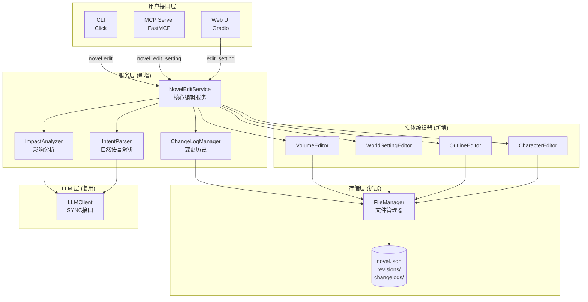
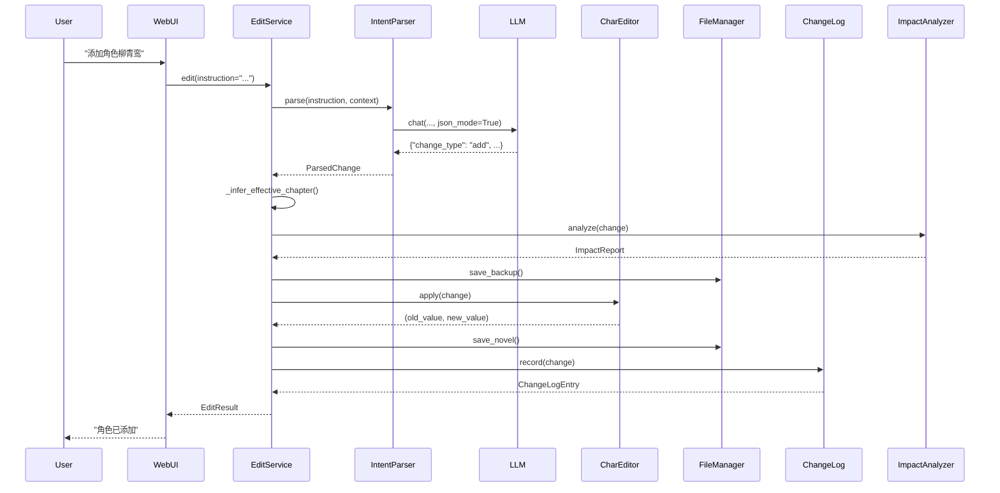
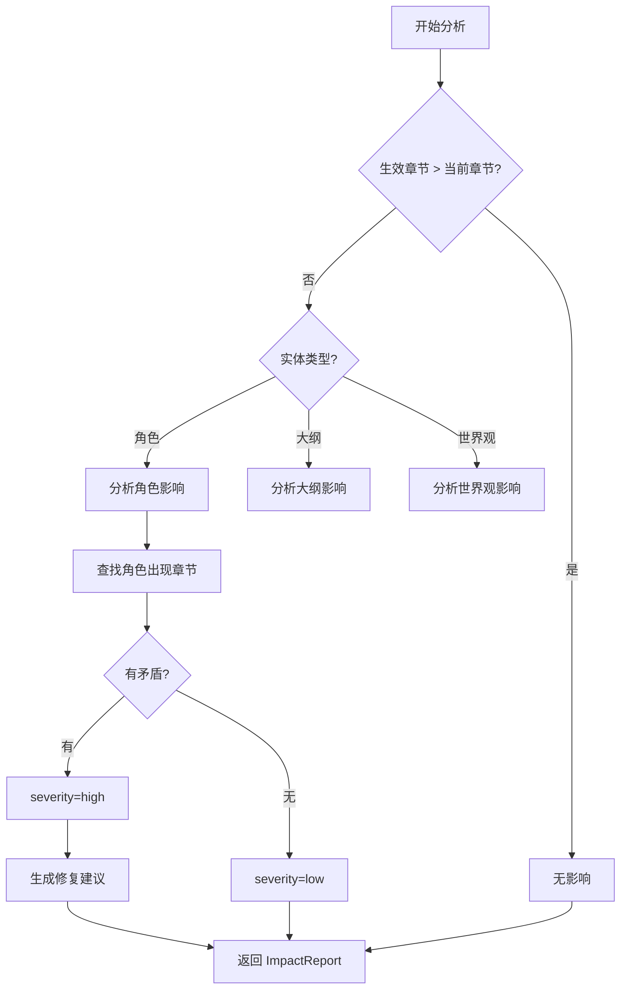
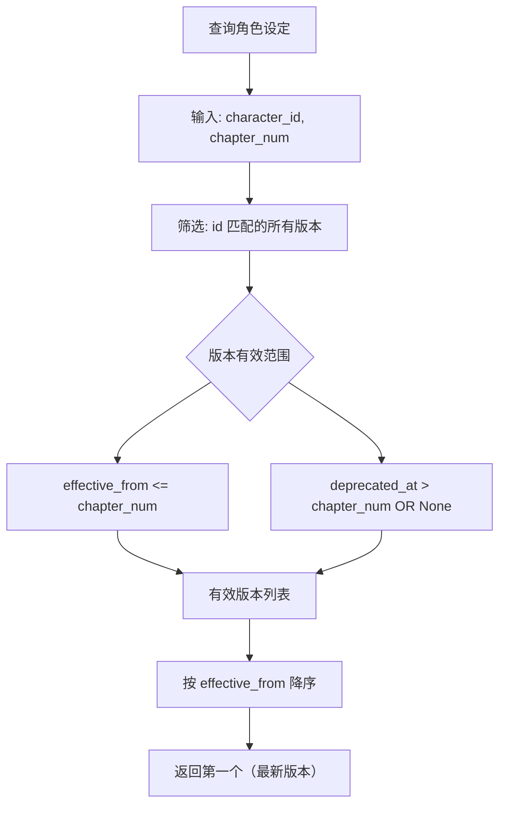

# 小说智能编辑系统架构设计

## 1. 系统概览

### 1.1 设计目标
将分散在 `web.py` 中的编辑逻辑抽取为独立的服务层，提供统一的自然语言 + 结构化编辑接口，支持 Web UI、MCP Server、CLI 三端调用。

### 1.2 核心原则
- **单一数据源**：所有修改通过服务层，保证一致性
- **版本化设定**：支持同一实体在不同章节的多版本并存
- **影响最小化**：变更只影响 `effective_from_chapter` 之后的内容
- **可追溯性**：所有修改记录到变更日志，可审计、可回滚
- **向后兼容**：扩展现有模型而非重建，老项目自动迁移

### 1.3 架构图



## 2. 模块设计

### 2.1 服务层核心模块

#### 2.1.1 NovelEditService

**职责**：
- 统一编辑入口，协调各子模块
- 管理事务边界（备份 → 修改 → 验证 → 保存）
- 处理并发冲突（乐观锁）

**接口**：
```python
class NovelEditService:
    def __init__(self, workspace: str = "workspace"):
        self.file_manager = FileManager(workspace)
        self.intent_parser = IntentParser()
        self.impact_analyzer = ImpactAnalyzer()
        self.change_log = ChangeLogManager(workspace)
        self._editors = {
            "character": CharacterEditor(self.file_manager),
            "outline": OutlineEditor(self.file_manager),
            "world_setting": WorldSettingEditor(self.file_manager),
            "volume": VolumeEditor(self.file_manager),
        }

    def edit(
        self,
        project_path: str,
        instruction: str | None = None,
        structured_change: dict | None = None,
        effective_from_chapter: int | None = None,
        dry_run: bool = False,
    ) -> EditResult:
        """
        编辑小说设定（自然语言或结构化指令）。

        Args:
            project_path: 项目路径
            instruction: 自然语言指令（如"添加角色李明"）
            structured_change: 结构化变更（用于 Web UI 表单）
            effective_from_chapter: 生效章节（None 则自动推断）
            dry_run: 仅分析不应用

        Returns:
            EditResult(
                change_id: str,
                change_type: "add" | "update" | "delete",
                target_entity_type: str,
                target_entity_id: str,
                old_value: dict | None,
                new_value: dict,
                effective_from_chapter: int,
                affected_chapters: list[int],
                conflicts: list[ConflictInfo],
                severity: "low" | "medium" | "high",
                status: "success" | "failed" | "preview",
            )
        """

    def rollback(
        self,
        project_path: str,
        change_id: str,
    ) -> RollbackResult:
        """回滚指定变更。"""

    def get_history(
        self,
        project_path: str,
        limit: int = 20,
        entity_type: str | None = None,
    ) -> list[ChangeLogEntry]:
        """查询变更历史。"""

    def analyze_impact(
        self,
        project_path: str,
        change: dict,
    ) -> ImpactReport:
        """仅分析影响，不应用变更。"""
```

**核心流程**：
```python
def edit(self, project_path, instruction, ...):
    # 1. 加载项目 + 乐观锁检查
    novel_data = self._load_with_lock(project_path)

    # 2. 解析意图（自然语言 → 结构化变更）
    if instruction:
        change = self.intent_parser.parse(instruction, novel_data)
    else:
        change = structured_change

    # 3. 推断生效章节
    if effective_from_chapter is None:
        effective_from_chapter = self._infer_effective_chapter(novel_data)
    change["effective_from_chapter"] = effective_from_chapter

    # 4. 影响分析
    impact = self.impact_analyzer.analyze(novel_data, change)

    # 5. Dry run 模式直接返回
    if dry_run:
        return EditResult(status="preview", **change, **impact)

    # 6. 执行变更（调用对应实体编辑器）
    editor = self._editors[change["entity_type"]]
    old_value, new_value = editor.apply(novel_data, change)

    # 7. 验证数据模型
    Novel.model_validate(novel_data)

    # 8. 备份旧版本
    self.file_manager.save_backup(project_path)

    # 9. 保存新版本
    self.file_manager.save_novel(novel_id, novel_data)

    # 10. 记录变更日志
    log_entry = self.change_log.record(change, old_value, new_value)

    return EditResult(
        change_id=log_entry.change_id,
        status="success",
        **change,
        old_value=old_value,
        new_value=new_value,
        **impact,
    )
```

#### 2.1.2 IntentParser

**职责**：
- 解析自然语言指令为结构化变更
- 提取关键信息（实体类型、操作类型、字段值）
- 智能推断缺失字段

**实现策略**：
```python
class IntentParser:
    def __init__(self, llm_client: LLMClient | None = None):
        self.llm = llm_client or create_llm_client()

    def parse(
        self,
        instruction: str,
        novel_context: dict,
    ) -> ParsedChange:
        """
        将自然语言指令转换为结构化变更。

        示例输入：
            "添加一个30岁女剑客反派，名叫柳青鸾，第10章出场"

        输出：
            {
                "change_type": "add",
                "entity_type": "character",
                "effective_from_chapter": 10,
                "data": {
                    "name": "柳青鸾",
                    "gender": "女",
                    "age": 30,
                    "occupation": "剑客",
                    "role": "antagonist",
                    "appearance": { ... },  # LLM 推断
                    "personality": { ... },  # LLM 推断
                }
            }
        """
        # 使用 LLM JSON mode 解析
        prompt = self._build_parse_prompt(instruction, novel_context)
        response = self.llm.chat(
            messages=[
                {"role": "system", "content": _PARSER_SYSTEM_PROMPT},
                {"role": "user", "content": prompt},
            ],
            temperature=0.2,  # 低温度保证稳定性
            json_mode=True,
        )
        parsed = json.loads(response.content)

        # 后处理：字段补全、验证
        return self._postprocess(parsed, novel_context)

    def _build_parse_prompt(self, instruction, context):
        """构建 LLM prompt。"""
        # 包含当前小说设定（世界观、现有角色等）作为上下文
        # 要求 LLM 输出符合 Pydantic 模型的 JSON

    def _postprocess(self, parsed, context):
        """后处理：字段推断、验证。"""
        # 1. 推断缺失字段（如未指定年龄，根据occupation推断）
        # 2. 生成 UUID（character_id 等）
        # 3. 验证外键引用（如 target_character_id 必须存在）
```

**Prompt 设计**：
```python
_PARSER_SYSTEM_PROMPT = """你是小说编辑助手，负责解析用户的设定修改指令。

输出格式（严格 JSON）：
{
  "change_type": "add | update | delete",
  "entity_type": "character | outline | world_setting | volume | chapter",
  "entity_id": "实体 ID（update/delete 时必须，add 时可选）",
  "effective_from_chapter": 10,  # 从哪章生效
  "data": { ... 具体变更内容，符合对应实体的 Pydantic 模型 ... }
}

注意：
1. 如果用户未指定生效章节，返回 null，系统会自动推断
2. 添加角色时，必须生成完整的 CharacterProfile 对象（包括 appearance、personality）
3. 缺失字段应根据小说设定智能推断（如玄幻小说的角色命名风格）
4. 所有 ID 字段（character_id 等）由系统生成，不要在 data 中包含
"""

_PARSER_USER_TEMPLATE = """当前小说设定：
- 题材：{genre}
- 世界观：{world_setting_summary}
- 现有角色：{character_list}
- 当前写到第 {current_chapter} 章

用户指令：
{instruction}

请解析为结构化变更。"""
```

#### 2.1.3 ImpactAnalyzer

**职责**：
- 分析设定变更对已写章节的影响
- 检测矛盾（如角色未登场就出现）
- 计算影响严重度

**实现策略**：
```python
class ImpactAnalyzer:
    def __init__(self, llm_client: LLMClient | None = None):
        self.llm = llm_client or create_llm_client()

    def analyze(
        self,
        novel_data: dict,
        change: dict,
    ) -> ImpactReport:
        """
        分析变更影响。

        Returns:
            ImpactReport(
                affected_chapters: list[int],
                conflicts: list[ConflictInfo],
                severity: "low" | "medium" | "high",
                summary: str,
            )
        """
        entity_type = change["entity_type"]
        effective_from = change.get("effective_from_chapter", 9999)

        # 1. 快速检查：未写章节无影响
        current_chapter = novel_data.get("current_chapter", 0)
        if effective_from > current_chapter:
            return ImpactReport(
                affected_chapters=[],
                conflicts=[],
                severity="low",
                summary="变更生效于未来章节，无需修改现有内容",
            )

        # 2. 实体特定检查
        if entity_type == "character":
            return self._analyze_character_impact(novel_data, change)
        elif entity_type == "outline":
            return self._analyze_outline_impact(novel_data, change)
        # ...

    def _analyze_character_impact(self, novel_data, change):
        """分析角色变更影响。"""
        change_type = change["change_type"]
        effective_from = change["effective_from_chapter"]

        if change_type == "delete":
            # 检查角色在哪些章节出现过
            char_id = change["entity_id"]
            affected = self._find_character_appearances(novel_data, char_id)

            conflicts = []
            for ch_num in affected:
                if ch_num >= effective_from:
                    conflicts.append(ConflictInfo(
                        chapter_number=ch_num,
                        reason=f"该角色在第{ch_num}章有对话/情节，删除会导致矛盾",
                        severity="high",
                        suggested_fix=f"将角色标记为 status='deceased'，而非完全删除",
                    ))

            return ImpactReport(
                affected_chapters=affected,
                conflicts=conflicts,
                severity="high" if conflicts else "low",
                summary=f"影响 {len(affected)} 章，发现 {len(conflicts)} 处矛盾",
            )

        elif change_type == "add":
            # 检查是否与现有角色名称冲突
            # ...

    def _find_character_appearances(self, novel_data, char_id):
        """查找角色在哪些章节出现。"""
        appearances = []
        for ch in novel_data.get("chapters", []):
            # 检查 involved_characters
            if char_id in ch.get("involved_characters", []):
                appearances.append(ch["chapter_number"])

            # 检查章节文本（可选，较重）
            # text = self.file_manager.load_chapter_text(...)
            # if char_name in text: ...

        # 也可以调用 LLM 分析章节文本（成本较高）
        return appearances
```

#### 2.1.4 ChangeLogManager

**职责**：
- 记录所有设定修改历史
- 支持查询和回滚

**数据模型**：
```python
class ChangeLogEntry(BaseModel):
    change_id: str = Field(default_factory=lambda: str(uuid4()))
    timestamp: str = Field(default_factory=lambda: datetime.now(timezone.utc).isoformat())

    change_type: Literal["add", "update", "delete"]
    entity_type: str  # "character", "outline", "world_setting"
    entity_id: str

    old_value: dict | None = None  # JSON 快照
    new_value: dict

    effective_from_chapter: int
    applied_by: str  # "web", "mcp", "cli"
    instruction: str | None = None  # 用户原始指令

    # 回滚相关
    reverted_by: str | None = None  # 如果被回滚，记录 change_id
    reverts: str | None = None  # 如果是回滚操作，记录被回滚的 change_id
```

**实现**：
```python
class ChangeLogManager:
    def __init__(self, workspace: str):
        self.workspace = Path(workspace)

    def record(
        self,
        novel_id: str,
        change: dict,
        old_value: dict | None,
        new_value: dict,
    ) -> ChangeLogEntry:
        """记录变更。"""
        entry = ChangeLogEntry(
            change_type=change["change_type"],
            entity_type=change["entity_type"],
            entity_id=change.get("entity_id", new_value.get("character_id")),
            old_value=old_value,
            new_value=new_value,
            effective_from_chapter=change["effective_from_chapter"],
            applied_by=change.get("applied_by", "unknown"),
            instruction=change.get("instruction"),
        )

        # 保存到 workspace/novels/{novel_id}/changelogs/{change_id}.json
        log_dir = self.workspace / "novels" / novel_id / "changelogs"
        log_dir.mkdir(parents=True, exist_ok=True)
        log_path = log_dir / f"{entry.change_id}.json"
        log_path.write_text(entry.model_dump_json(indent=2), encoding="utf-8")

        return entry

    def list_changes(
        self,
        novel_id: str,
        limit: int = 20,
        entity_type: str | None = None,
    ) -> list[ChangeLogEntry]:
        """查询变更历史（按时间倒序）。"""
        log_dir = self.workspace / "novels" / novel_id / "changelogs"
        if not log_dir.exists():
            return []

        entries = []
        for log_file in sorted(log_dir.glob("*.json"), reverse=True):
            entry = ChangeLogEntry.model_validate_json(log_file.read_text(encoding="utf-8"))
            if entity_type is None or entry.entity_type == entity_type:
                entries.append(entry)
            if len(entries) >= limit:
                break

        return entries

    def get(self, novel_id: str, change_id: str) -> ChangeLogEntry | None:
        """获取指定变更记录。"""
        log_path = self.workspace / "novels" / novel_id / "changelogs" / f"{change_id}.json"
        if not log_path.exists():
            return None
        return ChangeLogEntry.model_validate_json(log_path.read_text(encoding="utf-8"))
```

### 2.2 实体编辑器

#### 2.2.1 BaseEditor

**职责**：
- 定义编辑器通用接口
- 提供公共方法（验证、版本管理等）

**抽象类**：
```python
from abc import ABC, abstractmethod

class BaseEditor(ABC):
    def __init__(self, file_manager: FileManager):
        self.fm = file_manager

    @abstractmethod
    def apply(
        self,
        novel_data: dict,
        change: dict,
    ) -> tuple[dict | None, dict]:
        """
        应用变更到 novel_data（原地修改）。

        Returns:
            (old_value, new_value)
        """

    def _add_version_fields(self, entity: dict, change: dict):
        """为实体添加版本字段。"""
        entity["effective_from_chapter"] = change["effective_from_chapter"]
        entity["version"] = entity.get("version", 0) + 1
        entity["updated_at"] = datetime.now(timezone.utc).isoformat()

    def _deprecate_old_version(self, entity: dict, effective_from: int):
        """标记旧版本为过期。"""
        entity["deprecated_at_chapter"] = effective_from
```

#### 2.2.2 CharacterEditor

**职责**：
- 处理角色的增删改
- 维护关系网完整性
- 处理角色版本（如角色第10章性格大变）

**实现**：
```python
class CharacterEditor(BaseEditor):
    def apply(self, novel_data, change):
        change_type = change["change_type"]

        if change_type == "add":
            return self._add_character(novel_data, change)
        elif change_type == "update":
            return self._update_character(novel_data, change)
        elif change_type == "delete":
            return self._delete_character(novel_data, change)

    def _add_character(self, novel_data, change):
        """添加角色。"""
        new_char = change["data"]

        # 1. 生成 UUID
        if "character_id" not in new_char:
            new_char["character_id"] = str(uuid4())

        # 2. 添加版本字段
        self._add_version_fields(new_char, change)

        # 3. 验证模型
        CharacterProfile.model_validate(new_char)

        # 4. 追加到 characters 列表
        novel_data.setdefault("characters", []).append(new_char)

        return None, new_char

    def _update_character(self, novel_data, change):
        """更新角色。"""
        char_id = change["entity_id"]
        chars = novel_data.get("characters", [])

        # 1. 找到目标角色
        old_char = None
        for i, c in enumerate(chars):
            if c.get("character_id") == char_id:
                old_char = copy.deepcopy(c)

                # 2. 版本化策略：如果是重大变更，保留旧版本 + 添加新版本
                if self._is_major_change(change):
                    # 标记旧版本为过期
                    self._deprecate_old_version(c, change["effective_from_chapter"])

                    # 创建新版本
                    new_char = copy.deepcopy(c)
                    new_char.update(change["data"])
                    self._add_version_fields(new_char, change)
                    chars.append(new_char)
                else:
                    # 原地更新
                    c.update(change["data"])
                    self._add_version_fields(c, change)

                break

        if old_char is None:
            raise ValueError(f"角色不存在: {char_id}")

        # 3. 更新关系网引用（如名字改了，更新其他角色的 relationships）
        self._update_relationship_references(novel_data, char_id, change)

        return old_char, chars[-1] if self._is_major_change(change) else chars[i]

    def _delete_character(self, novel_data, change):
        """删除角色（软删除）。"""
        char_id = change["entity_id"]
        chars = novel_data.get("characters", [])

        old_char = None
        for c in chars:
            if c.get("character_id") == char_id:
                old_char = copy.deepcopy(c)
                # 软删除：标记为 deceased，而非真删除
                c["status"] = "deceased"
                self._add_version_fields(c, change)
                break

        if old_char is None:
            raise ValueError(f"角色不存在: {char_id}")

        # 清理关系网引用
        self._remove_relationship_references(novel_data, char_id)

        return old_char, {"character_id": char_id, "status": "deceased"}

    def _is_major_change(self, change):
        """判断是否为重大变更（需保留历史版本）。"""
        # 如修改 personality.core_belief、character_arc 等核心字段
        return "personality" in change["data"] or "character_arc" in change["data"]

    def _update_relationship_references(self, novel_data, char_id, change):
        """更新其他角色 relationships 中的引用。"""
        if "name" not in change["data"]:
            return

        # 遍历所有角色的 relationships
        for c in novel_data.get("characters", []):
            for rel in c.get("relationships", []):
                if rel.get("target_character_id") == char_id:
                    # 更新关系描述（如果需要）
                    pass
```

#### 2.2.3 OutlineEditor

**职责**：
- 处理大纲修改（章节、卷、幕）
- 维护大纲一致性（章节号连续性、卷包含章节正确）

**实现**：
```python
class OutlineEditor(BaseEditor):
    def apply(self, novel_data, change):
        target = change.get("target")  # "chapter" | "volume" | "act" | "main_storyline"

        if target == "chapter":
            return self._edit_chapter_outline(novel_data, change)
        elif target == "volume":
            return self._edit_volume_outline(novel_data, change)
        # ...

    def _edit_chapter_outline(self, novel_data, change):
        """修改章节大纲。"""
        ch_num = change["data"]["chapter_number"]
        outline = novel_data.get("outline", {})
        chapters = outline.get("chapters", [])

        old_ch = None
        for i, ch in enumerate(chapters):
            if ch.get("chapter_number") == ch_num:
                old_ch = copy.deepcopy(ch)
                ch.update(change["data"])
                self._add_version_fields(ch, change)
                break

        if old_ch is None:
            raise ValueError(f"章节不存在: {ch_num}")

        return old_ch, chapters[i]
```

### 2.3 数据模型扩展

#### 2.3.1 版本字段

在现有 Pydantic 模型中添加版本字段：

```python
# src/novel/models/character.py
class CharacterProfile(BaseModel):
    # ... 现有字段 ...

    # 版本控制（新增）
    effective_from_chapter: int | None = Field(
        None,
        description="从哪一章开始生效（None 表示从头生效）",
    )
    deprecated_at_chapter: int | None = Field(
        None,
        description="在哪一章被替换（None 表示当前版本）",
    )
    version: int = Field(1, ge=1, description="版本号")

# src/novel/models/novel.py
class ChapterOutline(BaseModel):
    # ... 现有字段 ...

    # 版本控制（新增）
    effective_from_chapter: int | None = None
    deprecated_at_chapter: int | None = None
    version: int = 1

class WorldSetting(BaseModel):
    # ... 现有字段 ...

    # 版本控制（新增）
    effective_from_chapter: int | None = None
    deprecated_at_chapter: int | None = None
    version: int = 1
```

**重要**：所有新增字段必须有默认值，保证向后兼容。

#### 2.3.2 辅助查询函数

```python
# src/novel/utils/setting_version.py

def get_setting_at_chapter(
    entities: list[dict],
    entity_id: str,
    chapter_num: int,
) -> dict | None:
    """
    查询指定章节时生效的实体版本。

    Args:
        entities: 实体列表（如 novel_data["characters"]）
        entity_id: 实体 ID
        chapter_num: 章节号

    Returns:
        生效的实体版本，如果无匹配则返回 None
    """
    candidates = []
    for e in entities:
        if e.get("character_id") != entity_id:
            continue

        effective_from = e.get("effective_from_chapter") or 1
        deprecated_at = e.get("deprecated_at_chapter") or 9999

        if effective_from <= chapter_num < deprecated_at:
            candidates.append((effective_from, e))

    if not candidates:
        return None

    # 返回最近的版本（effective_from 最大）
    candidates.sort(key=lambda x: x[0], reverse=True)
    return candidates[0][1]
```

### 2.4 存储层扩展

#### 2.4.1 FileManager 新增方法

```python
# src/novel/storage/file_manager.py

class FileManager:
    # ... 现有方法 ...

    def save_backup(self, novel_id: str) -> Path:
        """
        备份当前 novel.json 到 revisions/。

        Returns:
            备份文件路径
        """
        novel_path = self._novel_dir(novel_id) / "novel.json"
        if not novel_path.exists():
            raise FileNotFoundError(f"novel.json 不存在: {novel_id}")

        rev_dir = self._novel_dir(novel_id) / "revisions"
        rev_dir.mkdir(parents=True, exist_ok=True)

        timestamp = datetime.now().strftime("%Y%m%d_%H%M%S")
        backup_path = rev_dir / f"novel_backup_{timestamp}.json"

        import shutil
        shutil.copy2(novel_path, backup_path)

        # 保留最近 20 个备份
        self._cleanup_old_backups(rev_dir, keep=20)

        return backup_path

    def _cleanup_old_backups(self, rev_dir: Path, keep: int):
        """删除旧备份，保留最近 N 个。"""
        backups = sorted(rev_dir.glob("novel_backup_*.json"))
        if len(backups) > keep:
            for old in backups[:-keep]:
                old.unlink()
```

### 2.5 MCP 工具暴露

#### 2.5.1 新增 MCP 工具

```python
# mcp_server.py

@mcp.tool()
def novel_edit_setting(
    project_path: str,
    instruction: str | None = None,
    structured_change: dict | None = None,
    effective_from_chapter: int | None = None,
    dry_run: bool = False,
) -> dict[str, Any]:
    """
    编辑小说设定（自然语言或结构化指令）。

    Args:
        project_path: 项目路径
        instruction: 自然语言指令（如"添加角色李明"）
        structured_change: 结构化变更（JSON 格式）
        effective_from_chapter: 生效章节
        dry_run: 仅分析不应用

    Returns:
        变更结果 + 影响分析
    """
    try:
        from src.novel.services.edit_service import NovelEditService

        service = NovelEditService()
        result = service.edit(
            project_path=project_path,
            instruction=instruction,
            structured_change=structured_change,
            effective_from_chapter=effective_from_chapter,
            dry_run=dry_run,
        )
        return result.model_dump()
    except Exception as e:
        return {"error": str(e)}

@mcp.tool()
def novel_rollback_change(
    project_path: str,
    change_id: str,
) -> dict[str, Any]:
    """回滚指定变更。"""
    try:
        from src.novel.services.edit_service import NovelEditService

        service = NovelEditService()
        result = service.rollback(project_path, change_id)
        return result.model_dump()
    except Exception as e:
        return {"error": str(e)}

@mcp.tool()
def novel_get_change_history(
    project_path: str,
    limit: int = 20,
    entity_type: str | None = None,
) -> list[dict[str, Any]]:
    """查询设定变更历史。"""
    try:
        from src.novel.services.edit_service import NovelEditService

        service = NovelEditService()
        entries = service.get_history(project_path, limit, entity_type)
        return [e.model_dump() for e in entries]
    except Exception as e:
        return [{"error": str(e)}]
```

### 2.6 Web UI 集成

#### 2.6.1 重构现有编辑逻辑

将 `web.py` 中的编辑函数重构为调用服务层：

```python
# web.py

def _novel_setting_ai_modify(project: str, instruction: str):
    """AI 智能修改设定（重构版）。"""
    if not project or not instruction.strip():
        empty = gr.update()
        return ("", *([empty] * 36), "请输入修改指令")

    from src.novel.services.edit_service import NovelEditService

    project_path = _novel_extract_project_path(project)
    service = NovelEditService()

    try:
        # 1. 调用服务层
        result = service.edit(
            project_path=project_path,
            instruction=instruction,
            dry_run=False,  # Web UI 直接应用
        )

        # 2. 格式化结果为 Markdown
        md = f"### 修改成功\n\n"
        md += f"- **变更类型**: {result.change_type}\n"
        md += f"- **实体类型**: {result.entity_type}\n"
        md += f"- **生效章节**: 第 {result.effective_from_chapter} 章\n"
        if result.affected_chapters:
            md += f"- **受影响章节**: {', '.join(f'第{ch}章' for ch in result.affected_chapters)}\n"

        # 3. 重新加载表单（调用现有函数）
        load_outputs = _novel_setting_load_all(project)

        return (md, *load_outputs[:-1], "修改已应用")

    except Exception as e:
        empty = gr.update()
        return (f"### 错误\n\n{e}", *([empty] * 36), f"修改失败: {e}")

def _novel_setting_save_form(...):
    """表单保存（重构版）。"""
    # 1. 收集表单数据
    structured_change = {
        "change_type": "update",
        "entity_type": "character",  # 或其他
        "data": {
            "name": char_name,
            "gender": char_gender,
            # ...
        },
    }

    # 2. 调用服务层
    from src.novel.services.edit_service import NovelEditService
    service = NovelEditService()
    result = service.edit(
        project_path=project_path,
        structured_change=structured_change,
        dry_run=False,
    )

    return "保存成功"
```

## 3. 数据流设计

### 3.1 自然语言编辑流程



### 3.2 影响分析流程



### 3.3 版本查询流程



## 4. 并发控制设计

### 4.1 乐观锁机制

```python
class NovelEditService:
    def _load_with_lock(self, project_path: str) -> dict:
        """加载项目并检查乐观锁。"""
        novel_id = Path(project_path).name
        novel_data = self.file_manager.load_novel(novel_id)

        if novel_data is None:
            raise FileNotFoundError(f"项目不存在: {project_path}")

        # 记录加载时的 updated_at 时间戳
        self._loaded_timestamp = novel_data.get("updated_at")

        return novel_data

    def _check_lock_before_save(self, novel_data: dict):
        """保存前检查乐观锁。"""
        current_timestamp = novel_data.get("updated_at")

        if current_timestamp != self._loaded_timestamp:
            raise ConcurrentModificationError(
                "项目已被其他客户端修改，请重新加载后再试。"
                f"（加载时: {self._loaded_timestamp}, 当前: {current_timestamp}）"
            )
```

### 4.2 文件锁（可选）

```python
import fcntl  # Unix only

class FileManager:
    def _acquire_lock(self, novel_id: str):
        """获取文件锁（阻塞）。"""
        lock_file = self._novel_dir(novel_id) / ".lock"
        self._lock_fd = open(lock_file, "w")
        fcntl.flock(self._lock_fd, fcntl.LOCK_EX)

    def _release_lock(self):
        """释放文件锁。"""
        if self._lock_fd:
            fcntl.flock(self._lock_fd, fcntl.LOCK_UN)
            self._lock_fd.close()
```

## 5. 测试策略

### 5.1 单元测试

**测试文件**：`tests/novel/services/test_edit_service.py`

```python
import pytest
from unittest.mock import MagicMock
from src.novel.services.edit_service import NovelEditService

@pytest.fixture
def mock_llm():
    llm = MagicMock()
    llm.chat.return_value = MagicMock(
        content='{"change_type": "add", "entity_type": "character", ...}',
    )
    return llm

def test_edit_add_character(mock_llm, tmp_path):
    # 准备
    service = NovelEditService(workspace=str(tmp_path))
    # Mock FileManager
    service.file_manager.load_novel = MagicMock(return_value={
        "novel_id": "test_123",
        "characters": [],
        "current_chapter": 5,
        "updated_at": "2024-01-01T00:00:00",
    })
    service.file_manager.save_novel = MagicMock()
    service.intent_parser.llm = mock_llm

    # 执行
    result = service.edit(
        project_path=str(tmp_path / "novels" / "test_123"),
        instruction="添加角色李明",
        dry_run=False,
    )

    # 断言
    assert result.change_type == "add"
    assert result.entity_type == "character"
    assert result.status == "success"
    service.file_manager.save_novel.assert_called_once()

def test_edit_delete_character_with_conflicts(mock_llm, tmp_path):
    # 准备
    service = NovelEditService(workspace=str(tmp_path))
    service.file_manager.load_novel = MagicMock(return_value={
        "characters": [{"character_id": "char_1", "name": "李明"}],
        "outline": {
            "chapters": [
                {"chapter_number": 3, "involved_characters": ["char_1"]},
            ]
        },
        "current_chapter": 5,
    })

    # 执行
    result = service.edit(
        project_path="...",
        instruction="删除角色李明",
        dry_run=True,
    )

    # 断言
    assert result.severity == "high"
    assert 3 in result.affected_chapters
    assert len(result.conflicts) > 0
```

### 5.2 集成测试

**测试文件**：`tests/novel/services/test_edit_integration.py`

```python
def test_edit_and_rollback_flow(tmp_path):
    """完整编辑 + 回滚流程。"""
    # 1. 创建项目
    from src.novel.pipeline import NovelPipeline
    pipe = NovelPipeline(workspace=str(tmp_path))
    result = pipe.create_novel(...)

    # 2. 添加角色
    service = NovelEditService(workspace=str(tmp_path))
    edit_result = service.edit(
        project_path=result["project_path"],
        instruction="添加角色柳青鸾",
    )
    change_id = edit_result.change_id

    # 3. 验证角色已添加
    novel_data = service.file_manager.load_novel(...)
    assert any(c["name"] == "柳青鸾" for c in novel_data["characters"])

    # 4. 回滚
    rollback_result = service.rollback(
        project_path=result["project_path"],
        change_id=change_id,
    )

    # 5. 验证回滚成功
    novel_data = service.file_manager.load_novel(...)
    assert not any(c["name"] == "柳青鸾" for c in novel_data["characters"])
```

## 6. 性能优化

### 6.1 缓存策略

```python
from functools import lru_cache

class IntentParser:
    @lru_cache(maxsize=100)
    def _cached_parse(self, instruction_hash: str, context_hash: str):
        """缓存 LLM 解析结果。"""
        # 实际解析逻辑
```

### 6.2 批量操作优化

```python
class NovelEditService:
    def batch_edit(
        self,
        project_path: str,
        changes: list[dict],
    ) -> list[EditResult]:
        """批量应用多个变更（共享备份和验证）。"""
        # 1. 一次性加载项目
        novel_data = self._load_with_lock(project_path)

        # 2. 一次性备份
        self.file_manager.save_backup(...)

        # 3. 应用所有变更
        results = []
        for change in changes:
            editor = self._editors[change["entity_type"]]
            old, new = editor.apply(novel_data, change)
            results.append(...)

        # 4. 一次性验证 + 保存
        Novel.model_validate(novel_data)
        self.file_manager.save_novel(...)

        return results
```

## 7. 迁移策略

### 7.1 向后兼容

所有新增字段必须有默认值：

```python
class CharacterProfile(BaseModel):
    # 新增字段必须有默认值
    effective_from_chapter: int | None = None  # ✅
    # 而非
    # effective_from_chapter: int  # ❌ 会导致旧项目加载失败
```

### 7.2 自动迁移脚本

```python
# scripts/migrate_novel_v1_to_v2.py

def migrate_project(project_path: Path):
    """将 v1 项目迁移到 v2（添加版本字段）。"""
    novel_json = project_path / "novel.json"
    data = json.loads(novel_json.read_text(encoding="utf-8"))

    # 为所有现有实体添加版本字段
    for char in data.get("characters", []):
        if "version" not in char:
            char["version"] = 1
            char["effective_from_chapter"] = None
            char["deprecated_at_chapter"] = None

    # 保存
    novel_json.write_text(json.dumps(data, ensure_ascii=False, indent=2))
    print(f"✅ Migrated: {project_path}")

if __name__ == "__main__":
    workspace = Path("workspace/novels")
    for project_dir in workspace.iterdir():
        if project_dir.is_dir():
            migrate_project(project_dir)
```

## 8. 部署清单

### 8.1 新增文件

```
src/novel/services/
├── __init__.py
├── edit_service.py         # NovelEditService
├── intent_parser.py        # IntentParser
├── impact_analyzer.py      # ImpactAnalyzer
└── changelog_manager.py    # ChangeLogManager

src/novel/editors/
├── __init__.py
├── base.py                 # BaseEditor
├── character_editor.py     # CharacterEditor
├── outline_editor.py       # OutlineEditor
├── world_editor.py         # WorldSettingEditor
└── volume_editor.py        # VolumeEditor

src/novel/utils/
├── __init__.py
└── setting_version.py      # get_setting_at_chapter()

tests/novel/services/
├── test_edit_service.py
├── test_intent_parser.py
└── test_impact_analyzer.py

scripts/
└── migrate_novel_v1_to_v2.py
```

### 8.2 修改文件

```
src/novel/models/character.py    # 添加版本字段
src/novel/models/novel.py         # 添加版本字段
src/novel/models/world.py         # 添加版本字段
src/novel/storage/file_manager.py # 新增 save_backup()
web.py                             # 重构编辑函数
mcp_server.py                      # 新增 MCP 工具
```

## 9. 风险缓解

### 9.1 LLM 解析失败

**问题**：用户指令复杂时 LLM 可能误解

**缓解**：
1. 提供结构化模板（"请按以下格式输入..."）
2. 显示解析结果预览，要求用户确认
3. 兜底规则解析器（基于正则表达式）

```python
class IntentParser:
    def parse(self, instruction, context):
        try:
            # 尝试 LLM 解析
            return self._llm_parse(instruction, context)
        except Exception as e:
            log.warning("LLM 解析失败，尝试规则解析: %s", e)
            return self._rule_based_parse(instruction)

    def _rule_based_parse(self, instruction):
        """兜底的规则解析器。"""
        if re.match(r"添加.*角色", instruction):
            # 提取角色名、年龄等
            return {"change_type": "add", "entity_type": "character", ...}
        # ...
```

### 9.2 并发编辑冲突

**问题**：多个客户端同时编辑同一项目

**缓解**：
1. 乐观锁（基于 `updated_at` 时间戳）
2. 友好错误提示（"项目已被修改，请刷新后重试"）
3. 可选：文件锁（阻塞模式）

## 10. 后续扩展

### 10.1 协作编辑（多用户）

- 添加 `user_id` 字段到 `ChangeLogEntry`
- 冲突解决策略（如 OT 算法）
- WebSocket 实时同步

### 10.2 AI 自动修复

```python
class ImpactAnalyzer:
    def auto_fix_conflicts(self, novel_data, conflicts):
        """LLM 自动修复检测到的矛盾。"""
        for conflict in conflicts:
            fix_prompt = f"第{conflict.chapter_number}章有矛盾：{conflict.reason}。请修改章节文本。"
            # 调用 Writer agent 重写章节
```

### 10.3 版本对比可视化

```python
def diff_versions(old_char, new_char):
    """生成角色版本对比（HTML diff）。"""
    import difflib
    old_json = json.dumps(old_char, indent=2, ensure_ascii=False).splitlines()
    new_json = json.dumps(new_char, indent=2, ensure_ascii=False).splitlines()
    diff = difflib.HtmlDiff().make_file(old_json, new_json)
    return diff
```

## 11. 文档要求

### 11.1 用户文档

- 自然语言编辑示例库（`docs/edit_examples.md`）
- MCP 工具使用指南（`docs/mcp_edit_guide.md`）
- 变更历史查询教程（`docs/changelog_guide.md`）

### 11.2 开发文档

- 架构决策记录（ADR）（`docs/adr/0001-versioned-settings.md`）
- 实体编辑器扩展指南（`docs/dev/extend_editor.md`）
- 测试策略文档（`docs/dev/testing_strategy.md`）

---

**设计版本**: v1.0
**创建日期**: 2026-03-24
**作者**: Claude (AI Assistant)
**审阅状态**: 待审阅
