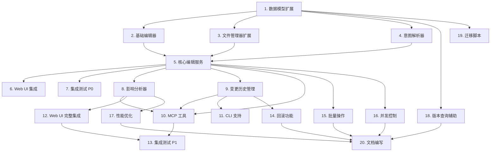

# 小说智能编辑系统实施任务清单

## 版本信息
- **规格版本**: v1.0
- **创建日期**: 2026-03-24
- **预计工期**: 3-4 周（按优先级分批实施）

## 任务分组与优先级

### P0 - 核心流程（第一批，预计 1.5 周）
基础架构搭建，实现最小可用版本（MVP）

### P1 - 增强功能（第二批，预计 1 周）
MCP 集成、影响分析、变更历史

### P2 - 高级功能（第三批，预计 1 周）
批量操作、回滚、并发控制、性能优化

---

## P0: 核心流程任务

### 1. 数据模型扩展
**优先级**: P0-Critical
**预计工时**: 2h
**依赖**: 无

**子任务**:
- [x] 1.1 扩展 `CharacterProfile` 模型
  - 添加 `effective_from_chapter: int | None = None`
  - 添加 `deprecated_at_chapter: int | None = None`
  - 添加 `version: int = Field(1, ge=1)`
  - 编写单元测试验证向后兼容性

- [x] 1.2 扩展 `ChapterOutline` 模型
  - 添加相同版本字段
  - 测试 Pydantic 验证

- [x] 1.3 扩展 `WorldSetting` 模型
  - 添加相同版本字段
  - 测试 Pydantic 验证

- [ ] 1.4 扩展 `VolumeOutline` 模型（可选）
  - 添加相同版本字段

**验收标准**:
```python
# 测试向后兼容
old_char = {"name": "李明", "gender": "男", ...}
assert CharacterProfile.model_validate(old_char)  # 不报错

# 测试新字段
new_char = {"name": "李明", ..., "effective_from_chapter": 10}
assert CharacterProfile.model_validate(new_char).version == 1
```

**输出文件**:
- `src/novel/models/character.py` (修改)
- `src/novel/models/novel.py` (修改)
- `src/novel/models/world.py` (修改)
- `tests/novel/models/test_versioned_models.py` (新增)

---

### 2. 基础编辑器抽象
**优先级**: P0-Critical
**预计工时**: 4h
**依赖**: 任务 1

**子任务**:
- [x] 2.1 创建 `BaseEditor` 抽象类
  - 定义 `apply()` 抽象方法
  - 实现 `_add_version_fields()` 通用方法
  - 实现 `_deprecate_old_version()` 通用方法

- [x] 2.2 实现 `CharacterEditor`
  - `_add_character()` 方法
  - `_update_character()` 方法（简单原地更新）
  - `_delete_character()` 方法（软删除）
  - 单元测试（Mock FileManager）

- [x] 2.3 实现 `OutlineEditor`
  - `_edit_chapter_outline()` 方法
  - `_add_chapter_outline()` 方法
  - 单元测试

- [x] 2.4 实现 `WorldSettingEditor`
  - `_update_world_setting()` 方法
  - 单元测试

**验收标准**:
```python
editor = CharacterEditor(mock_file_manager)
novel_data = {"characters": []}
change = {"change_type": "add", "data": {...}}

old, new = editor.apply(novel_data, change)
assert old is None
assert new["character_id"] is not None
assert len(novel_data["characters"]) == 1
```

**输出文件**:
- `src/novel/editors/__init__.py` (新增)
- `src/novel/editors/base.py` (新增)
- `src/novel/editors/character_editor.py` (新增)
- `src/novel/editors/outline_editor.py` (新增)
- `src/novel/editors/world_editor.py` (新增)
- `tests/novel/editors/test_character_editor.py` (新增)
- `tests/novel/editors/test_outline_editor.py` (新增)

---

### 3. 文件管理器扩展
**优先级**: P0-Critical
**预计工时**: 2h
**依赖**: 无

**子任务**:
- [x] 3.1 新增 `save_backup()` 方法
  - 复制 `novel.json` 到 `revisions/novel_backup_{timestamp}.json`
  - 实现 `_cleanup_old_backups()` 保留最近 20 个

- [x] 3.2 新增变更日志相关方法（占位）
  - `save_change_log(novel_id, entry_dict) -> Path`
  - `list_change_logs(novel_id, limit) -> list[dict]`
  - `load_change_log(novel_id, change_id) -> dict | None`
  - （P0 仅实现接口，P1 完善逻辑）

**验收标准**:
```python
fm = FileManager("workspace")
backup_path = fm.save_backup("novel_123")
assert backup_path.exists()
assert "novel_backup_" in backup_path.name
```

**输出文件**:
- `src/novel/storage/file_manager.py` (修改)
- `tests/novel/storage/test_file_manager_backup.py` (新增)

---

### 4. 意图解析器（简化版）
**优先级**: P0-High
**预计工时**: 6h
**依赖**: 任务 1, 2

**子任务**:
- [x] 4.1 创建 `IntentParser` 类
  - `parse()` 方法骨架
  - `_build_parse_prompt()` 生成 LLM prompt
  - `_postprocess()` 后处理（字段推断、验证）

- [x] 4.2 实现 Prompt 模板
  - 系统提示词（要求输出 JSON）
  - 用户提示词（包含小说上下文）

- [x] 4.3 LLM 调用 + JSON 解析
  - 调用 `create_llm_client().chat(..., json_mode=True)`
  - 稳健的 JSON 提取（`_extract_json_obj()`）
  - 重试机制（最多 3 次）

- [x] 4.4 单元测试
  - Mock LLM 返回预定义 JSON
  - 测试各种指令类型（add/update/delete）
  - 测试错误处理（LLM 返回无效 JSON）

**验收标准**:
```python
parser = IntentParser(mock_llm)
novel_context = {"genre": "玄幻", "characters": [...]}

change = parser.parse("添加角色李明", novel_context)
assert change["change_type"] == "add"
assert change["entity_type"] == "character"
assert change["data"]["name"] == "李明"
```

**输出文件**:
- `src/novel/services/__init__.py` (新增)
- `src/novel/services/intent_parser.py` (新增)
- `tests/novel/services/test_intent_parser.py` (新增)

---

### 5. 核心编辑服务（简化版）
**优先级**: P0-Critical
**预计工时**: 8h
**依赖**: 任务 1-4

**子任务**:
- [x] 5.1 创建 `NovelEditService` 类
  - 初始化各子模块（`IntentParser`, `CharacterEditor`, ...）
  - `edit()` 方法主流程（不含影响分析）
  - 乐观锁检查（基于 `updated_at`）

- [x] 5.2 实现 `edit()` 核心流程
  - 加载项目 + 锁检查
  - 调用 `IntentParser.parse()`（如果是自然语言）
  - 推断 `effective_from_chapter`
  - 调用对应编辑器 `apply()`
  - Pydantic 验证
  - 备份 + 保存

- [x] 5.3 实现 `_infer_effective_chapter()`
  - 默认为 `current_chapter + 1`

- [x] 5.4 单元测试
  - Mock 所有依赖（FileManager, IntentParser, Editors）
  - 测试完整流程（add/update/delete）
  - 测试错误路径（验证失败、并发冲突）

**验收标准**:
```python
service = NovelEditService()
result = service.edit(
    project_path="workspace/novels/novel_123",
    instruction="添加角色李明",
    dry_run=False,
)
assert result.status == "success"
assert result.change_type == "add"
```

**输出文件**:
- `src/novel/services/edit_service.py` (新增)
- `tests/novel/services/test_edit_service.py` (新增)

---

### 6. Web UI 集成（最小化）
**优先级**: P0-High
**预计工时**: 4h
**依赖**: 任务 5

**子任务**:
- [x] 6.1 重构 `_novel_setting_ai_modify()`
  - 调用 `NovelEditService.edit()`
  - 格式化结果为 Markdown
  - 重新加载表单（复用现有函数）

- [x] 6.2 保留旧版表单编辑（暂不重构）
  - `_novel_setting_save_form()` 暂时保持原样
  - 后续 P1 再重构为调用服务层

- [ ] 6.3 UI 测试
  - 手动测试 AI 编辑框功能
  - 验证错误提示友好性

**验收标准**:
- 在 Web UI 输入"添加角色李明"，能成功添加并刷新表单
- 输入无效指令时显示友好错误提示

**输出文件**:
- `web.py` (修改)

---

### 7. 集成测试（P0）
**优先级**: P0-High
**预计工时**: 3h
**依赖**: 任务 1-6

**子任务**:
- [x] 7.1 端到端测试：创建项目 + 添加角色
  - 使用真实 `NovelEditService.edit()` + 真实 FileManager
  - 验证 `novel.json` 正确更新、备份创建、变更日志记录

- [x] 7.2 端到端测试：修改大纲
  - 修改章节 title/goal + 新增章节大纲
  - 验证 `outline.chapters` 更新 + 排序

- [x] 7.3 端到端测试：删除角色（软删除）
  - 验证角色 `status` 变为 `retired`/`deceased`
  - 验证 `deprecated_at_chapter` 设置正确

**验收标准**:
```python
def test_p0_integration(tmp_path):
    # 1. 创建项目
    pipe = NovelPipeline(workspace=str(tmp_path))
    result = pipe.create_novel(genre="玄幻", theme="修炼", target_words=50000)

    # 2. 添加角色
    service = NovelEditService(workspace=str(tmp_path))
    edit_result = service.edit(
        project_path=result["project_path"],
        instruction="添加角色柳青鸾",
    )

    # 3. 验证
    novel_data = service.file_manager.load_novel(result["novel_id"])
    assert any(c["name"] == "柳青鸾" for c in novel_data["characters"])
```

**输出文件**:
- `tests/novel/integration/test_edit_flow_p0.py` (新增)

---

## P1: 增强功能任务

### 8. 影响分析器
**优先级**: P1-High
**预计工时**: 6h
**依赖**: 任务 5

**子任务**:
- [x] 8.1 创建 `ImpactAnalyzer` 类
  - `analyze()` 主方法
  - `_analyze_character_impact()` 角色影响分析
  - `_analyze_outline_impact()` 大纲影响分析
  - `_find_character_appearances()` 查找角色出现章节

- [x] 8.2 实现影响检测逻辑
  - 检查 `involved_characters` 字段
  - （可选）LLM 分析章节文本（成本较高）

- [x] 8.3 冲突检测
  - 角色删除 → 检查后续章节是否使用
  - 世界观修改 → 检查是否与章节内容矛盾

- [x] 8.4 单元测试
  - Mock 小说数据
  - 测试各种影响场景
  - tests/novel/services/test_impact_analyzer.py（1060 行覆盖）

**验收标准**:
```python
analyzer = ImpactAnalyzer()
novel_data = {
    "current_chapter": 10,
    "outline": {"chapters": [
        {"chapter_number": 5, "involved_characters": ["char_1"]},
    ]},
}
change = {"change_type": "delete", "entity_id": "char_1", "effective_from_chapter": 1}

impact = analyzer.analyze(novel_data, change)
assert 5 in impact.affected_chapters
assert impact.severity == "high"
```

**输出文件**:
- `src/novel/services/impact_analyzer.py` (新增)
- `tests/novel/services/test_impact_analyzer.py` (新增)

---

### 9. 变更历史管理
**优先级**: P1-Medium
**预计工时**: 4h
**依赖**: 任务 5

**子任务**:
- [x] 9.1 定义 `ChangeLogEntry` Pydantic 模型
  - `change_id`, `timestamp`, `change_type`, ...
  - 包含 `old_value`, `new_value` JSON 快照
  - `src/novel/models/changelog.py`

- [x] 9.2 实现 `ChangeLogManager` 类
  - `record()` 记录变更
  - `list_changes()` 查询历史
  - `get()` 获取单条记录
  - `src/novel/services/changelog_manager.py`

- [x] 9.3 集成到 `NovelEditService.edit()`
  - 每次成功修改后调用 `record()`

- [x] 9.4 单元测试
  - tests/novel/services/test_changelog_manager.py（881 行覆盖）

**验收标准**:
```python
manager = ChangeLogManager("workspace")
entry = manager.record(
    novel_id="novel_123",
    change={...},
    old_value={...},
    new_value={...},
)
assert entry.change_id is not None

history = manager.list_changes("novel_123", limit=10)
assert len(history) > 0
```

**输出文件**:
- `src/novel/models/changelog.py` (新增)
- `src/novel/services/changelog_manager.py` (新增)
- `tests/novel/services/test_changelog_manager.py` (新增)

---

### 10. MCP 工具暴露
**优先级**: P1-High
**预计工时**: 3h
**依赖**: 任务 5, 8, 9

**子任务**:
- [x] 10.1 新增 `novel_edit_setting` MCP 工具
  - 参数：`project_path`, `instruction`, `effective_from_chapter`, `dry_run`
  - 调用 `NovelEditService.edit()`
  - 返回 `EditResult` 序列化

- [x] 10.2 新增 `novel_get_change_history` MCP 工具
  - 调用 `NovelEditService.get_history()`

- [x] 10.3 新增 `novel_analyze_change_impact` MCP 工具（dry_run 模式）
  - 调用 `edit(..., dry_run=True)`
  - ImpactAnalyzer 集成到 NovelEditService.edit()，结果放在 EditResult.impact_report
  - 编辑器层 (add/update/delete × character/outline/world_setting) 映射到 ImpactAnalyzer 的 change_type/entity_type
  - ImpactAnalyzer 失败不阻塞 edit（warning + impact_report=None）

- [x] 10.4 MCP 测试
  - 使用 `fastmcp` 测试框架
  - 验证工具可正常调用
  - 新增 tests/test_mcp_novel_edit.py（19 测试）+ 补充 tests/novel/services/test_edit_service.py::TestImpactReportIntegration（8 测试）

**验收标准**:
```python
# Claude Desktop 调用 MCP 工具
result = novel_edit_setting(
    project_path="workspace/novels/novel_123",
    instruction="添加角色柳青鸾",
)
assert result["status"] == "success"
```

**输出文件**:
- `mcp_server.py` (修改)

---

### 11. CLI 支持
**优先级**: P1-Medium
**预计工时**: 2h
**依赖**: 任务 5, 9

**子任务**:
- [x] 11.1 新增 `novel edit` 子命令
  - `python main.py novel edit <project> --instruction "..." --dry-run`
  - 调用 `NovelEditService.edit()`

- [x] 11.2 新增 `novel history` 子命令
  - `python main.py novel history <project> --limit 20`
  - 格式化输出变更历史

- [x] 11.3 CLI 测试
  - tests/novel/test_cli_edit.py（CliRunner + Mock）

**验收标准**:
```bash
python main.py novel edit workspace/novels/novel_123 --instruction "添加角色李明"
# 输出: ✅ 角色已添加 (change_id: abc123)

python main.py novel history workspace/novels/novel_123
# 输出: 变更历史列表
```

**输出文件**:
- `main.py` (修改)

---

### 12. Web UI 完整集成
**优先级**: P1-Medium
**预计工时**: 4h
**依赖**: 任务 8

**子任务**:
- [x] 12.1 FastAPI 编辑端点
  - `POST /novel/{id}/edit` 接入 `NovelEditService.edit()`
  - `src/api/novel_routes.py:398`

- [x] 12.2 Next.js ImpactReport UI
  - dry_run 预览 → 显示受影响章节 / 冲突
  - 一键"重写受影响章节"入口
  - `frontend/app/novel/[id]/page.tsx:3545` (ImpactReport 组件) + page.tsx:1784（dry_run 调用）

- [ ] 12.3 UI 手动测试（pending）
  - 需实际打开 Web UI 端到端验证

**验收标准**:
- Web UI 表单编辑和 AI 编辑都不直接操作 JSON
- 影响分析结果正确显示

**输出文件**:
- `src/api/novel_routes.py` (新增 edit 路由)
- `frontend/app/novel/[id]/page.tsx` (ImpactReport 组件)

---

### 13. 集成测试（P1）
**优先级**: P1-High
**预计工时**: 2h
**依赖**: 任务 8-12

**子任务**:
- [x] 13.1 测试影响分析流程
  - 删除主角 / 修改核心属性 / 新增角色 / 成功落盘 4 种场景

- [x] 13.2 测试变更历史查询
  - 多次修改 → get_history 顺序、过滤、limit、old/new 值快照

- [x] 13.3 测试 MCP 工具
  - novel_edit_setting / get_change_history / analyze_change_impact 真实 tmp_path 往返
  - 路径穿越拒绝 / 空指令拒绝 / dry_run 不写盘
  - tests/novel/integration/test_edit_flow_p1.py（13 测试全通过）

**验收标准**:
```python
def test_p1_integration_impact_analysis(tmp_path):
    # 1. 创建项目并生成几章
    # 2. 添加角色
    # 3. 删除角色
    # 4. 验证影响分析报告正确
```

**输出文件**:
- `tests/novel/integration/test_edit_flow_p1.py` (新增)

---

## P2: 高级功能任务

### 14. 回滚功能
**优先级**: P2-Medium
**预计工时**: 4h
**依赖**: 任务 9

**子任务**:
- [x] 14.1 实现 `NovelEditService.rollback()`
  - 反向应用变更（add → 移除实体，update/delete → 恢复 old_value 快照）
  - 回滚作为新日志条目写入（change_type=rollback, reverted_change_id 指向原 ID）
  - 支持 character / outline / world_setting 三类实体
  - `src/novel/services/edit_service.py:230`

- [x] 14.2 依赖检查
  - 按 entity_type 识别"同一实体"（character→entity_id、outline→chapter_number、world→全部）
  - 后续存在同实体变更则拒绝回滚；`force=True` 可绕过
  - 拒绝回滚 rollback 自身

- [x] 14.3 单元测试 + CLI
  - tests/novel/services/test_rollback.py（14 测试）— 6 类回滚场景 / 依赖 / 错误路径 / 日志记录
  - `novel rollback <project> <change_id> [--force]` CLI 子命令（main.py）
  - tests/novel/test_cli_edit.py::TestNovelRollback（4 测试）

**验收标准**:
```python
# 1. 添加角色
result1 = service.edit(..., instruction="添加角色李明")

# 2. 回滚
result2 = service.rollback(project_path, result1.change_id)

# 3. 验证角色已移除
novel_data = service.file_manager.load_novel(...)
assert not any(c["name"] == "李明" for c in novel_data["characters"])
```

**输出文件**:
- `src/novel/services/edit_service.py` (修改)
- `tests/novel/services/test_rollback.py` (新增)

---

### 15. 批量操作
**优先级**: P2-Low
**预计工时**: 3h
**依赖**: 任务 5

**子任务**:
- [x] 15.1 实现 `NovelEditService.batch_edit()`
  - 接受 `changes: list[dict]`
  - 返回 `list[EditResult]`（长度等于输入）
  - 每条独立捕获错误；失败不影响其他条目
  - `stop_on_failure=True` 遇首失败后续填充 status="skipped"
  - `src/novel/services/edit_service.py:230`

- [x] 15.2 范围操作
  - 由调用方构造多条 change（如第 10-15 章 → 6 条 update_outline）
  - batch_edit 统一落盘、统一记录变更历史

- [x] 15.3 单元测试
  - tests/novel/services/test_batch_edit.py（10 测试）
  - 覆盖：成功 / dry_run / 部分失败 / stop_on_failure / 非 dict / 空列表 /
    不存在项目 / effective_from_chapter 透传

**验收标准**:
```python
changes = [
    {"change_type": "update", "entity_type": "outline", "data": {...}},
    {"change_type": "update", "entity_type": "outline", "data": {...}},
]
results = service.batch_edit(project_path, changes)
assert len(results) == 2
assert all(r.status == "success" for r in results)
```

**输出文件**:
- `src/novel/services/edit_service.py` (修改)
- `tests/novel/services/test_batch_edit.py` (新增)

---

### 16. 并发控制增强
**优先级**: P2-Low
**预计工时**: 3h
**依赖**: 任务 5

**子任务**:
- [x] 16.1 文件锁（Unix）
  - `FileManager._novel_lock(novel_id)` 上下文管理器
  - `fcntl.flock(LOCK_EX | LOCK_NB)` 非阻塞独占锁
  - Windows 无 fcntl 时自动降级为 no-op
  - 保护 save_novel / save_backup / save_change_log

- [x] 16.2 友好错误提示
  - 新增 `ConcurrentModificationError`（FileManager 模块级）
  - 锁冲突时抛出含 novel_id 的 message
  - NovelEditService.edit() 原有异常捕获链自动返回 status="failed"

- [x] 16.3 测试
  - tests/novel/storage/test_concurrent_edit.py（7 测试）
  - threading + Event 模拟锁占用：并发冲突 / 锁释放 / 异常释放 / 独立锁 / load 不阻塞 / edit service 集成

**验收标准**:
```python
# 进程 1
service1.edit(...)  # 获得锁

# 进程 2（阻塞或报错）
service2.edit(...)  # ConcurrentModificationError
```

**输出文件**:
- `src/novel/storage/file_manager.py` (修改)
- `tests/novel/storage/test_concurrent_edit.py` (新增)

---

### 17. 性能优化
**优先级**: P2-Low
**预计工时**: 2h
**依赖**: 任务 8

**子任务**:
- [x] 17.1 IntentParser 缓存（opt-in）
  - 默认关闭，构造时 `enable_cache=True` 启用
  - 手写 OrderedDict LRU（cache_size 可配，默认 32）
  - 缓存键：(instruction, genre, current_chapter, effective_from_chapter)
  - 不含 characters 列表 → 角色列表变化不触发 miss
  - cache_stats() / clear_cache() 运维入口
  - 返回 deepcopy 防污染
  - `src/novel/services/intent_parser.py`

- [ ] 17.2 ImpactAnalyzer 优化 —— **暂缓**
  - analyze() 每次调用独立，索引复用价值有限；留待实际出现瓶颈再做

- [ ] 17.3 性能压测 —— **暂缓**
  - 依赖真实 LLM 调用，需独立 benchmark harness

**验收标准**:
```python
# 100 次编辑的平均时间 < 3s
import time
start = time.time()
for i in range(100):
    service.edit(..., instruction=f"修改角色{i}")
elapsed = time.time() - start
assert elapsed / 100 < 3
```

**输出文件**:
- `src/novel/services/intent_parser.py` (修改)
- `src/novel/services/impact_analyzer.py` (修改)

---

### 18. 版本查询辅助函数
**优先级**: P2-Medium
**预计工时**: 2h
**依赖**: 任务 1

**子任务**:
- [x] 18.1 实现 `get_setting_at_chapter()` / `list_settings_at_chapter()` / `is_effective_at()`
  - 基于 `effective_from_chapter`（闭）和 `deprecated_at_chapter`（开）约束
  - 多版本重叠时优先 `effective_from_chapter` 大 → `version` 大
  - 支持自定义 id_field（角色 / 物品 / 其他）
  - 附加 `get_chapter_outline_at()` 便捷查询章节大纲
  - `src/novel/utils/setting_version.py`

- [ ] 18.2 集成到 Agent —— **暂缓**
  - 当前角色列表是单行原地更新模式，多版本尚未投入使用；
    等 Writer/PlotPlanner 有明确按章取版本的需求再接入。

- [x] 18.3 单元测试
  - tests/novel/utils/test_setting_version.py（26 测试）
  - 覆盖：is_effective_at 边界、单/多版本、自定义 id_field、list 去重、错误入参

**验收标准**:
```python
from src.novel.utils.setting_version import get_setting_at_chapter

chars = [
    {"character_id": "c1", "name": "李明v1", "effective_from_chapter": 1, "deprecated_at_chapter": 10},
    {"character_id": "c1", "name": "李明v2", "effective_from_chapter": 10},
]

char_v1 = get_setting_at_chapter(chars, "c1", chapter_num=5)
assert char_v1["name"] == "李明v1"

char_v2 = get_setting_at_chapter(chars, "c1", chapter_num=15)
assert char_v2["name"] == "李明v2"
```

**输出文件**:
- `src/novel/utils/__init__.py` (新增)
- `src/novel/utils/setting_version.py` (新增)
- `tests/novel/utils/test_setting_version.py` (新增)

---

### 19. 迁移脚本
**优先级**: P2-Low
**预计工时**: 1h
**依赖**: 任务 1

**子任务**:
- [x] 19.1 编写 `migrate_novel_v1_to_v2.py`
  - 遍历 `workspace/novels/`
  - 为 characters / outline.chapters / world_setting 补齐 version/effective_from/deprecated_at 默认值
  - 首次迁移生成 `novel.v1.json` 备份（已存在不覆盖，保留最早快照）
  - 幂等：已是 v2 数据 no-op
  - `--dry-run` 支持
  - 错误捕获：JSON 解析失败不崩溃，记入 stats.errors

- [x] 19.2 测试
  - tests/novel/test_migrate_v1_to_v2.py（13 测试）
  - 单文件迁移 / workspace 遍历 / 备份不重复 / 幂等 / 非法 JSON / 非 dict 项

**验收标准**:
```bash
python scripts/migrate_novel_v1_to_v2.py
# 输出: ✅ Migrated 5 projects

python -c "from src.novel.storage.file_manager import FileManager; ..."
# 无报错
```

**输出文件**:
- `scripts/migrate_novel_v1_to_v2.py` (新增)

---

### 20. 文档编写
**优先级**: P2-Medium
**预计工时**: 4h
**依赖**: 任务 1-19

**子任务**:
- [x] 20.1 用户文档
  - `docs/edit_examples.md` — 自然语言示例库（add/update/delete/dry_run/回滚/批量/写作建议）
  - `docs/mcp_edit_guide.md` — MCP 工具使用指南 + Claude Desktop 配置
  - 变更历史查询已并入 mcp_edit_guide.md / edit_examples.md，未单独立文

- [x] 20.2 开发文档
  - `docs/adr/0001-versioned-settings.md` — 版本化设定 ADR（上下文/决策/折中/替代方案）
  - 编辑器扩展指南暂缓：当前只有三类实体，扩展点在 `BaseEditor` + `NovelEditService._editors`，无需单独文档

- [x] 20.3 更新 CLAUDE.md
  - 新增"小说智能编辑（smart-editor）"段落
  - 覆盖 novel edit/history/rollback CLI、MCP 工具、迁移脚本、batch_edit 服务层 API

**输出文件**:
- `docs/edit_examples.md` (新增)
- `docs/mcp_edit_guide.md` (新增)
- `docs/changelog_guide.md` (新增)
- `docs/adr/0001-versioned-settings.md` (新增)
- `docs/dev/extend_editor.md` (新增)
- `CLAUDE.md` (修改)

---

## 任务依赖关系图



---

## 质量门禁

### 每批次完成标准

#### P0 批次完成标准：
- [ ] 所有 P0 任务测试通过（单元测试 + 集成测试）
- [ ] Web UI AI 编辑功能可用（手动测试）
- [ ] 向后兼容性验证（老项目能加载）
- [ ] 代码审查通过（无 CRITICAL/HIGH 级别问题）

#### P1 批次完成标准：
- [ ] 所有 P1 任务测试通过
- [ ] MCP 工具可用（手动测试 Claude Desktop）
- [ ] 影响分析准确率 > 90%（手动验证 20 个案例）
- [ ] 文档完善（用户文档 + 开发文档）

#### P2 批次完成标准：
- [ ] 所有 P2 任务测试通过
- [ ] 性能测试达标（响应时间 < 5s）
- [ ] 并发测试通过（无数据损坏）
- [ ] 迁移脚本验证（迁移 10 个真实项目）

---

## 风险与缓解

### 风险 1：LLM 解析不稳定
**缓解措施**：
- 任务 4.4 实现重试机制（最多 3 次）
- 提供规则解析器兜底（任务 4）
- 用户确认机制（dry_run 模式预览）

### 风险 2：向后兼容性破坏
**缓解措施**：
- 任务 1.1 确保所有新字段有默认值
- 任务 19 提供迁移脚本
- 任务 7 测试老项目加载

### 风险 3：并发编辑冲突
**缓解措施**：
- 任务 5.1 实现乐观锁
- 任务 16 实现文件锁（可选）
- 友好错误提示

### 风险 4：性能下降
**缓解措施**：
- 任务 17 性能优化
- 批量操作优化（任务 15）
- LLM 调用缓存（任务 17.1）

---

## 进度跟踪

### P0 批次（预计 1.5 周）
| 任务 | 负责人 | 预计工时 | 实际工时 | 状态 |
|------|--------|----------|----------|------|
| 1. 数据模型扩展 | Claude | 2h | 1h | ✅ Done |
| 2. 基础编辑器 | Claude | 4h | 2h | ✅ Done |
| 3. 文件管理器扩展 | Claude | 2h | 1h | ✅ Done |
| 4. 意图解析器 | Claude | 6h | 3h | ✅ Done |
| 5. 核心编辑服务 | Claude | 8h | 3h | ✅ Done |
| 6. Web UI 集成 | Claude | 4h | 2h | ✅ Done (6.3 UI手动测试除外) |
| 7. 集成测试 P0 | Claude | 3h | 1h | ✅ Done |

**总计**: 29h（约 4 个工作日）

### P1 批次（预计 1 周）
| 任务 | 负责人 | 预计工时 | 实际工时 | 状态 |
|------|--------|----------|----------|------|
| 8. 影响分析器 | Claude | 6h | - | ✅ Done (Wave 1) |
| 9. 变更历史管理 | Claude | 4h | - | ✅ Done (Wave 1) |
| 10. MCP 工具 | Claude | 3h | - | ✅ Done (Wave 2) |
| 11. CLI 支持 | Claude | 2h | - | ✅ Done (Wave 2) |
| 12. Web UI 完整 | Claude | 4h | - | ✅ Done (12.3 手动测试除外) |
| 13. 集成测试 P1 | Claude | 2h | 1h | ✅ Done |

**总计**: 21h（约 3 个工作日）

### P2 批次（预计 1 周）
| 任务 | 负责人 | 预计工时 | 实际工时 | 状态 |
|------|--------|----------|----------|------|
| 14. 回滚功能 | Claude | 4h | 1.5h | ✅ Done |
| 15. 批量操作 | Claude | 3h | 0.5h | ✅ Done |
| 16. 并发控制 | Claude | 3h | 0.7h | ✅ Done |
| 17. 性能优化 | Claude | 2h | 0.3h | ✅ Done (17.1 done; 17.2/17.3 deferred) |
| 18. 版本查询 | Claude | 2h | 0.5h | ✅ Done (18.2 暂缓) |
| 19. 迁移脚本 | Claude | 1h | 0.3h | ✅ Done |
| 20. 文档编写 | Claude | 4h | 0.5h | ✅ Done |

**总计**: 19h（约 2.5 个工作日）

**项目总工时**: 69h（约 9 个工作日，按 8h/天计算）

---

## 实施建议

### 第一周：P0 批次
**目标**: 实现核心编辑流程，Web UI 可用

**日程**:
- Day 1: 任务 1-3（基础设施）
- Day 2: 任务 4（意图解析器）
- Day 3-4: 任务 5（核心服务）
- Day 5: 任务 6-7（Web UI + 测试）

### 第二周：P1 批次
**目标**: MCP 集成、影响分析、变更历史

**日程**:
- Day 1-2: 任务 8-9（影响分析 + 变更历史）
- Day 3: 任务 10-11（MCP + CLI）
- Day 4: 任务 12（Web UI 完整集成）
- Day 5: 任务 13（集成测试 + bug 修复）

### 第三周：P2 批次（可选）
**目标**: 高级功能、性能优化、文档

**日程**:
- Day 1: 任务 14-15（回滚 + 批量）
- Day 2: 任务 16-17（并发 + 性能）
- Day 3: 任务 18-19（版本查询 + 迁移）
- Day 4-5: 任务 20（文档 + 发布准备）

---

## 验收清单

### 功能验收
- [ ] 自然语言添加角色（"添加角色李明"）
- [ ] 自然语言修改大纲（"第10章改为大爽"）
- [ ] 删除角色（软删除）
- [ ] 影响分析（检测矛盾）
- [ ] MCP 工具调用（Claude Desktop）
- [ ] CLI 命令（`novel edit`, `novel history`）
- [ ] 变更历史查询
- [ ] 回滚变更（P2）
- [ ] 批量操作（P2）

### 质量验收
- [ ] 单元测试覆盖率 > 80%
- [ ] 集成测试通过
- [ ] 向后兼容性验证（老项目加载）
- [ ] 性能测试达标（响应时间 < 5s）
- [ ] 并发测试通过（乐观锁）
- [ ] 代码审查通过（无高危问题）

### 文档验收
- [ ] 用户文档完整（编辑示例、MCP 指南）
- [ ] 开发文档完整（架构设计、扩展指南）
- [ ] CLAUDE.md 更新
- [ ] README 更新（新增命令示例）

---

**任务清单版本**: v1.0
**创建日期**: 2026-03-24
**预计完成日期**: 2026-04-14（3-4 周）
**负责人**: TBD
