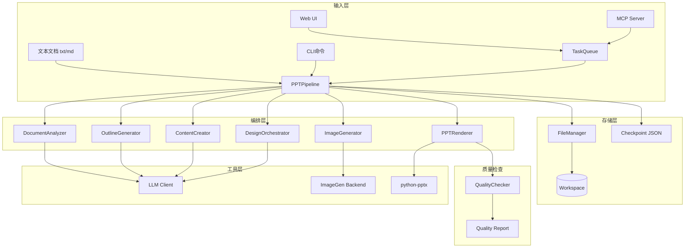

# AI 自动生成 PPT - 设计文档

## 1. 系统架构

### 1.1 整体架构图



### 1.2 模块职责

| 模块 | 职责 | 输入 | 输出 |
|------|------|------|------|
| **PPTPipeline** | 流水线编排，checkpoint 管理 | 文本、配置 | 最终 .pptx 文件 |
| **DocumentAnalyzer** | 分析文档主题、结构、受众 | 原始文本 | 分析结果 JSON |
| **OutlineGenerator** | 生成 PPT 大纲（页数、布局、要点） | 分析结果 + 文本 | 大纲 JSON |
| **ContentCreator** | 为每页生成精炼文案 | 大纲 + 原始文本 | 页面内容 JSON |
| **DesignOrchestrator** | 为每页分配布局、配色、装饰元素 | 页面内容 + 主题 | 设计方案 JSON |
| **ImageGenerator** | 生成配图 | 图片需求列表 | 图片文件 + 路径映射 |
| **PPTRenderer** | 渲染最终 .pptx 文件 | 完整页面数据 | .pptx 文件 |
| **QualityChecker** | 检查排版问题并修复 | 渲染后的 PPT 数据 | 质量报告 + 修复后数据 |
| **FileManager** | 管理 workspace 文件结构 | 项目 ID | 文件路径 |
| **ThemeManager** | 加载和应用主题配置 | 主题名称 | ThemeConfig 对象 |

---

## 2. 数据模型（Pydantic）

### 2.1 核心数据模型

```python
from pydantic import BaseModel, Field
from enum import Enum
from typing import Literal

class DocumentType(str, Enum):
    """文档类型枚举"""
    BUSINESS_REPORT = "business_report"
    PRODUCT_INTRO = "product_intro"
    TECH_SHARE = "tech_share"
    TEACHING = "teaching"
    CREATIVE_PITCH = "creative_pitch"
    OTHER = "other"

class Audience(str, Enum):
    """受众类型"""
    BUSINESS = "business"
    TECHNICAL = "technical"
    EDUCATIONAL = "educational"
    CREATIVE = "creative"
    GENERAL = "general"

class Tone(str, Enum):
    """语言风格"""
    PROFESSIONAL = "professional"  # 专业正式
    CASUAL = "casual"              # 轻松随意
    CREATIVE = "creative"          # 创意活泼
    TECHNICAL = "technical"        # 技术严谨
    WARM = "warm"                  # 温暖亲切

class LayoutType(str, Enum):
    """布局类型"""
    TITLE_HERO = "title_hero"                   # 封面页
    SECTION_DIVIDER = "section_divider"         # 章节分隔
    TEXT_LEFT_IMAGE_RIGHT = "text_left_image_right"
    IMAGE_LEFT_TEXT_RIGHT = "image_left_text_right"
    FULL_IMAGE_OVERLAY = "full_image_overlay"
    THREE_COLUMNS = "three_columns"
    QUOTE_PAGE = "quote_page"
    DATA_HIGHLIGHT = "data_highlight"
    TIMELINE = "timeline"
    BULLET_WITH_ICONS = "bullet_with_icons"
    COMPARISON = "comparison"
    CLOSING = "closing"

class DocumentAnalysis(BaseModel):
    """阶段1：文档分析结果"""
    theme: str = Field(..., description="核心主题（1-2句话）")
    doc_type: DocumentType
    audience: Audience
    tone: Tone
    key_points: list[str] = Field(..., description="核心要点列表")
    has_sections: bool = Field(False, description="是否有明确章节")
    has_data: bool = Field(False, description="是否包含数据/表格")
    has_quotes: bool = Field(False, description="是否有引用内容")
    estimated_pages: int = Field(..., ge=5, le=50, description="建议页数")

class SlideContent(BaseModel):
    """页面内容（阶段3输出）"""
    title: str = Field(..., max_length=50, description="页面标题")
    subtitle: str | None = Field(None, max_length=100, description="副标题（可选）")
    bullet_points: list[str] = Field(default_factory=list, description="要点列表，每条≤30字")
    body_text: str | None = Field(None, description="段落文本（某些布局用）")
    speaker_notes: str = Field("", description="演讲备注")
    data_value: str | None = Field(None, description="数据高亮值（如'30%'）")
    data_label: str | None = Field(None, description="数据说明文字")

class ColorScheme(BaseModel):
    """配色方案"""
    primary: str = Field(..., pattern=r"^#[0-9A-Fa-f]{6}$")
    secondary: str = Field(..., pattern=r"^#[0-9A-Fa-f]{6}$")
    accent: str = Field(..., pattern=r"^#[0-9A-Fa-f]{6}$")
    text: str = Field(..., pattern=r"^#[0-9A-Fa-f]{6}$")
    background: str = Field(default="#FFFFFF", pattern=r"^#[0-9A-Fa-f]{6}$")

class FontSpec(BaseModel):
    """字体规格"""
    size: int = Field(..., ge=10, le=72)
    bold: bool = False
    italic: bool = False
    color: str = Field(..., pattern=r"^#[0-9A-Fa-f]{6}$")
    family: str = Field(default="微软雅黑")

class DecorationSpec(BaseModel):
    """装饰元素规格"""
    has_divider: bool = False
    divider_color: str | None = None
    divider_width: int = Field(default=2, ge=1, le=5)
    has_background_shape: bool = False
    shape_type: Literal["rectangle", "circle", "gradient"] | None = None
    shape_color: str | None = None
    shape_opacity: float = Field(default=0.2, ge=0.0, le=1.0)

class SlideDesign(BaseModel):
    """页面设计方案（阶段4输出）"""
    layout: LayoutType
    colors: ColorScheme
    title_font: FontSpec
    body_font: FontSpec
    note_font: FontSpec
    decoration: DecorationSpec
    padding: dict[str, int] = Field(
        default={"left": 80, "right": 80, "top": 60, "bottom": 60},
        description="页边距（像素）"
    )

class ImageRequest(BaseModel):
    """图片生成请求"""
    page_number: int
    prompt: str = Field(..., description="英文 prompt")
    size: Literal["landscape", "portrait", "square"] = "landscape"
    style: str = Field(..., description="风格标签，如 'abstract_business'")

class SlideSpec(BaseModel):
    """完整页面规格（汇总阶段1-5）"""
    page_number: int = Field(..., ge=1)
    content: SlideContent
    design: SlideDesign
    needs_image: bool = False
    image_request: ImageRequest | None = None
    image_path: str | None = Field(None, description="生成后的图片路径")

class PPTOutline(BaseModel):
    """阶段2：PPT 大纲"""
    total_pages: int = Field(..., ge=5, le=50)
    estimated_duration: str = Field(..., description="预计演讲时长，如'8-10分钟'")
    slides: list[SlideSpec]

class PPTProject(BaseModel):
    """PPT 项目元数据"""
    project_id: str
    input_text: str
    theme: str = Field("modern", description="主题名称")
    max_pages: int = Field(20, ge=5, le=50)
    brand_template: dict | None = None
    status: Literal["analyzing", "outlining", "writing", "designing", "imaging", "rendering", "completed", "failed"] = "analyzing"
    current_stage: str = "文档分析"
    progress: float = Field(0.0, ge=0.0, le=1.0)
    analysis: DocumentAnalysis | None = None
    outline: PPTOutline | None = None
    output_path: str | None = None
    quality_report: dict | None = None
    errors: list[str] = Field(default_factory=list)

class ThemeConfig(BaseModel):
    """主题配置（预设或品牌模板）"""
    name: str
    colors: ColorScheme
    title_font: FontSpec
    body_font: FontSpec
    note_font: FontSpec
    layout_preferences: dict = Field(
        default_factory=lambda: {
            "max_bullet_points": 5,
            "prefer_images": True,
            "allow_full_image": True
        }
    )
    decoration_defaults: DecorationSpec = Field(default_factory=DecorationSpec)
    brand_logo: str | None = Field(None, description="Logo 图片路径")
    footer_text: str | None = None
```

---

## 3. Pipeline 设计

### 3.1 PPTPipeline 类

```python
class PPTPipeline:
    """PPT 生成流水线 - 编排 6 个阶段的执行"""

    def __init__(
        self,
        config: dict | None = None,
        workspace: str = "workspace",
    ):
        self.config = config or load_config()
        self.workspace = workspace
        self.file_manager = FileManager(workspace)
        self.llm = create_llm_client(config.get("llm", {}))
        self.image_gen = create_image_generator(config.get("imagegen", {}))
        self.theme_manager = ThemeManager()

    def generate(
        self,
        input_text: str,
        theme: str = "modern",
        max_pages: int = 20,
        brand_template: dict | None = None,
        progress_callback: Callable[[float, str], None] | None = None,
    ) -> PPTProject:
        """主流程：6 阶段生成"""
        project_id = f"ppt_{uuid.uuid4().hex[:8]}"

        # 初始化项目
        project = PPTProject(
            project_id=project_id,
            input_text=input_text,
            theme=theme,
            max_pages=max_pages,
            brand_template=brand_template,
        )

        try:
            # 阶段 1: 文档分析
            project = self._stage_1_analyze(project, progress_callback)
            self._save_checkpoint(project)

            # 阶段 2: 大纲生成
            project = self._stage_2_outline(project, progress_callback)
            self._save_checkpoint(project)

            # 阶段 3: 内容创作
            project = self._stage_3_content(project, progress_callback)
            self._save_checkpoint(project)

            # 阶段 4: 设计编排
            project = self._stage_4_design(project, progress_callback)
            self._save_checkpoint(project)

            # 阶段 5: 配图生成
            project = self._stage_5_imaging(project, progress_callback)
            self._save_checkpoint(project)

            # 阶段 6: PPT 渲染
            project = self._stage_6_render(project, progress_callback)
            self._save_checkpoint(project)

            project.status = "completed"
            project.current_stage = "完成"
            project.progress = 1.0

        except Exception as e:
            log.error(f"生成失败: {e}")
            project.status = "failed"
            project.errors.append(str(e))
            self._save_checkpoint(project)
            raise

        return project

    def resume(self, project_id: str) -> PPTProject:
        """断点续传"""
        project = self._load_checkpoint(project_id)
        if project is None:
            raise FileNotFoundError(f"找不到项目: {project_id}")

        # 根据 status 决定从哪个阶段继续
        stage_map = {
            "analyzing": self._stage_1_analyze,
            "outlining": self._stage_2_outline,
            "writing": self._stage_3_content,
            "designing": self._stage_4_design,
            "imaging": self._stage_5_imaging,
            "rendering": self._stage_6_render,
        }

        # 执行剩余阶段
        # ...（省略实现细节）

        return project

    # ------------------------------------------------------------------
    # 6 个阶段的实现
    # ------------------------------------------------------------------

    def _stage_1_analyze(
        self,
        project: PPTProject,
        progress_callback: Callable | None,
    ) -> PPTProject:
        """阶段1：文档分析"""
        project.status = "analyzing"
        project.current_stage = "文档分析"
        if progress_callback:
            progress_callback(0.05, "正在分析文档...")

        analyzer = DocumentAnalyzer(self.llm)
        analysis = analyzer.analyze(project.input_text)
        project.analysis = analysis

        if progress_callback:
            progress_callback(0.15, "文档分析完成")

        return project

    def _stage_2_outline(
        self,
        project: PPTProject,
        progress_callback: Callable | None,
    ) -> PPTProject:
        """阶段2：大纲生成"""
        project.status = "outlining"
        project.current_stage = "生成大纲"
        if progress_callback:
            progress_callback(0.20, "正在生成 PPT 大纲...")

        generator = OutlineGenerator(self.llm)
        outline = generator.generate(
            text=project.input_text,
            analysis=project.analysis,
            max_pages=project.max_pages,
        )
        project.outline = outline

        if progress_callback:
            progress_callback(0.35, f"大纲生成完成（共{outline.total_pages}页）")

        return project

    def _stage_3_content(
        self,
        project: PPTProject,
        progress_callback: Callable | None,
    ) -> PPTProject:
        """阶段3：内容创作"""
        project.status = "writing"
        project.current_stage = "创作内容"

        creator = ContentCreator(self.llm)
        total = len(project.outline.slides)

        for idx, slide_spec in enumerate(project.outline.slides):
            if progress_callback:
                pct = 0.35 + 0.15 * (idx / total)
                progress_callback(pct, f"正在创作第{idx+1}/{total}页内容...")

            # 为每页生成内容
            content = creator.create(
                page_number=slide_spec.page_number,
                layout=slide_spec.design.layout,
                source_text=project.input_text,
                analysis=project.analysis,
                tone=project.analysis.tone,
            )
            slide_spec.content = content

        if progress_callback:
            progress_callback(0.50, "内容创作完成")

        return project

    def _stage_4_design(
        self,
        project: PPTProject,
        progress_callback: Callable | None,
    ) -> PPTProject:
        """阶段4：设计编排"""
        project.status = "designing"
        project.current_stage = "设计编排"
        if progress_callback:
            progress_callback(0.55, "正在设计排版...")

        # 加载主题配置
        theme_config = self.theme_manager.load_theme(
            project.theme,
            brand_template=project.brand_template,
        )

        orchestrator = DesignOrchestrator(self.llm, theme_config)
        orchestrator.orchestrate(project.outline.slides)

        if progress_callback:
            progress_callback(0.65, "设计编排完成")

        return project

    def _stage_5_imaging(
        self,
        project: PPTProject,
        progress_callback: Callable | None,
    ) -> PPTProject:
        """阶段5：配图生成"""
        project.status = "imaging"
        project.current_stage = "生成配图"

        # 收集所有需要图片的页面
        image_requests = [
            slide.image_request
            for slide in project.outline.slides
            if slide.needs_image and slide.image_request
        ]

        if not image_requests:
            if progress_callback:
                progress_callback(0.80, "无需配图，跳过")
            return project

        # 并行生成图片（最多3张同时）
        from concurrent.futures import ThreadPoolExecutor, as_completed

        image_dir = self.file_manager.get_image_dir(project.project_id)
        total = len(image_requests)
        completed = 0

        with ThreadPoolExecutor(max_workers=3) as executor:
            futures = {
                executor.submit(
                    self._generate_image,
                    req,
                    image_dir,
                ): req
                for req in image_requests
            }

            for future in as_completed(futures):
                req = futures[future]
                try:
                    image_path = future.result()
                    # 更新 slide_spec
                    for slide in project.outline.slides:
                        if slide.page_number == req.page_number:
                            slide.image_path = image_path
                            break
                    completed += 1
                    if progress_callback:
                        pct = 0.65 + 0.15 * (completed / total)
                        progress_callback(pct, f"已生成 {completed}/{total} 张配图")
                except Exception as e:
                    log.error(f"第{req.page_number}页配图生成失败: {e}")
                    project.errors.append(f"第{req.page_number}页配图失败")
                    # 用占位块替代（在渲染阶段处理）

        if progress_callback:
            progress_callback(0.80, "配图生成完成")

        return project

    def _stage_6_render(
        self,
        project: PPTProject,
        progress_callback: Callable | None,
    ) -> PPTProject:
        """阶段6：PPT 渲染"""
        project.status = "rendering"
        project.current_stage = "渲染 PPT"
        if progress_callback:
            progress_callback(0.85, "正在渲染 PPT 文件...")

        renderer = PPTRenderer()
        output_path = self.file_manager.get_output_path(project.project_id)

        prs = renderer.render(
            slides=project.outline.slides,
            theme_config=self.theme_manager.load_theme(project.theme),
            output_path=output_path,
        )

        project.output_path = str(output_path)

        # 质量检查
        if progress_callback:
            progress_callback(0.95, "质量检查中...")

        checker = QualityChecker()
        quality_report = checker.check(prs, project.outline.slides)
        project.quality_report = quality_report

        # 如果有问题，尝试修复
        if quality_report.get("issues"):
            log.info(f"发现 {len(quality_report['issues'])} 个问题，尝试修复...")
            prs = checker.fix(prs, quality_report)
            prs.save(output_path)

        if progress_callback:
            progress_callback(1.0, "生成完成!")

        return project

    # ------------------------------------------------------------------
    # 辅助方法
    # ------------------------------------------------------------------

    def _generate_image(
        self,
        req: ImageRequest,
        image_dir: Path,
    ) -> str:
        """生成单张图片"""
        size_map = {
            "landscape": (1920, 1080),
            "portrait": (1080, 1920),
            "square": (1024, 1024),
        }

        # 调用 ImageGenerator
        img = self.image_gen.generate(req.prompt)

        # 调整尺寸
        target_size = size_map[req.size]
        img = img.resize(target_size, Image.Resampling.LANCZOS)

        # 保存
        image_path = image_dir / f"slide_{req.page_number}.png"
        img.save(image_path)

        return str(image_path)

    def _save_checkpoint(self, project: PPTProject) -> None:
        """保存检查点"""
        ckpt_path = self.file_manager.get_checkpoint_path(project.project_id)
        ckpt_path.parent.mkdir(parents=True, exist_ok=True)
        with open(ckpt_path, "w", encoding="utf-8") as f:
            f.write(project.model_dump_json(indent=2, exclude_none=True))

    def _load_checkpoint(self, project_id: str) -> PPTProject | None:
        """加载检查点"""
        ckpt_path = self.file_manager.get_checkpoint_path(project_id)
        if not ckpt_path.exists():
            return None
        with open(ckpt_path, encoding="utf-8") as f:
            data = json.load(f)
        return PPTProject(**data)
```

---

## 4. 各模块接口定义

### 4.1 DocumentAnalyzer

```python
class DocumentAnalyzer:
    """文档分析器 - 阶段1"""

    def __init__(self, llm: LLMClient):
        self.llm = llm

    def analyze(self, text: str) -> DocumentAnalysis:
        """分析文档，返回结构化分析结果"""
        prompt = f"""
你是一位专业的文档分析师。请深入分析以下文档，提取关键信息。

文档内容：
{text[:5000]}  # 取前5000字，避免超长

请以 JSON 格式返回分析结果：
{{
  "theme": "核心主题（1-2句话）",
  "doc_type": "文档类型（business_report/product_intro/tech_share/teaching/creative_pitch/other）",
  "audience": "目标受众（business/technical/educational/creative/general）",
  "tone": "语言风格（professional/casual/creative/technical/warm）",
  "key_points": ["要点1", "要点2", "要点3"],
  "has_sections": true/false,
  "has_data": true/false,
  "has_quotes": true/false,
  "estimated_pages": 15
}}
"""

        messages = [{"role": "user", "content": prompt}]
        response = self.llm.chat(messages, temperature=0.3, json_mode=True)

        # 解析 JSON
        data = json.loads(response.content)
        return DocumentAnalysis(**data)
```

### 4.2 OutlineGenerator

```python
class OutlineGenerator:
    """大纲生成器 - 阶段2"""

    def __init__(self, llm: LLMClient):
        self.llm = llm

    def generate(
        self,
        text: str,
        analysis: DocumentAnalysis,
        max_pages: int,
    ) -> PPTOutline:
        """生成 PPT 大纲"""

        # 布局分配策略
        layout_pool = self._build_layout_pool(analysis)

        prompt = f"""
你是一位专业的 PPT 结构设计师。请为以下文档生成 PPT 大纲。

文档主题：{analysis.theme}
文档类型：{analysis.doc_type}
目标受众：{analysis.audience}
语言风格：{analysis.tone}
核心要点：{', '.join(analysis.key_points)}

原文内容：
{text[:8000]}

要求：
1. 总页数在 8-{max_pages} 页之间
2. 必须有封面页和结束页
3. 布局多样性：同一 PPT 中不能连续 3 页使用相同布局
4. 节奏感：文字密集页 → 图片页 → 数据页交替
5. 可用布局类型：{', '.join([lt.value for lt in LayoutType])}
6. 每页标题不超过 15 字，要点 3-5 个，每条不超过 30 字

请以 JSON 格式返回大纲：
{{
  "total_pages": 15,
  "estimated_duration": "8-10分钟",
  "slides": [
    {{
      "page_number": 1,
      "layout": "title_hero",
      "title": "标题",
      "subtitle": "副标题",
      "needs_image": true,
      "image_style": "abstract_business"
    }},
    ...
  ]
}}
"""

        messages = [{"role": "user", "content": prompt}]
        response = self.llm.chat(
            messages,
            temperature=0.5,
            json_mode=True,
            max_tokens=8192,  # 大纲可能很长
        )

        data = json.loads(response.content)

        # 构建 SlideSpec 列表
        slides = []
        for s in data["slides"]:
            slide_spec = SlideSpec(
                page_number=s["page_number"],
                content=SlideContent(title=s["title"], subtitle=s.get("subtitle")),
                design=SlideDesign(
                    layout=LayoutType(s["layout"]),
                    colors=ColorScheme(primary="#000000", secondary="#000000", accent="#000000", text="#000000"),  # 占位，阶段4填充
                    title_font=FontSpec(size=32, color="#000000"),
                    body_font=FontSpec(size=20, color="#000000"),
                    note_font=FontSpec(size=14, color="#000000"),
                    decoration=DecorationSpec(),
                ),
                needs_image=s.get("needs_image", False),
                image_request=ImageRequest(
                    page_number=s["page_number"],
                    prompt="",  # 阶段3/4填充
                    style=s.get("image_style", "abstract"),
                ) if s.get("needs_image") else None,
            )
            slides.append(slide_spec)

        return PPTOutline(
            total_pages=data["total_pages"],
            estimated_duration=data["estimated_duration"],
            slides=slides,
        )

    def _build_layout_pool(self, analysis: DocumentAnalysis) -> list[LayoutType]:
        """根据文档类型构建布局池（权重分配）"""
        # 不同文档类型偏好不同布局
        # 例如：business_report 多用 text_left_image_right、data_highlight
        # tech_share 多用 bullet_with_icons、comparison
        # ...（省略实现细节）
        pass
```

### 4.3 ContentCreator

```python
class ContentCreator:
    """内容创作器 - 阶段3"""

    def __init__(self, llm: LLMClient):
        self.llm = llm
        self.ai_flavor_blacklist = self._load_blacklist()

    def create(
        self,
        page_number: int,
        layout: LayoutType,
        source_text: str,
        analysis: DocumentAnalysis,
        tone: Tone,
    ) -> SlideContent:
        """为单页生成内容"""

        # 根据布局类型调整 prompt
        if layout == LayoutType.TITLE_HERO:
            return self._create_title_page(source_text, analysis)
        elif layout == LayoutType.DATA_HIGHLIGHT:
            return self._create_data_page(source_text, page_number)
        elif layout == LayoutType.QUOTE_PAGE:
            return self._create_quote_page(source_text, page_number)
        else:
            return self._create_content_page(source_text, page_number, layout, tone)

    def _create_content_page(
        self,
        source_text: str,
        page_number: int,
        layout: LayoutType,
        tone: Tone,
    ) -> SlideContent:
        """创作普通内容页"""

        # 提取与当前页相关的文本片段
        relevant_chunk = self._extract_relevant_chunk(source_text, page_number)

        prompt = f"""
你是一位专业的 PPT 内容撰写师。请为以下内容生成一页 PPT 的文案。

原文片段：
{relevant_chunk}

页面编号：{page_number}
布局类型：{layout.value}
语言风格：{tone.value}

要求：
1. 标题：简洁有力，不超过 15 个汉字
2. 要点：3-5 个，每条不超过 30 字
3. 避免"AI 味"：
   - 不用"赋能"、"闭环"、"抓手"等空洞词汇
   - 不用"首先、其次、最后"等刻板结构（至少一半打破）
   - 数据具体化：不说"显著增长"，而是"增长 30%"
   - 语言有温度：不是"用户痛点"，而是"用户最头疼的是"
4. 演讲备注：200-300 字，为演讲者提供详细解说词

禁用词汇列表：{', '.join(self.ai_flavor_blacklist)}

请以 JSON 格式返回：
{{
  "title": "页面标题",
  "bullet_points": ["要点1", "要点2", "要点3"],
  "speaker_notes": "演讲备注..."
}}
"""

        messages = [{"role": "user", "content": prompt}]
        response = self.llm.chat(messages, temperature=0.7, json_mode=True)

        data = json.loads(response.content)
        return SlideContent(**data)

    def _load_blacklist(self) -> list[str]:
        """加载 AI 味黑名单"""
        return [
            "赋能", "闭环", "抓手", "生态", "矩阵", "链路", "场域",
            "底层逻辑", "顶层设计", "降维打击", "组合拳", "一盘棋",
            "首先、其次、最后", "综上所述", "显著", "大幅", "极大地",
        ]

    def _extract_relevant_chunk(self, text: str, page_number: int) -> str:
        """提取与当前页相关的文本片段（简单分段）"""
        # 按段落分割，取对应部分
        # 更复杂的实现可以用 BM25 检索
        paragraphs = text.split("\n\n")
        total = len(paragraphs)
        chunk_size = max(1, total // 15)  # 假设15页
        start_idx = (page_number - 1) * chunk_size
        end_idx = start_idx + chunk_size
        chunk = "\n\n".join(paragraphs[start_idx:end_idx])
        return chunk[:2000]  # 最多2000字
```

### 4.4 DesignOrchestrator

```python
class DesignOrchestrator:
    """设计编排器 - 阶段4"""

    def __init__(self, llm: LLMClient, theme_config: ThemeConfig):
        self.llm = llm
        self.theme_config = theme_config

    def orchestrate(self, slides: list[SlideSpec]) -> None:
        """为所有页面分配设计方案（in-place 修改）"""

        # 全局配色（从主题配置获取）
        base_colors = self.theme_config.colors

        # 确保布局多样性
        self._ensure_layout_diversity(slides)

        # 为每页分配设计
        for slide in slides:
            slide.design.colors = base_colors
            slide.design.title_font = self.theme_config.title_font
            slide.design.body_font = self.theme_config.body_font
            slide.design.note_font = self.theme_config.note_font

            # 根据布局类型调整装饰元素
            slide.design.decoration = self._design_decoration(slide.design.layout)

            # 生成图片 prompt（如果需要）
            if slide.needs_image and slide.image_request:
                slide.image_request.prompt = self._generate_image_prompt(
                    slide.content,
                    slide.design.layout,
                    slide.image_request.style,
                )

    def _ensure_layout_diversity(self, slides: list[SlideSpec]) -> None:
        """确保不连续 3 页使用相同布局"""
        for i in range(len(slides) - 2):
            layout1 = slides[i].design.layout
            layout2 = slides[i+1].design.layout
            layout3 = slides[i+2].design.layout

            if layout1 == layout2 == layout3:
                # 替换第3页的布局
                alternative_layouts = [
                    lt for lt in LayoutType
                    if lt != layout1 and lt not in [LayoutType.TITLE_HERO, LayoutType.CLOSING]
                ]
                slides[i+2].design.layout = random.choice(alternative_layouts)
                log.info(f"调整第{i+3}页布局，避免连续重复")

    def _design_decoration(self, layout: LayoutType) -> DecorationSpec:
        """根据布局类型设计装饰元素"""
        if layout == LayoutType.SECTION_DIVIDER:
            return DecorationSpec(
                has_divider=True,
                divider_color=self.theme_config.colors.accent,
                divider_width=3,
                has_background_shape=True,
                shape_type="gradient",
                shape_color=self.theme_config.colors.primary,
                shape_opacity=0.1,
            )
        elif layout == LayoutType.QUOTE_PAGE:
            return DecorationSpec(
                has_background_shape=True,
                shape_type="rectangle",
                shape_color=self.theme_config.colors.secondary,
                shape_opacity=0.15,
            )
        else:
            return self.theme_config.decoration_defaults

    def _generate_image_prompt(
        self,
        content: SlideContent,
        layout: LayoutType,
        style: str,
    ) -> str:
        """生成图片 prompt（英文）"""

        # 提取关键词
        keywords = f"{content.title} {' '.join(content.bullet_points)}"

        prompt_template = f"""
根据以下内容生成一张图片的英文 prompt：

页面标题：{content.title}
要点：{', '.join(content.bullet_points)}
风格：{style}

要求：
1. Prompt 用英文，长度 50-100 词
2. 风格后缀：minimalist, clean background, professional photography style, high quality, 4K
3. 色调控制：color palette: {self.theme_config.colors.primary} and {self.theme_config.colors.secondary}
4. 构图：根据布局类型 {layout.value} 选择合适的构图

仅返回 prompt 文本，不要额外解释。
"""

        messages = [{"role": "user", "content": prompt_template}]
        response = self.llm.chat(messages, temperature=0.6, max_tokens=200)

        return response.content.strip()
```

### 4.5 PPTRenderer

```python
from pptx import Presentation
from pptx.util import Inches, Pt
from pptx.enum.text import PP_ALIGN

class PPTRenderer:
    """PPT 渲染器 - 阶段6"""

    def __init__(self):
        self.prs = None
        self.slide_width = Inches(10)   # 16:9 宽屏
        self.slide_height = Inches(5.625)

    def render(
        self,
        slides: list[SlideSpec],
        theme_config: ThemeConfig,
        output_path: Path,
    ) -> Presentation:
        """渲染所有页面并保存"""

        # 创建空白演示文稿
        self.prs = Presentation()
        self.prs.slide_width = self.slide_width
        self.prs.slide_height = self.slide_height

        # 逐页渲染
        for slide_spec in slides:
            self._render_slide(slide_spec, theme_config)

        # 保存
        self.prs.save(output_path)
        log.info(f"PPT 已保存: {output_path}")

        return self.prs

    def _render_slide(self, spec: SlideSpec, theme_config: ThemeConfig) -> None:
        """渲染单页"""

        layout_renderers = {
            LayoutType.TITLE_HERO: self._render_title_hero,
            LayoutType.SECTION_DIVIDER: self._render_section_divider,
            LayoutType.TEXT_LEFT_IMAGE_RIGHT: self._render_text_left_image_right,
            LayoutType.IMAGE_LEFT_TEXT_RIGHT: self._render_image_left_text_right,
            LayoutType.FULL_IMAGE_OVERLAY: self._render_full_image_overlay,
            LayoutType.THREE_COLUMNS: self._render_three_columns,
            LayoutType.QUOTE_PAGE: self._render_quote_page,
            LayoutType.DATA_HIGHLIGHT: self._render_data_highlight,
            LayoutType.TIMELINE: self._render_timeline,
            LayoutType.BULLET_WITH_ICONS: self._render_bullet_with_icons,
            LayoutType.COMPARISON: self._render_comparison,
            LayoutType.CLOSING: self._render_closing,
        }

        renderer = layout_renderers.get(spec.design.layout)
        if renderer:
            renderer(spec, theme_config)
        else:
            log.warning(f"未知布局类型: {spec.design.layout}")
            self._render_fallback(spec)

    def _render_title_hero(self, spec: SlideSpec, theme_config: ThemeConfig) -> None:
        """渲染封面页"""
        slide = self.prs.slides.add_slide(self.prs.slide_layouts[6])  # 空白布局

        # 背景图（如果有）
        if spec.image_path and Path(spec.image_path).exists():
            self._add_background_image(slide, spec.image_path)

        # 标题（大字，居中上方）
        title_box = slide.shapes.add_textbox(
            Inches(1), Inches(1.5), Inches(8), Inches(1)
        )
        title_frame = title_box.text_frame
        title_frame.text = spec.content.title
        title_para = title_frame.paragraphs[0]
        title_para.font.size = Pt(spec.design.title_font.size)
        title_para.font.bold = spec.design.title_font.bold
        title_para.font.color.rgb = self._parse_color(spec.design.title_font.color)
        title_para.alignment = PP_ALIGN.CENTER

        # 副标题（中字，居中下方）
        if spec.content.subtitle:
            subtitle_box = slide.shapes.add_textbox(
                Inches(1), Inches(2.8), Inches(8), Inches(0.6)
            )
            subtitle_frame = subtitle_box.text_frame
            subtitle_frame.text = spec.content.subtitle
            subtitle_para = subtitle_frame.paragraphs[0]
            subtitle_para.font.size = Pt(24)
            subtitle_para.font.color.rgb = self._parse_color(spec.design.body_font.color)
            subtitle_para.alignment = PP_ALIGN.CENTER

        # 品牌 Logo（右上角）
        if theme_config.brand_logo and Path(theme_config.brand_logo).exists():
            slide.shapes.add_picture(
                theme_config.brand_logo,
                Inches(8.5), Inches(0.3), height=Inches(0.5)
            )

        # 演讲备注
        if spec.content.speaker_notes:
            slide.notes_slide.notes_text_frame.text = spec.content.speaker_notes

    def _render_text_left_image_right(self, spec: SlideSpec, theme_config: ThemeConfig) -> None:
        """渲染左文右图布局"""
        slide = self.prs.slides.add_slide(self.prs.slide_layouts[6])

        # 标题（顶部）
        title_box = slide.shapes.add_textbox(
            Inches(0.8), Inches(0.6), Inches(8.4), Inches(0.6)
        )
        self._set_text(title_box.text_frame, spec.content.title, spec.design.title_font)

        # 左侧文本区（60%）
        text_box = slide.shapes.add_textbox(
            Inches(0.8), Inches(1.5), Inches(5), Inches(3.5)
        )
        text_frame = text_box.text_frame
        for point in spec.content.bullet_points:
            para = text_frame.add_paragraph()
            para.text = f"• {point}"
            para.font.size = Pt(spec.design.body_font.size)
            para.font.color.rgb = self._parse_color(spec.design.body_font.color)
            para.level = 0

        # 右侧图片区（40%）
        if spec.image_path and Path(spec.image_path).exists():
            slide.shapes.add_picture(
                spec.image_path,
                Inches(6.2), Inches(1.5), width=Inches(3.3), height=Inches(3.5)
            )
        else:
            # 占位块
            placeholder = slide.shapes.add_shape(
                1,  # 矩形
                Inches(6.2), Inches(1.5), Inches(3.3), Inches(3.5)
            )
            placeholder.fill.solid()
            placeholder.fill.fore_color.rgb = self._parse_color(spec.design.colors.secondary)
            placeholder.line.color.rgb = self._parse_color(spec.design.colors.primary)

        # 装饰元素
        if spec.design.decoration.has_divider:
            self._add_divider(slide, spec.design.decoration)

        # 演讲备注
        if spec.content.speaker_notes:
            slide.notes_slide.notes_text_frame.text = spec.content.speaker_notes

    def _render_data_highlight(self, spec: SlideSpec, theme_config: ThemeConfig) -> None:
        """渲染数据突出展示布局"""
        slide = self.prs.slides.add_slide(self.prs.slide_layouts[6])

        # 标题
        title_box = slide.shapes.add_textbox(
            Inches(0.8), Inches(0.6), Inches(8.4), Inches(0.6)
        )
        self._set_text(title_box.text_frame, spec.content.title, spec.design.title_font)

        # 巨大数字（居中）
        if spec.content.data_value:
            data_box = slide.shapes.add_textbox(
                Inches(2), Inches(2), Inches(6), Inches(1.5)
            )
            data_frame = data_box.text_frame
            data_frame.text = spec.content.data_value
            data_para = data_frame.paragraphs[0]
            data_para.font.size = Pt(72)
            data_para.font.bold = True
            data_para.font.color.rgb = self._parse_color(spec.design.colors.accent)
            data_para.alignment = PP_ALIGN.CENTER

        # 数据说明（小字）
        if spec.content.data_label:
            label_box = slide.shapes.add_textbox(
                Inches(2), Inches(3.5), Inches(6), Inches(0.5)
            )
            label_frame = label_box.text_frame
            label_frame.text = spec.content.data_label
            label_para = label_frame.paragraphs[0]
            label_para.font.size = Pt(20)
            label_para.font.color.rgb = self._parse_color(spec.design.body_font.color)
            label_para.alignment = PP_ALIGN.CENTER

        # 演讲备注
        if spec.content.speaker_notes:
            slide.notes_slide.notes_text_frame.text = spec.content.speaker_notes

    # 其他布局渲染函数...（省略，结构类似）

    # ------------------------------------------------------------------
    # 辅助方法
    # ------------------------------------------------------------------

    def _set_text(self, text_frame, text: str, font_spec: FontSpec) -> None:
        """设置文本样式"""
        text_frame.text = text
        para = text_frame.paragraphs[0]
        para.font.size = Pt(font_spec.size)
        para.font.bold = font_spec.bold
        para.font.italic = font_spec.italic
        para.font.color.rgb = self._parse_color(font_spec.color)
        para.font.name = font_spec.family

    def _parse_color(self, hex_color: str):
        """解析 HEX 颜色为 RGBColor"""
        from pptx.dml.color import RGBColor
        hex_color = hex_color.lstrip("#")
        r, g, b = int(hex_color[0:2], 16), int(hex_color[2:4], 16), int(hex_color[4:6], 16)
        return RGBColor(r, g, b)

    def _add_background_image(self, slide, image_path: str) -> None:
        """添加背景图（全屏）"""
        slide.shapes.add_picture(
            image_path,
            Inches(0), Inches(0),
            width=self.slide_width,
            height=self.slide_height
        )

    def _add_divider(self, slide, decoration: DecorationSpec) -> None:
        """添加分割线"""
        line = slide.shapes.add_connector(
            1,  # 直线
            Inches(0.8), Inches(1.3), Inches(9.2), Inches(1.3)
        )
        line.line.color.rgb = self._parse_color(decoration.divider_color)
        line.line.width = Pt(decoration.divider_width)
```

### 4.6 QualityChecker

```python
class QualityChecker:
    """质量检查器 - 检测并修复排版问题"""

    def check(self, prs: Presentation, slides: list[SlideSpec]) -> dict:
        """检查 PPT 质量，返回报告"""
        issues = []

        for idx, slide in enumerate(prs.slides):
            slide_spec = slides[idx]

            # 检查文本溢出
            overflow = self._check_text_overflow(slide)
            if overflow:
                issues.append({
                    "page": idx + 1,
                    "type": "text_overflow",
                    "message": f"第{idx+1}页文本溢出",
                    "shapes": overflow,
                })

            # 检查元素重叠
            overlaps = self._check_overlaps(slide)
            if overlaps:
                issues.append({
                    "page": idx + 1,
                    "type": "overlap",
                    "message": f"第{idx+1}页元素重叠",
                    "pairs": overlaps,
                })

            # 检查对齐
            misaligned = self._check_alignment(slide)
            if misaligned:
                issues.append({
                    "page": idx + 1,
                    "type": "misalignment",
                    "message": f"第{idx+1}页元素未对齐",
                    "shapes": misaligned,
                })

            # 检查图片缺失
            if slide_spec.needs_image and not slide_spec.image_path:
                issues.append({
                    "page": idx + 1,
                    "type": "missing_image",
                    "message": f"第{idx+1}页配图缺失",
                })

        # 检查配色一致性
        color_issues = self._check_color_consistency(prs)
        issues.extend(color_issues)

        return {
            "total_issues": len(issues),
            "issues": issues,
            "summary": self._generate_summary(issues),
        }

    def fix(self, prs: Presentation, report: dict) -> Presentation:
        """尝试修复检测到的问题"""
        for issue in report["issues"]:
            if issue["type"] == "text_overflow":
                self._fix_text_overflow(prs, issue)
            elif issue["type"] == "overlap":
                self._fix_overlap(prs, issue)
            elif issue["type"] == "misalignment":
                self._fix_alignment(prs, issue)

        return prs

    def _check_text_overflow(self, slide) -> list[int]:
        """检测文本框是否溢出"""
        overflow_shapes = []
        for idx, shape in enumerate(slide.shapes):
            if shape.has_text_frame:
                # python-pptx 没有直接的溢出检测，使用启发式判断
                text_len = len(shape.text_frame.text)
                box_area = shape.width * shape.height
                # 假设每个字符需要 1000 EMU^2（经验值）
                estimated_area = text_len * 1000
                if estimated_area > box_area:
                    overflow_shapes.append(idx)
        return overflow_shapes

    def _fix_text_overflow(self, prs: Presentation, issue: dict) -> None:
        """修复文本溢出：缩小字号"""
        slide = prs.slides[issue["page"] - 1]
        for shape_idx in issue["shapes"]:
            shape = slide.shapes[shape_idx]
            if shape.has_text_frame:
                for para in shape.text_frame.paragraphs:
                    if para.font.size and para.font.size > Pt(14):
                        para.font.size = Pt(para.font.size.pt - 2)
                log.info(f"第{issue['page']}页文本框{shape_idx}字号已缩小")

    def _check_overlaps(self, slide) -> list[tuple[int, int]]:
        """检测元素重叠"""
        overlaps = []
        shapes_list = list(slide.shapes)
        for i in range(len(shapes_list)):
            for j in range(i + 1, len(shapes_list)):
                if self._is_overlapping(shapes_list[i], shapes_list[j]):
                    overlaps.append((i, j))
        return overlaps

    def _is_overlapping(self, shape1, shape2) -> bool:
        """判断两个形状是否重叠"""
        x1, y1, w1, h1 = shape1.left, shape1.top, shape1.width, shape1.height
        x2, y2, w2, h2 = shape2.left, shape2.top, shape2.width, shape2.height

        # 矩形重叠判断
        return not (x1 + w1 < x2 or x2 + w2 < x1 or y1 + h1 < y2 or y2 + h2 < y1)

    def _check_alignment(self, slide) -> list[int]:
        """检测元素是否对齐（8px 网格）"""
        grid = Inches(0.1)  # 8px ≈ 0.1 inch
        misaligned = []
        for idx, shape in enumerate(slide.shapes):
            if shape.left % grid > Inches(0.01):  # 容差
                misaligned.append(idx)
        return misaligned

    def _check_color_consistency(self, prs: Presentation) -> list[dict]:
        """检测配色一致性（暂不自动修复）"""
        # 统计所有页面使用的颜色
        colors_used = set()
        for slide in prs.slides:
            for shape in slide.shapes:
                if shape.has_text_frame:
                    for para in shape.text_frame.paragraphs:
                        if para.font.color.type == 1:  # RGB
                            colors_used.add(para.font.color.rgb)

        # 如果颜色种类过多（>10种），警告
        if len(colors_used) > 10:
            return [{
                "page": 0,
                "type": "color_inconsistency",
                "message": f"全篇使用了{len(colors_used)}种颜色，可能不够统一",
            }]
        return []

    def _generate_summary(self, issues: list[dict]) -> str:
        """生成问题摘要"""
        if not issues:
            return "✅ 质量检查通过，未发现问题"

        type_counts = {}
        for issue in issues:
            t = issue["type"]
            type_counts[t] = type_counts.get(t, 0) + 1

        summary = f"⚠️ 发现 {len(issues)} 个问题：\n"
        for t, count in type_counts.items():
            summary += f"  - {t}: {count}个\n"
        return summary
```

---

## 5. JSON 中间格式 Schema

所有阶段的数据都使用 Pydantic 模型，可序列化为 JSON 保存在 checkpoint 中。

### 5.1 Checkpoint 文件结构

```json
{
  "project_id": "ppt_abc12345",
  "input_text": "原始文档内容...",
  "theme": "modern",
  "max_pages": 20,
  "brand_template": null,
  "status": "imaging",
  "current_stage": "生成配图",
  "progress": 0.72,
  "analysis": {
    "theme": "产品市场分析报告",
    "doc_type": "business_report",
    "audience": "business",
    "tone": "professional",
    "key_points": ["市场规模增长30%", "竞争对手分析"],
    "has_sections": true,
    "has_data": true,
    "has_quotes": false,
    "estimated_pages": 15
  },
  "outline": {
    "total_pages": 15,
    "estimated_duration": "8-10分钟",
    "slides": [
      {
        "page_number": 1,
        "content": {
          "title": "2024 年产品市场分析报告",
          "subtitle": "数据驱动的战略洞察",
          "bullet_points": [],
          "speaker_notes": "开场白..."
        },
        "design": {
          "layout": "title_hero",
          "colors": {
            "primary": "#1A237E",
            "secondary": "#00BCD4",
            "accent": "#FDD835",
            "text": "#424242",
            "background": "#FFFFFF"
          },
          "title_font": {"size": 44, "bold": true, "color": "#1A237E", "family": "微软雅黑"},
          "body_font": {"size": 20, "bold": false, "color": "#424242", "family": "微软雅黑"},
          "note_font": {"size": 14, "bold": false, "color": "#757575", "family": "微软雅黑"},
          "decoration": {
            "has_divider": false,
            "has_background_shape": false
          },
          "padding": {"left": 80, "right": 80, "top": 60, "bottom": 60}
        },
        "needs_image": true,
        "image_request": {
          "page_number": 1,
          "prompt": "abstract business growth concept, upward arrow, clean background, professional style, 4K",
          "size": "landscape",
          "style": "abstract_business"
        },
        "image_path": "workspace/ppt_abc12345/images/slide_1.png"
      }
      // ... 其他页面
    ]
  },
  "output_path": "workspace/ppt_abc12345/output.pptx",
  "quality_report": {
    "total_issues": 2,
    "issues": [
      {"page": 3, "type": "text_overflow", "message": "第3页文本溢出"}
    ],
    "summary": "⚠️ 发现 2 个问题..."
  },
  "errors": []
}
```

---

## 6. 主题/风格系统设计

### 6.1 ThemeManager

```python
class ThemeManager:
    """主题管理器 - 加载和应用主题配置"""

    def __init__(self):
        self.themes_dir = Path(__file__).parent / "themes"
        self.builtin_themes = self._load_builtin_themes()

    def load_theme(
        self,
        theme_name: str,
        brand_template: dict | None = None,
    ) -> ThemeConfig:
        """加载主题配置"""

        # 优先使用品牌模板
        if brand_template:
            return self._parse_brand_template(brand_template)

        # 使用内置主题
        if theme_name in self.builtin_themes:
            return self.builtin_themes[theme_name]

        # 从文件加载自定义主题
        theme_path = self.themes_dir / f"{theme_name}.yaml"
        if theme_path.exists():
            with open(theme_path, encoding="utf-8") as f:
                data = yaml.safe_load(f)
            return ThemeConfig(**data)

        # Fallback 到 modern
        log.warning(f"主题 {theme_name} 不存在，使用 modern")
        return self.builtin_themes["modern"]

    def _load_builtin_themes(self) -> dict[str, ThemeConfig]:
        """加载内置的 5 种主题"""
        return {
            "modern": ThemeConfig(
                name="modern",
                colors=ColorScheme(
                    primary="#1A237E",   # 深蓝
                    secondary="#FFD700",  # 金色
                    accent="#FDD835",    # 高亮黄
                    text="#424242",      # 深灰
                    background="#FFFFFF"
                ),
                title_font=FontSpec(size=44, bold=True, color="#1A237E", family="微软雅黑"),
                body_font=FontSpec(size=20, bold=False, color="#424242", family="微软雅黑"),
                note_font=FontSpec(size=14, bold=False, color="#757575", family="微软雅黑"),
                layout_preferences={
                    "max_bullet_points": 5,
                    "prefer_images": True,
                    "allow_full_image": True
                },
                decoration_defaults=DecorationSpec(
                    has_divider=True,
                    divider_color="#FFD700",
                    divider_width=2
                ),
            ),
            "business": ThemeConfig(
                name="business",
                colors=ColorScheme(
                    primary="#0D47A1",
                    secondary="#90CAF9",
                    accent="#1976D2",
                    text="#212121",
                    background="#FAFAFA"
                ),
                title_font=FontSpec(size=40, bold=True, color="#0D47A1"),
                body_font=FontSpec(size=18, bold=False, color="#212121"),
                note_font=FontSpec(size=12, bold=False, color="#757575"),
                layout_preferences={"max_bullet_points": 4, "prefer_images": False},
            ),
            "creative": ThemeConfig(
                name="creative",
                colors=ColorScheme(
                    primary="#E65100",  # 深橙
                    secondary="#FF6F61",  # 珊瑚红
                    accent="#FDD835",
                    text="#212121",
                    background="#FFFEF7"  # 米白
                ),
                title_font=FontSpec(size=48, bold=True, color="#E65100"),
                body_font=FontSpec(size=22, bold=False, color="#212121"),
                note_font=FontSpec(size=14, bold=False, color="#757575"),
                layout_preferences={"max_bullet_points": 3, "prefer_images": True},
            ),
            "tech": ThemeConfig(
                name="tech",
                colors=ColorScheme(
                    primary="#00E676",  # 霓虹绿
                    secondary="#00BCD4",  # 青色
                    accent="#FDD835",
                    text="#E0E0E0",  # 浅灰（暗色背景用）
                    background="#212121"  # 深色背景
                ),
                title_font=FontSpec(size=42, bold=True, color="#00E676"),
                body_font=FontSpec(size=18, bold=False, color="#E0E0E0", family="Consolas"),
                note_font=FontSpec(size=12, bold=False, color="#9E9E9E"),
                layout_preferences={"max_bullet_points": 5, "prefer_images": False},
            ),
            "education": ThemeConfig(
                name="education",
                colors=ColorScheme(
                    primary="#4CAF50",  # 绿色
                    secondary="#FF9800",  # 橙色
                    accent="#FFEB3B",
                    text="#424242",
                    background="#FAFAFA"
                ),
                title_font=FontSpec(size=38, bold=True, color="#4CAF50"),
                body_font=FontSpec(size=20, bold=False, color="#424242"),
                note_font=FontSpec(size=14, bold=False, color="#757575"),
                layout_preferences={"max_bullet_points": 5, "prefer_images": True},
            ),
        }

    def _parse_brand_template(self, template: dict) -> ThemeConfig:
        """解析品牌模板 YAML"""
        # 从 template 字典构建 ThemeConfig
        colors = ColorScheme(**template.get("colors", {}))
        fonts = template.get("fonts", {})

        return ThemeConfig(
            name=template.get("brand", {}).get("name", "custom"),
            colors=colors,
            title_font=FontSpec(size=40, bold=True, color=colors.primary, family=fonts.get("title", "微软雅黑")),
            body_font=FontSpec(size=20, bold=False, color=colors.text, family=fonts.get("body", "微软雅黑")),
            note_font=FontSpec(size=14, bold=False, color=colors.text, family=fonts.get("body", "微软雅黑")),
            layout_preferences=template.get("layout_preferences", {}),
            brand_logo=template.get("brand", {}).get("logo"),
            footer_text=template.get("footer", {}).get("text"),
        )
```

---

## 7. 与现有模块集成方案

### 7.1 LLM 集成

直接复用 `src/llm/llm_client.py`：
```python
from src.llm import create_llm_client, LLMClient, LLMResponse

llm = create_llm_client(config.get("llm", {}))
response = llm.chat(messages, temperature=0.7, json_mode=True)
```

### 7.2 图片生成集成

直接复用 `src/imagegen/image_generator.py`：
```python
from src.imagegen import create_image_generator

image_gen = create_image_generator(config.get("imagegen", {}))
img = image_gen.generate(prompt)  # 返回 PIL.Image
```

### 7.3 配置管理集成

扩展 `config.yaml`，新增 `ppt` 部分：
```yaml
ppt:
  default_theme: "modern"
  max_pages: 20
  enable_image_generation: true
  image_parallel_limit: 3
  quality_check: true
  auto_fix: true
```

### 7.4 任务队列集成（Web UI 用）

复用 `src/task_queue/`：
```python
from src.task_queue import TaskQueue

task_queue = TaskQueue()
task_id = task_queue.submit("ppt_generate", input_text=text, theme="modern")
status = task_queue.get_status(task_id)
```

---

## 8. 文件结构

```
src/ppt/
├── __init__.py
├── pipeline.py              # PPTPipeline 主流程
├── document_analyzer.py     # 阶段1：文档分析
├── outline_generator.py     # 阶段2：大纲生成
├── content_creator.py       # 阶段3：内容创作
├── design_orchestrator.py   # 阶段4：设计编排
├── ppt_renderer.py          # 阶段6：PPT 渲染
├── quality_checker.py       # 质量检查与修复
├── theme_manager.py         # 主题管理
├── file_manager.py          # 文件管理（workspace 结构）
├── models.py                # Pydantic 数据模型
├── themes/                  # 主题配置文件
│   ├── modern.yaml
│   ├── business.yaml
│   ├── creative.yaml
│   ├── tech.yaml
│   └── education.yaml
└── layouts/                 # 布局渲染函数（模块化）
    ├── __init__.py
    ├── title_hero.py
    ├── text_left_image_right.py
    ├── data_highlight.py
    └── ...

workspace/
└── ppt_abc12345/
    ├── checkpoint.json      # 断点续传
    ├── images/              # 生成的配图
    │   ├── slide_1.png
    │   └── slide_3.png
    ├── output.pptx          # 最终 PPT 文件
    └── quality_report.json  # 质量检查报告
```

---

## 9. 性能优化策略

### 9.1 并行化
- **图片生成并行**：使用 `ThreadPoolExecutor`，最多 3 张同时生成
- **内容创作可并行**：多页内容创作互不依赖，可并行（但需注意 LLM API 限流）

### 9.2 缓存
- **LLM 响应缓存**（可选）：相同 prompt 返回缓存结果（开发/测试阶段有用）
- **图片缓存**：相同 prompt 不重复生成

### 9.3 省钱模式
- **跳过配图**：`enable_image_generation=false`，用纯色占位块
- **使用便宜 LLM**：Gemini（免费）/ DeepSeek（便宜）
- **减少页数**：`max_pages` 设置为 10-12 页

---

## 10. 错误处理与恢复

### 10.1 Checkpoint 机制

每个阶段完成后保存 checkpoint：
```python
def _save_checkpoint(self, project: PPTProject) -> None:
    ckpt_path = self.file_manager.get_checkpoint_path(project.project_id)
    ckpt_path.parent.mkdir(parents=True, exist_ok=True)
    with open(ckpt_path, "w", encoding="utf-8") as f:
        f.write(project.model_dump_json(indent=2, exclude_none=True))
```

### 10.2 断点续传

```python
def resume(self, project_id: str) -> PPTProject:
    project = self._load_checkpoint(project_id)
    if project.status == "analyzing":
        project = self._stage_1_analyze(project, None)
    if project.status == "outlining":
        project = self._stage_2_outline(project, None)
    # ... 依次执行剩余阶段
    return project
```

### 10.3 错误记录

所有阶段的异常都记录到 `project.errors`：
```python
try:
    analysis = analyzer.analyze(text)
except Exception as e:
    log.error(f"文档分析失败: {e}")
    project.errors.append(f"文档分析失败: {e}")
    project.status = "failed"
    raise
```

---

## 11. 测试策略

### 11.1 单元测试

每个模块独立测试，Mock LLM 和 ImageGen：
```python
def test_document_analyzer():
    mock_llm = MagicMock()
    mock_llm.chat.return_value = LLMResponse(
        content='{"theme": "测试主题", "doc_type": "business_report", ...}',
        model="mock",
    )
    analyzer = DocumentAnalyzer(mock_llm)
    result = analyzer.analyze("测试文本")
    assert result.theme == "测试主题"
```

### 11.2 集成测试

端到端测试，使用小文档：
```python
def test_ppt_pipeline_e2e():
    config = {...}  # Mock 配置
    pipeline = PPTPipeline(config, workspace="test_workspace")
    project = pipeline.generate(
        input_text="测试文档内容...",
        theme="modern",
        max_pages=5,
    )
    assert project.status == "completed"
    assert Path(project.output_path).exists()
```

### 11.3 质量检查测试

测试文本溢出、元素重叠检测：
```python
def test_quality_checker_overflow():
    prs = Presentation()
    slide = prs.slides.add_slide(prs.slide_layouts[6])
    text_box = slide.shapes.add_textbox(...)
    text_box.text_frame.text = "非常长的文本..." * 100  # 模拟溢出

    checker = QualityChecker()
    report = checker.check(prs, [])
    assert any(issue["type"] == "text_overflow" for issue in report["issues"])
```

---

## 12. 监控与日志

### 12.1 日志级别

- **INFO**：阶段进度（"正在生成大纲..."）
- **WARNING**：非致命问题（"第3页配图生成失败，使用占位块"）
- **ERROR**：致命错误（"文档分析失败"）

### 12.2 进度回调

```python
def progress_callback(progress: float, message: str):
    print(f"[{progress*100:.1f}%] {message}")

pipeline.generate(text, progress_callback=progress_callback)
```

### 12.3 质量报告

生成完成后输出质量报告：
```json
{
  "total_issues": 2,
  "issues": [
    {"page": 3, "type": "text_overflow", "message": "第3页文本溢出"},
    {"page": 5, "type": "missing_image", "message": "第5页配图缺失"}
  ],
  "summary": "⚠️ 发现 2 个问题：\n  - text_overflow: 1个\n  - missing_image: 1个"
}
```

---

## 13. 扩展性设计

### 13.1 自定义布局

用户可添加自定义布局渲染函数：
```python
# src/ppt/layouts/custom_layout.py
def render_custom_layout(slide, spec: SlideSpec, theme: ThemeConfig):
    # 自定义渲染逻辑
    pass

# 注册到 renderer
PPTRenderer.register_layout("custom_layout", render_custom_layout)
```

### 13.2 插件系统（未来）

支持第三方插件扩展装饰元素、配图风格等。

---

## 14. 安全性考虑

### 14.1 输入验证

- 文本长度限制：最大 50000 字
- 文件格式白名单：仅允许 `.txt`, `.md`
- 禁止执行用户代码

### 14.2 图片安全

- 生成的图片自动检测敏感内容（可选，使用 Vision LLM）
- 图片文件名不包含用户输入，防止路径注入

### 14.3 资源限制

- 最大页数：50 页
- 最大图片数：50 张
- 单次生成超时：30 分钟

---

## 15. 总结

本设计文档详细定义了 AI 自动生成 PPT 功能的：
- **系统架构**：6 阶段 Pipeline + 质量检查
- **数据模型**：Pydantic 模型 + JSON checkpoint
- **核心模块**：DocumentAnalyzer、OutlineGenerator、ContentCreator、DesignOrchestrator、PPTRenderer、QualityChecker
- **集成方案**：复用现有 LLM、ImageGen、TaskQueue 模块
- **主题系统**：5 种内置主题 + 品牌模板支持
- **质量保障**：自动检测与修复排版问题

所有设计均符合"精美、有人味、充分利用优势"的核心原则，为后续实现提供了清晰的蓝图。
