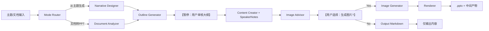
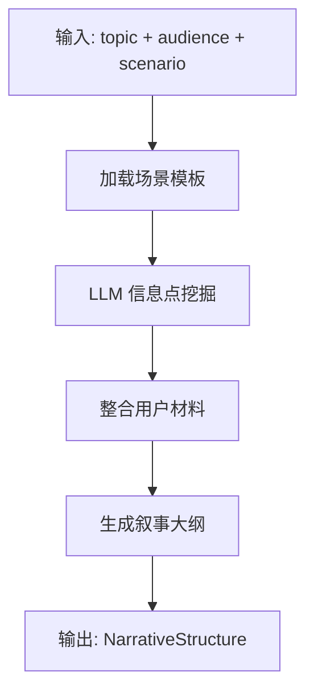
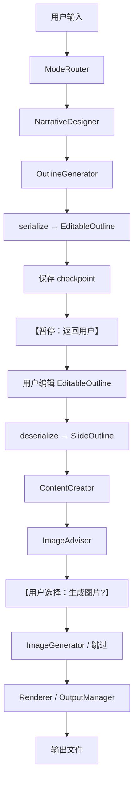
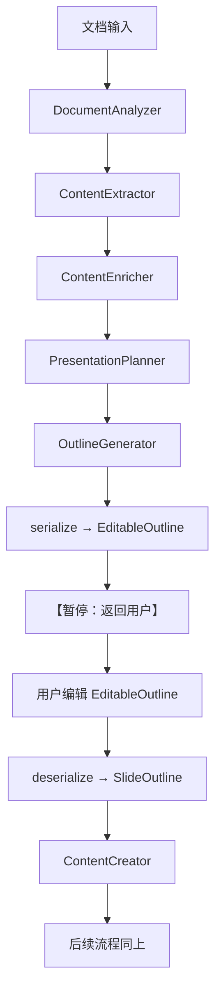

# AI PPT 生成 V2 - 设计文档（产品修正版）

## 1. 系统架构

### 1.1 整体架构对比

**V1 架构（9 阶段黑盒）**：


**V2 架构（两阶段暂停 + 可选配图）**：


### 1.2 模块职责变更

| 模块 | V1 职责 | V2 职责 | 变更类型 |
|------|---------|---------|---------|
| **Pipeline** | 编排 9 阶段 | 编排新流程 + 支持两阶段暂停 | 修改 |
| **DocumentAnalyzer** | 分析文档 | 保持不变（仅用于文档转 PPT 模式） | 保留 |
| **ContentExtractor** | 提取文档内容 | 保持不变 | 保留 |
| **ContentEnricher** | 增强提取内容 | 保持不变 | 保留 |
| **PresentationPlanner** | 规划演示结构 | 保持不变 | 保留 |
| **NarrativeDesigner** | 无 | 根据场景设计叙事结构 | **新增** |
| **OutlineGenerator** | 生成大纲 | 支持从叙事结构生成 + 返回可编辑大纲 | 修改 |
| **ContentCreator** | 生成标题+要点 | 生成标题+要点+**详细演讲稿** | 修改 |
| **ImageAdvisor** | 无 | 生成配图建议（而非直接生成图片） | **新增** |
| **ImageGenerator** | 生成配图 | 仅在用户选择时生成（可选） | 修改 |
| **DesignOrchestrator** | 分配布局+配色 | 保持不变（简化为维护模式） | 保留 |
| **PPTRenderer** | 渲染 .pptx | 保持不变（简化为维护模式） | 保留 |
| **QualityChecker** | 检查排版问题 | 增加 AI 味检测 | 修改 |
| **OutputManager** | 无 | 输出中间产物（Markdown/JSON/PDF） | **新增** |

---

## 2. 核心模块设计

### 2.1 ModeRouter（新增）- 路由模式选择

#### 2.1.1 职责
根据用户输入，路由到"从主题生成"或"文档转 PPT"模式。

#### 2.1.2 输入
```python
{
    "mode": "topic" | "document",  # 显式指定，或根据输入自动推断
    "topic": "2024 年度产品规划",  # topic 模式必填
    "document_text": None,  # document 模式必填
    "audience": "business",
    "scenario": "quarterly_review",
    "materials": [...],  # topic 模式可选
}
```

#### 2.1.3 路由逻辑
```python
def route_mode(input_data: dict) -> str:
    """路由到对应模式"""
    if input_data.get("mode"):
        return input_data["mode"]

    # 自动推断
    if input_data.get("topic") and not input_data.get("document_text"):
        return "topic"
    elif input_data.get("document_text"):
        return "document"
    else:
        raise ValueError("必须提供 topic 或 document_text")
```

#### 2.1.4 输出
```python
{
    "mode": "topic",  # 确定的模式
    "next_stage": "narrative_design",  # topic 模式下一阶段
}
```

---

### 2.2 NarrativeDesigner（新增）- 叙事结构设计

#### 2.2.1 职责
根据场景（scenario）设计叙事结构（narrative arc），确定每页的 PageRole 和顺序。

#### 2.2.2 场景模板（YAML 配置）
```yaml
# src/ppt/narratives/quarterly_review.yaml
narrative_id: quarterly_review
name: 季度汇报
description: 适用于向上级或团队汇报季度工作进展
target_pages: 12-18
structure:
  - role: cover
    title_template: "{{quarter}} 季度工作汇报"
    required: true

  - role: executive_summary
    title_template: "核心亮点"
    key_points_count: 3-5
    required: true

  - role: background
    title_template: "背景与目标"
    key_points_count: 3-4
    required: false

  - role: progress
    title_template: "关键进展"
    key_points_count: 4-6
    required: true

  - role: data_evidence
    title_template: "数据表现"
    key_points_count: 3-5
    required: true

  - role: risk_problem
    title_template: "挑战与风险"
    key_points_count: 3-4
    required: false

  - role: next_steps
    title_template: "下季度计划"
    key_points_count: 4-6
    required: true

  - role: closing
    title_template: "谢谢"
    required: true

narrative_tips:
  - "结论先行：executive_summary 必须在前 3 页内"
  - "数据为王：data_evidence 页必须有具体数字"
  - "风险透明：risk_problem 页不要回避问题"
```

#### 2.2.3 设计流程


#### 2.2.4 数据模型
```python
class NarrativeStructure(BaseModel):
    """叙事结构"""
    scenario: str = Field(..., description="场景 ID")
    total_pages: int = Field(..., ge=5, le=50)
    sections: list[NarrativeSection] = Field(..., description="章节列表")

class NarrativeSection(BaseModel):
    """叙事章节"""
    role: PageRole = Field(..., description="页面角色")
    title_hint: str = Field(..., description="标题提示")
    key_points_hint: list[str] = Field([], description="要点提示（可能为空，由 LLM 填充）")
    speaker_notes_hint: str = Field("", description="演讲稿提示")
    layout_preference: LayoutType | None = Field(None, description="推荐布局")
    image_strategy: ImageStrategy = Field(ImageStrategy.NONE)
    required: bool = Field(True, description="是否必须保留")
```

#### 2.2.5 LLM Prompt
```python
_NARRATIVE_SYSTEM_PROMPT = """
你是一位资深演示策划师。你的任务是根据主题、受众、场景，挖掘需要覆盖的关键信息点。

## 场景模板
{scenario_template}

## 任务
1. 根据主题 "{topic}"，识别需要覆盖的关键信息点
2. 如果用户提供了零散材料，将材料归类到对应的页面角色
3. 为每个页面角色生成标题提示和要点提示

## 输出格式（JSON）
{{
  "sections": [
    {{
      "role": "cover",
      "title_hint": "2024 Q1 产品进展汇报",
      "key_points_hint": [],
      "speaker_notes_hint": "自我介绍 + 开场白"
    }},
    {{
      "role": "executive_summary",
      "title_hint": "核心亮点",
      "key_points_hint": ["GMV 增长 30%", "用户满意度 8.5 分", "推出 3 个新功能"],
      "speaker_notes_hint": "快速总结本季度成绩，引出后续详细汇报"
    }},
    ...
  ]
}}
"""
```

#### 2.2.6 实现文件
- **新文件**：`src/ppt/narrative_designer.py`（约 300 行）
- **新目录**：`src/ppt/narratives/`（存放场景 YAML 模板）
- **依赖**：`src/llm/llm_client.py`

---

### 2.3 OutlineGenerator（修改）- 支持大纲审核

#### 2.3.1 职责变更
**V1**：生成大纲（不可编辑，直接进入下一阶段）
**V2**：生成大纲 → 序列化为可编辑格式 → 等待用户确认 → 反序列化后继续

#### 2.3.2 新增：可编辑大纲格式
```python
class EditableOutline(BaseModel):
    """可编辑大纲（暴露给用户）"""
    project_id: str
    total_pages: int
    estimated_duration: str
    narrative_arc: str
    slides: list[EditableSlide]

class EditableSlide(BaseModel):
    """可编辑的单页大纲"""
    page_number: int
    role: str  # PageRole 枚举值（字符串）
    title: str  # 可编辑
    subtitle: str = ""  # 可编辑
    key_points: list[str] = []  # 可编辑（增删改）
    layout: str  # LayoutType 枚举值（可编辑）
    image_strategy: str  # ImageStrategy 枚举值（可编辑）
    speaker_notes_hint: str = ""  # 可编辑
    editable: bool = True  # 是否可编辑（封面/结束页可能不可编辑）
    locked: bool = False  # 是否锁定（用户可锁定某页避免误操作）
```

#### 2.3.3 新增：序列化/反序列化
```python
def serialize_outline_for_edit(outline: list[SlideOutline]) -> EditableOutline:
    """将内部大纲转为可编辑格式"""
    return EditableOutline(
        project_id=...,
        total_pages=len(outline),
        estimated_duration=f"{len(outline) * 0.5:.0f}-{len(outline) * 0.7:.0f} 分钟",
        narrative_arc=...,
        slides=[
            EditableSlide(
                page_number=slide.page_number,
                role=slide.role.value,  # 枚举转字符串
                title=slide.title,
                subtitle=slide.subtitle,
                key_points=slide.key_points,
                layout=slide.layout.value,
                image_strategy=slide.image_strategy.value,
                speaker_notes_hint=slide.speaker_notes_hint,
                editable=slide.role not in {PageRole.COVER, PageRole.CLOSING},
            )
            for slide in outline
        ],
    )

def deserialize_edited_outline(edited: EditableOutline) -> list[SlideOutline]:
    """将用户编辑后的大纲转回内部格式"""
    return [
        SlideOutline(
            page_number=slide.page_number,
            role=PageRole(slide.role),  # 字符串转枚举
            title=slide.title,
            subtitle=slide.subtitle,
            key_points=slide.key_points,
            layout=LayoutType(slide.layout),
            image_strategy=ImageStrategy(slide.image_strategy),
            speaker_notes_hint=slide.speaker_notes_hint,
        )
        for slide in edited.slides
    ]
```

#### 2.3.4 修改文件
- **修改**：`src/ppt/outline_generator.py`（新增约 100 行）
- **新增**：`src/ppt/models.py` 中新增 `EditableOutline` 和 `EditableSlide`

---

### 2.4 ContentCreator（修改）- 生成详细演讲稿

#### 2.4.1 职责变更
**V1**：生成标题 + 要点（bullet points）
**V2**：生成标题 + 要点 + **详细演讲稿（200-300 字）**

#### 2.4.2 新增：演讲稿生成
```python
class SlideContent(BaseModel):
    """单页内容（V2 扩展）"""
    page_number: int
    title: str
    subtitle: str = ""
    bullet_points: list[str]
    speaker_notes: str = ""  # **新增：详细演讲稿**
    speaker_notes_word_count: int = 0  # **新增：字数统计**
```

#### 2.4.3 LLM Prompt（演讲稿部分）
```python
_SPEAKER_NOTES_PROMPT = """
你是一位资深演讲教练。请为以下页面生成详细的演讲稿（200-300 字）。

## 页面信息
- 页面角色：{role}
- 标题：{title}
- 要点：{key_points}

## 要求
1. **开场白**：如果是第一页，需要包含自我介绍和开场白
2. **过渡句**：如果不是第一页,需要包含与上一页的过渡
3. **强调点**：明确标注需要重点强调的数据或观点（用"特别注意"、"这里是关键"等提示词）
4. **口语化**：避免书面语，使用口语化表达
5. **时间控制**：演讲稿字数控制在 200-300 字（演讲时长约 1 分钟）

## 禁止
- 不要用"赋能"、"闭环"、"抓手"等空洞词汇
- 不要用"首先、其次、最后"等刻板结构
- 不要堆砌形容词（"非常重要"、"十分关键"）

## 输出格式（纯文本）
大家好，我是...（如果是第一页）
在上一页我们讲到了...（如果不是第一页）

（正文，200-300 字）

接下来我们将...（过渡到下一页）
"""
```

#### 2.4.4 修改文件
- **修改**：`src/ppt/content_creator.py`（新增约 150 行）
- **修改**：`src/ppt/models.py` 中扩展 `SlideContent`

---

### 2.5 ImageAdvisor（新增）- 配图建议生成

#### 2.5.1 职责
生成配图建议（而非直接调用图片生成 API），用户可选择是否生成。

#### 2.5.2 数据模型
```python
class ImageSuggestion(BaseModel):
    """配图建议"""
    page_number: int
    title: str
    type: ImageStrategy  # chart / diagram / illustration / ui_mock
    description: str = Field(..., description="配图内容描述（中文，50-100 字）")
    composition: str = Field(..., description="构图建议（中文，30-50 字）")
    color_scheme: str = Field("", description="色调建议")
    alternative_text: str = Field("", description="如果不生成图片，建议如何手动制作")
    prompt_if_generate: str = Field("", description="如果生成图片，使用的 prompt（英文）")
    generate_image: bool = Field(False, description="是否生成图片（默认 False）")
    generated_image_path: str | None = None  # 生成后填充
```

#### 2.5.3 LLM Prompt
```python
_IMAGE_ADVISOR_PROMPT = """
你是一位资深视觉设计顾问。请为以下页面生成配图建议。

## 页面信息
- 页面角色：{role}
- 标题：{title}
- 要点：{key_points}
- 配图策略：{image_strategy}

## 任务
1. **描述配图内容**：具体描述需要什么样的配图（50-100 字）
2. **构图建议**：描述构图方式（居中/非对称/俯视等，30-50 字）
3. **色调建议**：建议配色方案（与主题 {theme} 协调）
4. **手动制作建议**：如果用户不生成图片，建议如何手动制作（例如"在 Excel 中绘制柱状图"）
5. **AI 生成 Prompt**：如果用户选择生成图片，提供英文 prompt

## 示例（图表类）
{{
  "type": "chart",
  "description": "柱状图，展示 2022-2024 三年市场规模对比，从左到右递增，2024 年最高",
  "composition": "3 根柱子，左对齐，每根柱子上方标注具体数值",
  "color_scheme": "蓝色系渐变（深蓝→浅蓝）",
  "alternative_text": "建议在 Excel 中绘制柱状图，然后截图插入 PPT",
  "prompt_if_generate": "A clean bar chart showing market size growth from 2022 to 2024, three blue gradient bars increasing from left to right, values labeled on top, minimalist style, white background, high quality"
}}

## 示例（插图类）
{{
  "type": "illustration",
  "description": "抽象科技背景，体现创新和未来感",
  "composition": "深蓝色渐变背景，右下角有金色几何曲线",
  "color_scheme": "深蓝+金色",
  "alternative_text": "可在 Canva 中搜索"科技背景"模板",
  "prompt_if_generate": "Abstract technology background, deep blue gradient, golden geometric curves in bottom right corner, futuristic, minimalist, high quality, 4K"
}}

## 输出格式（JSON）
{{
  "type": "...",
  "description": "...",
  "composition": "...",
  "color_scheme": "...",
  "alternative_text": "...",
  "prompt_if_generate": "..."
}}
"""
```

#### 2.5.4 实现文件
- **新文件**：`src/ppt/image_advisor.py`（约 200 行）
- **新增**：`src/ppt/models.py` 中新增 `ImageSuggestion`

---

### 2.6 QualityChecker（修改）- 增加 AI 味检测

#### 2.6.1 职责变更
**V1**：检查排版问题（文本溢出、元素重叠、对齐）
**V2**：检查排版问题 + **AI 味检测**

#### 2.6.2 AI 味黑名单
```python
# 复用小说模块的黑名单
from src.novel.templates.ai_taste_blacklist import AI_TASTE_WORDS

# 扩展 PPT 专用黑名单
PPT_SPECIFIC_BLACKLIST = {
    "赋能": "支持",
    "闭环": "完整流程",
    "抓手": "关键措施",
    "颗粒度": "细节程度",
    "打通": "连接",
    "沉淀": "积累",
    "抽象": "概括",
    "链路": "流程",
    "触达": "到达",
    "心智": "认知",
}
```

#### 2.6.3 检测流程
```python
def check_ai_taste(content: SlideContent) -> list[str]:
    """检测 AI 味词汇"""
    issues = []
    text_to_check = content.title + " " + " ".join(content.bullet_points) + " " + content.speaker_notes

    for word, replacement in PPT_SPECIFIC_BLACKLIST.items():
        if word in text_to_check:
            issues.append(f"检测到空洞词"{word}"，建议替换为"{replacement}"")

    return issues

def auto_replace_ai_taste(content: SlideContent) -> SlideContent:
    """自动替换 AI 味词汇"""
    for word, replacement in PPT_SPECIFIC_BLACKLIST.items():
        content.title = content.title.replace(word, replacement)
        content.bullet_points = [bp.replace(word, replacement) for bp in content.bullet_points]
        content.speaker_notes = content.speaker_notes.replace(word, replacement)

    return content
```

#### 2.6.4 修改文件
- **修改**：`src/ppt/quality_checker.py`（新增约 100 行）

---

### 2.7 OutputManager（新增）- 输出中间产物

#### 2.7.1 职责
生成并输出中间产物（Markdown 大纲、演讲稿文本、配图建议 JSON）。

#### 2.7.2 输出文件列表
```python
class OutputFiles(BaseModel):
    """输出文件清单"""
    pptx_path: str | None = None  # final.pptx
    outline_md_path: str | None = None  # outline.md
    content_txt_path: str | None = None  # content.txt
    speaker_notes_pdf_path: str | None = None  # speaker_notes.pdf
    image_suggestions_json_path: str | None = None  # image_suggestions.json
    quality_report_md_path: str | None = None  # quality_report.md
```

#### 2.7.3 Markdown 大纲生成
```python
def generate_outline_markdown(
    outline: EditableOutline,
    contents: list[SlideContent],
) -> str:
    """生成 Markdown 大纲"""
    lines = [
        f"# {contents[0].title}",  # 封面标题
        f"**演讲时长**：{outline.estimated_duration} | **页数**：{outline.total_pages} 页 | **风格**：{outline.narrative_arc}",
        "",
        "---",
        "",
    ]

    for slide, content in zip(outline.slides, contents):
        lines.extend([
            f"## 第 {slide.page_number} 页：{slide.role}",
            f"**标题**：{content.title}",
        ])

        if content.subtitle:
            lines.append(f"**副标题**：{content.subtitle}")

        if content.bullet_points:
            lines.append("**要点**：")
            for bp in content.bullet_points:
                lines.append(f"- {bp}")

        lines.extend([
            f"**布局**：{slide.layout}",
            f"**配图建议**：{slide.image_strategy}",
            "",
            "**演讲稿**：",
            content.speaker_notes,
            "",
            "---",
            "",
        ])

    return "\n".join(lines)
```

#### 2.7.4 配图建议 JSON 生成
```python
def generate_image_suggestions_json(suggestions: list[ImageSuggestion]) -> str:
    """生成配图建议 JSON"""
    return json.dumps(
        [sugg.model_dump() for sugg in suggestions],
        ensure_ascii=False,
        indent=2,
    )
```

#### 2.7.5 演讲者备注 PDF 生成（可选，P1）
```python
def generate_speaker_notes_pdf(contents: list[SlideContent], output_path: str) -> None:
    """生成演讲者备注 PDF（需要 reportlab 库）"""
    from reportlab.lib.pagesizes import A4
    from reportlab.pdfgen import canvas

    c = canvas.Canvas(output_path, pagesize=A4)
    y = 800  # 起始 y 坐标

    for content in contents:
        c.setFont("Helvetica-Bold", 14)
        c.drawString(50, y, f"第 {content.page_number} 页：{content.title}")
        y -= 30

        c.setFont("Helvetica", 10)
        for line in content.speaker_notes.split("\n"):
            c.drawString(50, y, line)
            y -= 20
            if y < 100:  # 换页
                c.showPage()
                y = 800

        y -= 30  # 页面间隔

    c.save()
```

#### 2.7.6 实现文件
- **新文件**：`src/ppt/output_manager.py`（约 300 行）

---

### 2.8 PPTPipeline（修改）- 支持两阶段暂停

#### 2.8.1 新增：阶段状态枚举
```python
class PipelineStage(str, Enum):
    """Pipeline 阶段"""
    MODE_ROUTING = "mode_routing"
    NARRATIVE_DESIGN = "narrative_design"  # 新增
    DOCUMENT_ANALYSIS = "document_analysis"
    OUTLINE_GENERATION = "outline_generation"
    OUTLINE_REVIEW = "outline_review"  # **新增：暂停点 1**
    CONTENT_CREATION = "content_creation"
    IMAGE_ADVISORY = "image_advisory"  # 新增
    IMAGE_SELECTION = "image_selection"  # **新增：暂停点 2（可选）**
    IMAGE_GENERATION = "image_generation"
    RENDERING = "rendering"
    OUTPUT = "output"
    COMPLETED = "completed"
```

#### 2.8.2 新增：两阶段暂停方法
```python
class PPTPipeline:
    def generate_outline_only(
        self,
        topic: str | None = None,
        document_text: str | None = None,
        audience: str = "business",
        scenario: str = "quarterly_review",
        materials: list[dict] | None = None,
        theme: str = "modern",
        target_pages: int | None = None,
    ) -> tuple[str, EditableOutline]:
        """阶段 1：仅生成大纲（返回 project_id 和可编辑大纲）"""
        # 1. Mode routing
        mode = self._route_mode(topic, document_text)

        # 2. 根据模式生成大纲
        if mode == "topic":
            narrative = self._narrative_designer.design(topic, audience, scenario, materials)
            outline = self._outline_generator.from_narrative(narrative, theme, target_pages)
        else:
            analysis = self._document_analyzer.analyze(document_text)
            outline = self._outline_generator.from_document(analysis, theme, target_pages)

        # 3. 序列化为可编辑大纲
        editable = serialize_outline_for_edit(outline)

        # 4. 保存 checkpoint
        self._save_checkpoint(project_id, stage=PipelineStage.OUTLINE_REVIEW, data=editable)

        return project_id, editable

    def continue_from_outline(
        self,
        project_id: str,
        edited_outline: EditableOutline,
        generate_images: bool = True,
        content_only: bool = False,
    ) -> OutputFiles:
        """阶段 2：从大纲继续生成（用户确认后）"""
        # 1. 反序列化大纲
        outline = deserialize_edited_outline(edited_outline)

        # 2. 生成内容 + 演讲稿
        contents = self._content_creator.create_all(outline)

        # 3. 生成配图建议
        suggestions = self._image_advisor.advise_all(outline, contents)

        # 4. 如果 content_only，直接输出 Markdown
        if content_only:
            return self._output_manager.output_content_only(
                outline=edited_outline,
                contents=contents,
                suggestions=suggestions,
            )

        # 5. 如果用户选择生成图片
        if generate_images:
            self._image_generator.generate_selected(suggestions)

        # 6. 渲染 PPT
        pptx_path = self._renderer.render(outline, contents, suggestions)

        # 7. 输出所有文件
        return self._output_manager.output_all(
            pptx_path=pptx_path,
            outline=edited_outline,
            contents=contents,
            suggestions=suggestions,
        )
```

#### 2.8.3 修改文件
- **修改**：`src/ppt/pipeline.py`（新增约 300 行）

---

## 3. 数据流设计

### 3.1 从主题生成模式数据流


### 3.2 文档转 PPT 模式数据流（保持 V1，加审核）


### 3.3 Checkpoint 数据结构
```python
{
    "project_id": "ppt_20240317_abc123",
    "stage": "outline_review",  # 当前阶段
    "mode": "topic",  # topic / document
    "created_at": "2024-03-17T10:00:00Z",
    "updated_at": "2024-03-17T10:05:00Z",
    "data": {
        "input": {
            "topic": "2024 年度产品规划",
            "audience": "business",
            "scenario": "quarterly_review",
            "theme": "modern",
        },
        "stages": {
            "narrative_design": {
                "completed": True,
                "data": {...},  # NarrativeStructure
            },
            "outline_generation": {
                "completed": True,
                "data": {...},  # EditableOutline
            },
            "outline_review": {
                "completed": False,  # 等待用户确认
                "data": None,
            },
        },
    },
}
```

---

## 4. 接口设计

### 4.1 CLI 接口（修改）

#### 4.1.1 新命令：从主题生成
```bash
# 生成大纲（暂停）
python main.py ppt create "2024 年度产品规划" \
    --audience business \
    --scenario quarterly_review \
    --theme modern \
    --target-pages 15 \
    --materials data/q1_report.txt

# 输出：
# Project ID: ppt_20240317_abc123
# Outline saved to: workspace/ppt_20240317_abc123/outline_editable.yaml
# Please review and edit the outline, then run:
#   python main.py ppt continue workspace/ppt_20240317_abc123

# 继续生成（用户编辑后）
python main.py ppt continue workspace/ppt_20240317_abc123

# 继续生成（仅输出内容，不渲染 PPT）
python main.py ppt continue workspace/ppt_20240317_abc123 --content-only

# 继续生成（跳过配图）
python main.py ppt continue workspace/ppt_20240317_abc123 --no-images
```

#### 4.1.2 修改命令：文档转 PPT（加审核）
```bash
# V1 方式（一键生成）仍然支持，但会在大纲生成后暂停
python main.py ppt generate input/report.txt --theme modern

# 输出：
# Project ID: ppt_20240317_xyz789
# Outline saved to: workspace/ppt_20240317_xyz789/outline_editable.yaml
# Please review and edit the outline, then run:
#   python main.py ppt continue workspace/ppt_20240317_xyz789

# 如果用户不想审核，可以加 --auto-continue
python main.py ppt generate input/report.txt --theme modern --auto-continue
```

#### 4.1.3 新命令：查看大纲
```bash
# 查看可编辑大纲（YAML 格式）
python main.py ppt show-outline workspace/ppt_20240317_abc123

# 输出大纲到指定文件
python main.py ppt show-outline workspace/ppt_20240317_abc123 --output outline.yaml
```

#### 4.1.4 实现文件
- **修改**：`main.py` 中的 `ppt` 命令组（新增约 200 行）

---

### 4.2 Web UI 接口（修改）

#### 4.2.1 新增：从主题生成表单
```python
with gr.Tab("PPT生成", id="tab_ppt"):
    with gr.Row():
        gr.HTML('<div class="section-title">AI 智能 PPT 生成</div>')

    # 模式选择
    ppt_mode = gr.Radio(
        label="生成模式",
        choices=[("从主题生成（推荐）", "topic"), ("从文档转换", "document")],
        value="topic",
    )

    # 从主题生成表单（默认显示）
    with gr.Group(visible=True) as topic_form:
        ppt_topic = gr.Textbox(label="主题", placeholder="例如：2024 年度产品规划")
        with gr.Row():
            ppt_audience = gr.Dropdown(
                label="受众",
                choices=["business", "technical", "educational", "creative"],
                value="business",
            )
            ppt_scenario = gr.Dropdown(
                label="使用场景",
                choices=[
                    "quarterly_review", "product_launch", "tech_share",
                    "course_lecture", "pitch_deck", "workshop", "status_update",
                ],
                value="quarterly_review",
            )
        ppt_materials = gr.File(label="零散材料（可选）", file_count="multiple")

    # 从文档转换表单（隐藏）
    with gr.Group(visible=False) as document_form:
        ppt_document = gr.Textbox(label="文档内容", lines=10)
        ppt_file_input = gr.File(label="或上传文档（txt/md）")

    # 通用设置
    with gr.Row():
        ppt_theme = gr.Dropdown(
            label="视觉风格",
            choices=["modern", "business", "creative", "tech", "education"],
            value="modern",
        )
        ppt_target_pages = gr.Slider(label="目标页数", minimum=5, maximum=50, value=15)

    # 生成按钮
    ppt_generate_outline_btn = gr.Button("生成大纲（第 1 步）", variant="primary")

    # 大纲编辑器（表格）
    with gr.Group(visible=False) as outline_editor:
        gr.Markdown("## 大纲预览（可编辑）")
        ppt_outline_table = gr.DataFrame(
            label="PPT 大纲",
            headers=["页码", "角色", "标题", "要点", "布局", "配图策略"],
            datatype=["number", "str", "str", "str", "str", "str"],
            row_count=(5, "dynamic"),
            col_count=(6, "fixed"),
        )

        with gr.Row():
            ppt_delete_page_btn = gr.Button("删除选中页")
            ppt_add_page_btn = gr.Button("新增页面")

        with gr.Row():
            ppt_confirm_outline_btn = gr.Button("确认大纲，继续生成（第 2 步）", variant="primary")
            ppt_content_only_checkbox = gr.Checkbox(label="仅生成内容大纲（不渲染 PPT）", value=False)
            ppt_no_images_checkbox = gr.Checkbox(label="跳过配图生成", value=False)

    # 进度和输出
    ppt_status_box = gr.Textbox(label="状态", interactive=False)
    with gr.Tab("输出文件"):
        ppt_output_files = gr.File(label="下载文件", file_count="multiple")
```

#### 4.2.2 事件处理
```python
def _on_generate_outline(mode, topic, audience, scenario, materials, document, theme, target_pages):
    """生成大纲"""
    if mode == "topic":
        project_id, editable_outline = pipeline.generate_outline_only(
            topic=topic,
            audience=audience,
            scenario=scenario,
            materials=materials,
            theme=theme,
            target_pages=target_pages,
        )
    else:
        project_id, editable_outline = pipeline.generate_outline_only(
            document_text=document,
            theme=theme,
            target_pages=target_pages,
        )

    # 转为 DataFrame 格式
    df_data = [
        [
            slide.page_number,
            slide.role,
            slide.title,
            " | ".join(slide.key_points),
            slide.layout,
            slide.image_strategy,
        ]
        for slide in editable_outline.slides
    ]

    return {
        ppt_outline_table: gr.DataFrame(value=df_data, visible=True),
        outline_editor: gr.Group(visible=True),
        ppt_status_box: f"大纲已生成（项目 ID: {project_id}），请审核后点击"确认大纲"继续",
    }

def _on_confirm_outline(project_id, edited_df, content_only, no_images):
    """确认大纲，继续生成"""
    # 将 DataFrame 转回 EditableOutline
    edited_outline = _df_to_editable_outline(edited_df)

    # 提交后台任务
    task_id = _task_client.submit_task("ppt_continue", {
        "project_id": project_id,
        "edited_outline": edited_outline.model_dump(),
        "content_only": content_only,
        "generate_images": not no_images,
    })

    return {
        ppt_status_box: f"任务已提交（ID: {task_id}），正在生成...",
        poll_timer: gr.Timer(active=True),
    }
```

#### 4.2.3 修改文件
- **修改**：`web.py` 中的 PPT Tab（新增约 400 行）

---

### 4.3 MCP Server 接口（修改）

#### 4.3.1 新工具：从主题生成大纲
```python
@mcp.tool()
def ppt_create_from_topic(
    topic: str,
    audience: str = "business",
    scenario: str = "quarterly_review",
    theme: str = "modern",
    target_pages: int = 15,
    materials: list[dict] | None = None,
) -> dict[str, Any]:
    """Create PPT outline from topic (step 1).

    Args:
        topic: PPT topic (5-30 characters)
        audience: Target audience (business/technical/educational/creative)
        scenario: Use case scenario (quarterly_review/product_launch/tech_share/...)
        theme: Visual theme (modern/business/creative/tech/education)
        target_pages: Target number of pages (5-50)
        materials: Optional scattered materials (list of {"type": "text"/"file", "content"/"path": ...})

    Returns:
        {
            "project_id": "ppt_20240317_abc123",
            "outline": {...},  # EditableOutline
            "status": "outline_ready",
        }
    """
    pipe = _get_ppt_pipeline()
    project_id, editable_outline = pipe.generate_outline_only(
        topic=topic,
        audience=audience,
        scenario=scenario,
        materials=materials,
        theme=theme,
        target_pages=target_pages,
    )
    return {
        "project_id": project_id,
        "outline": editable_outline.model_dump(),
        "status": "outline_ready",
    }
```

#### 4.3.2 新工具：确认大纲并继续
```python
@mcp.tool()
def ppt_confirm_outline(
    project_id: str,
    edited_outline: dict,
    content_only: bool = False,
    generate_images: bool = True,
) -> dict[str, Any]:
    """Confirm outline and continue generation (step 2).

    Args:
        project_id: Project ID from ppt_create_from_topic
        edited_outline: Edited outline (EditableOutline dict)
        content_only: Only generate content files (no pptx rendering)
        generate_images: Whether to generate images

    Returns:
        {
            "project_id": "ppt_20240317_abc123",
            "output_files": {...},  # OutputFiles
            "status": "completed",
        }
    """
    pipe = _get_ppt_pipeline()
    from src.ppt.models import EditableOutline

    editable = EditableOutline(**edited_outline)
    output_files = pipe.continue_from_outline(
        project_id=project_id,
        edited_outline=editable,
        generate_images=generate_images,
        content_only=content_only,
    )

    return {
        "project_id": project_id,
        "output_files": output_files.model_dump(),
        "status": "completed",
    }
```

#### 4.3.3 修改工具：文档转 PPT（加审核）
```python
@mcp.tool()
def ppt_generate(
    text: str,
    theme: str = "modern",
    max_pages: int = 20,
    generate_images: bool = True,
    auto_continue: bool = False,  # **新增：是否自动继续（不暂停审核）**
) -> dict[str, Any]:
    """Generate a PPT presentation from text.

    Args:
        text: Source text (document content)
        theme: Visual theme (modern/business/creative/tech/education)
        max_pages: Maximum number of pages
        generate_images: Whether to generate images
        auto_continue: If True, skip outline review and auto-continue

    Returns:
        If auto_continue=True:
            {"project_id": "...", "output_path": "...", "status": "completed"}
        If auto_continue=False:
            {"project_id": "...", "outline": {...}, "status": "outline_ready"}
    """
    pipe = _get_ppt_pipeline()

    # 生成大纲
    project_id, editable_outline = pipe.generate_outline_only(
        document_text=text,
        theme=theme,
        target_pages=max_pages,
    )

    # 如果 auto_continue，直接继续
    if auto_continue:
        output_files = pipe.continue_from_outline(
            project_id=project_id,
            edited_outline=editable_outline,
            generate_images=generate_images,
        )
        return {
            "project_id": project_id,
            "output_files": output_files.model_dump(),
            "status": "completed",
        }
    else:
        return {
            "project_id": project_id,
            "outline": editable_outline.model_dump(),
            "status": "outline_ready",
        }
```

#### 4.3.4 修改文件
- **修改**：`mcp_server.py`（新增约 150 行）

---

## 5. 错误处理与边界条件

### 5.1 输入验证
| 输入 | 验证规则 | 错误处理 |
|------|---------|---------|
| **topic** | 5-30 字 | 抛出 ValueError |
| **audience** | 必须是枚举值 | 抛出 ValueError |
| **scenario** | 必须是已定义场景 | fallback 到 "quarterly_review" + 警告日志 |
| **materials** | 每个 ≤5000 字，总数 ≤10 | 截断 + 警告日志 |
| **edited_outline** | 反序列化失败 | 抛出 ValidationError，提示用户检查 JSON/YAML |

### 5.2 LLM 调用失败
- **重试策略**：3 次重试，指数退避（1s, 2s, 4s）
- **Fallback**：如果 LLM 生成的 JSON 格式错误，使用 `extract_json_obj` 提取
- **降级**：如果演讲稿生成失败，使用简单模板填充（"这一页主要讲..., 要点包括..."）

### 5.3 配图生成失败
- **不阻塞流程**：配图生成失败不影响 PPT 渲染
- **占位处理**：使用纯色占位块 + 警告标签
- **记录日志**：在 quality_report.md 中标注哪些页面图片生成失败

### 5.4 大纲编辑冲突
- **版本控制**：每次编辑保存为新版本（outline_v1.yaml, outline_v2.yaml）
- **合并冲突**：如果用户同时在 CLI 和 Web UI 编辑，以最后保存的为准 + 警告日志

---

## 6. 性能优化

### 6.1 并行化
| 任务 | V1 | V2 | 优化方式 |
|------|----|----|---------|
| **配图建议生成** | N/A | 串行 | 无需并行（仅文本生成，速度快） |
| **配图生成** | 并行（最多 3 张） | 可选并行 | 保持不变 |
| **演讲稿生成** | N/A | 串行 | 考虑并行（每页独立，可 ThreadPoolExecutor） |

### 6.2 缓存
- **叙事结构模板**：首次加载后缓存到内存（避免重复读取 YAML）
- **AI 味黑名单**：首次加载后缓存到内存

### 6.3 省钱策略
- **配图建议优先**：默认不生成图片，只生成建议（节省图片生成 API 费用）
- **演讲稿可选**：提供 `--no-speaker-notes` 选项，跳过演讲稿生成（节省 LLM 调用）

---

## 7. 测试策略

### 7.1 单元测试
| 模块 | 测试重点 | Mock 依赖 |
|------|---------|-----------|
| **NarrativeDesigner** | 场景模板加载、LLM 信息点挖掘 | Mock LLM |
| **OutlineGenerator** | 序列化/反序列化、大纲生成 | Mock LLM |
| **ContentCreator** | 演讲稿生成、字数控制 | Mock LLM |
| **ImageAdvisor** | 配图建议生成、Prompt 质量 | Mock LLM |
| **QualityChecker** | AI 味检测、自动替换 | 无 Mock |
| **OutputManager** | Markdown/JSON 生成 | 无 Mock |

### 7.2 集成测试
| 场景 | 测试流程 | 验收标准 |
|------|---------|---------|
| **从主题生成** | topic → outline → continue → output | 生成文件齐全，大纲结构符合场景 |
| **文档转 PPT** | document → outline → continue → output | V1 功能不受影响 |
| **大纲编辑** | generate_outline → edit → continue | 编辑后的修改正确应用 |
| **仅输出内容** | generate_outline → continue(content_only=True) | 仅输出 Markdown/JSON，无 .pptx |

### 7.3 端到端测试
| 端 | 测试流程 | 验收标准 |
|----|---------|---------|
| **CLI** | `ppt create` → 编辑 YAML → `ppt continue` | 流程顺畅，输出文件正确 |
| **Web UI** | 填表 → 生成大纲 → 编辑表格 → 确认 → 下载 | 交互流畅，表格编辑正常 |
| **MCP** | `ppt_create_from_topic` → `ppt_confirm_outline` | AI 助手可正常调用 |

---

## 8. 迁移路径（V1 → V2）

### 8.1 向后兼容
- **V1 CLI 命令**：`python main.py ppt generate input.txt` 仍然可用，但会在大纲生成后暂停
- **V1 MCP 工具**：`ppt_generate(text, auto_continue=True)` 保持 V1 行为（不暂停）
- **V1 Checkpoint**：可加载 V1 checkpoint，自动转换为 V2 格式

### 8.2 破坏性变更
- **Pipeline 内部接口**：`generate()` 方法签名变更，需更新调用代码
- **数据模型**：`SlideContent` 新增 `speaker_notes` 字段，旧 checkpoint 需迁移

### 8.3 迁移脚本
```python
# scripts/migrate_ppt_v1_to_v2.py
def migrate_checkpoint(v1_ckpt: dict) -> dict:
    """将 V1 checkpoint 迁移到 V2"""
    v2_ckpt = v1_ckpt.copy()

    # 1. 添加缺失字段
    for slide in v2_ckpt["data"]["stages"]["content"]["data"]:
        slide["speaker_notes"] = ""  # V2 新增字段
        slide["speaker_notes_word_count"] = 0

    # 2. 添加新阶段
    v2_ckpt["data"]["stages"]["image_advisory"] = {
        "completed": False,
        "data": None,
    }

    return v2_ckpt
```

---

## 9. 部署与监控

### 9.1 配置项（新增）
```yaml
# config.yaml
ppt:
  mode: "topic"  # 默认模式（topic / document）
  auto_continue: false  # 是否自动继续（跳过大纲审核）
  generate_speaker_notes: true  # 是否生成演讲稿
  generate_images: false  # 是否默认生成图片（改为 false）
  ai_taste_detection: true  # 是否检测 AI 味
  narrative_templates_dir: "src/ppt/narratives"  # 叙事模板目录
```

### 9.2 监控指标
| 指标 | 说明 | 目标值 |
|------|------|--------|
| **outline_edit_rate** | 用户编辑大纲的比例 | ≥50% |
| **content_only_rate** | 仅输出内容（不渲染 PPT）的比例 | ≥30% |
| **image_generation_rate** | 选择生成图片的比例 | 20-50% |
| **speaker_notes_avg_length** | 演讲稿平均字数 | 200-300 |
| **ai_taste_detection_recall** | AI 味检测召回率 | ≥90% |

---

## 10. 风险与缓解（技术层面）

### 10.1 风险 1：演讲稿生成质量不稳定
**缓解措施**：
- 提供多个演讲稿风格模板（正式/轻松/幽默）
- 添加后处理检查（字数、口语化程度、AI 味）
- 用户可在 Web UI 中手动编辑演讲稿

### 10.2 风险 2：大纲编辑器性能差（Web UI）
**缓解措施**：
- 使用 Gradio DataFrame 组件（高性能）
- 限制最大页数（50 页）
- 提供"折叠/展开"功能（避免一次性渲染过多内容）

### 10.3 风险 3：叙事结构模板不够丰富
**缓解措施**：
- V2.0 提供 7 个内置场景模板
- V2.1 支持用户自定义场景（YAML 配置）
- 社区贡献模板（GitHub）

---

## 11. 附录

### 11.1 叙事结构场景清单
| Scenario ID | 中文名称 | 典型页数 | 叙事弧线 |
|-------------|---------|---------|---------|
| `quarterly_review` | 季度汇报 | 12-18 | 背景→进展→数据→风险→计划 |
| `product_launch` | 产品发布 | 10-15 | 痛点→方案→功能→案例→CTA |
| `tech_share` | 技术分享 | 15-25 | 背景→原理→实践→案例→总结 |
| `course_lecture` | 课程讲义 | 20-30 | 目标→概念→举例→练习→回顾 |
| `pitch_deck` | 融资路演 | 8-12 | 问题→方案→市场→团队→融资 |
| `workshop` | 工作坊 | 15-20 | 破冰→学习→实践→分享→总结 |
| `status_update` | 项目进展 | 8-12 | 背景→进展→问题→计划→资源 |

### 11.2 AI 味黑名单（PPT 专用）
```python
PPT_SPECIFIC_BLACKLIST = {
    "赋能": "支持",
    "闭环": "完整流程",
    "抓手": "关键措施",
    "颗粒度": "细节程度",
    "打通": "连接",
    "沉淀": "积累",
    "抽象": "概括",
    "链路": "流程",
    "触达": "到达",
    "心智": "认知",
    "降本增效": "降低成本提升效率",
    "顶层设计": "整体规划",
    "中台": "共享服务",
    "生态": "合作伙伴",
    "赛道": "行业领域",
}
```

### 11.3 文件结构（V2 新增）
```
src/ppt/
├── __init__.py
├── pipeline.py                # 修改：支持两阶段暂停
├── models.py                  # 修改：新增 EditableOutline、ImageSuggestion
├── narrative_designer.py      # 新增：叙事结构设计
├── narratives/                # 新增：叙事模板目录
│   ├── quarterly_review.yaml
│   ├── product_launch.yaml
│   ├── tech_share.yaml
│   ├── course_lecture.yaml
│   ├── pitch_deck.yaml
│   ├── workshop.yaml
│   └── status_update.yaml
├── outline_generator.py       # 修改：支持序列化/反序列化
├── content_creator.py         # 修改：新增演讲稿生成
├── image_advisor.py           # 新增：配图建议生成
├── quality_checker.py         # 修改：新增 AI 味检测
├── output_manager.py          # 新增：中间产物输出
├── document_analyzer.py       # 保留（文档转 PPT 模式）
├── content_extractor.py       # 保留
├── content_enricher.py        # 保留
├── presentation_planner.py    # 保留
├── design_orchestrator.py     # 保留
├── ppt_renderer.py            # 保留
├── file_manager.py            # 保留
└── theme_manager.py           # 保留
```
