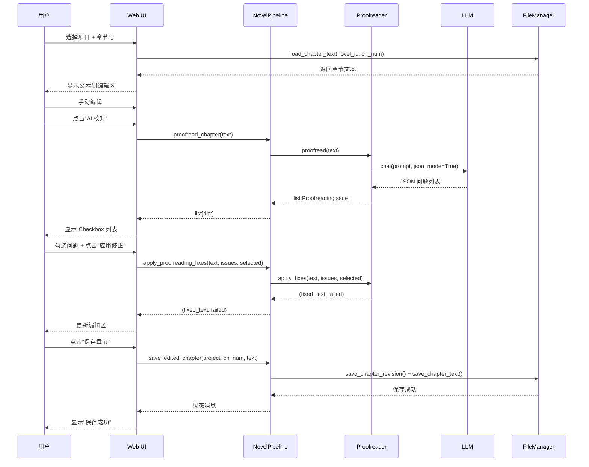
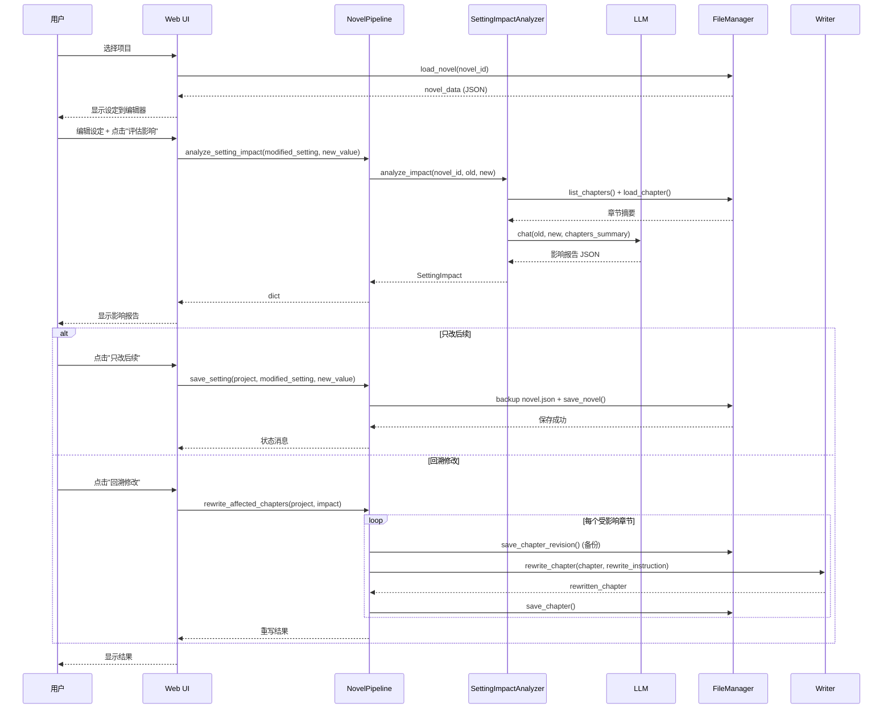
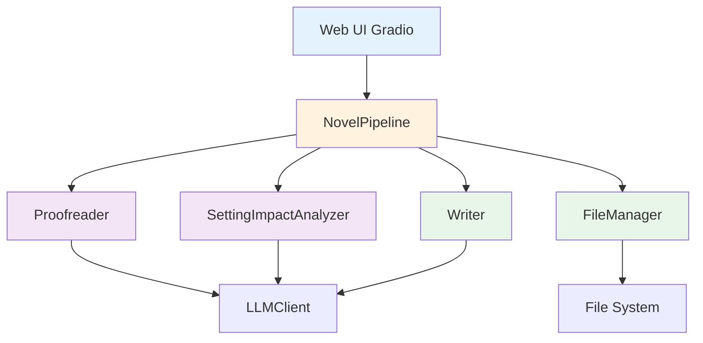

# Design: 章节编辑工作台

## 1. 架构概览

### 1.1 系统组成

```
┌─────────────────────────────────────────────────────────┐
│                       Web UI (Gradio)                    │
│  ┌──────────────────┐  ┌──────────────────────────────┐ │
│  │ 章节编辑 Tab     │  │ 设定编辑 Tab                  │ │
│  │ - 文本编辑器     │  │ - 世界观/角色/大纲编辑        │ │
│  │ - AI 校对按钮    │  │ - 影响评估按钮                │ │
│  │ - 问题列表展示   │  │ - 回溯修改流程                │ │
│  └──────────────────┘  └──────────────────────────────┘ │
└─────────────────────────────────────────────────────────┘
                         ↓
┌─────────────────────────────────────────────────────────┐
│            Backend API (NovelPipeline 扩展)             │
│  ┌──────────────────┐  ┌──────────────────────────────┐ │
│  │ Proofreader      │  │ SettingImpactAnalyzer        │ │
│  │ - proofread()    │  │ - analyze_impact()           │ │
│  │ - apply_fixes()  │  │ - rewrite_affected_chapters()│ │
│  └──────────────────┘  └──────────────────────────────┘ │
└─────────────────────────────────────────────────────────┘
                         ↓
┌─────────────────────────────────────────────────────────┐
│                   Storage Layer                          │
│  FileManager (读写 chapter/novel/revisions)              │
│  Writer (rewrite_chapter)                                │
│  LLMClient (调用 LLM)                                    │
└─────────────────────────────────────────────────────────┘
```

### 1.2 模块职责

| 模块 | 职责 | 输入 | 输出 |
|------|------|------|------|
| `Proofreader` | AI 校对章节文本 | `text: str` | `list[ProofreadingIssue]` |
| `SettingImpactAnalyzer` | 分析设定修改影响 | `old_setting, new_setting, chapters` | `SettingImpact` |
| `FileManager` | 读写章节/设定/revision | `novel_id, chapter_number` | `dict / None` |
| `NovelPipeline` | 编排工作流 | 用户请求 | 处理结果 |

---

## 2. 数据模型

### 2.1 新增模型

#### ProofreadingIssue
```python
from pydantic import BaseModel, Field
from typing import Literal
from uuid import uuid4

class ProofreadingIssue(BaseModel):
    """AI 校对问题条目"""
    issue_id: str = Field(default_factory=lambda: str(uuid4()))
    type: Literal["punctuation", "grammar", "typo", "word_choice"]
    location: str = Field(..., description="段落索引或起始字符位置，如 'para_5' 或 'char_1024'")
    original: str = Field(..., max_length=100, description="原文片段（用于精确匹配替换）")
    correction: str = Field(..., max_length=100, description="修正后文本")
    reason: str = Field(..., max_length=200, description="修正原因（一句话）")
```

#### SettingImpact
```python
class SettingConflict(BaseModel):
    """设定冲突条目"""
    chapter: int = Field(..., ge=1)
    conflict: str = Field(..., description="具体矛盾描述")
    severity: Literal["low", "medium", "high"]

class SettingImpact(BaseModel):
    """设定修改影响评估结果"""
    impact_id: str = Field(default_factory=lambda: str(uuid4()))
    modified_setting: Literal["world", "character", "outline"]
    old_value: dict = Field(..., description="修改前设定（JSON）")
    new_value: dict = Field(..., description="修改后设定（JSON）")
    affected_chapters: list[int] = Field(default_factory=list)
    conflicts: list[SettingConflict] = Field(default_factory=list)
    recommendation: str = Field(..., description="建议：only_future | retroactive | split_volume")
    timestamp: str = Field(default_factory=lambda: datetime.now(timezone.utc).isoformat())
```

### 2.2 现有模型扩展

#### Novel（扩展）
```python
class Novel(BaseModel):
    # ... 现有字段 ...

    # 新增：设定版本管理
    setting_version: int = Field(1, description="设定版本号，修改设定时递增")
    setting_history: list[dict] = Field(
        default_factory=list,
        description="设定修改历史: [{version, timestamp, modified_field, old_value, new_value}]"
    )
```

---

## 3. 核心组件设计

### 3.1 Proofreader（AI 校对器）

**位置**：`src/novel/services/proofreader.py`

**职责**：
1. 调用 LLM 检查章节文本的语言问题
2. 解析 LLM 返回的 JSON，转换为 `ProofreadingIssue` 列表
3. 应用用户选中的修正（字符串替换）

**接口设计**：
```python
class Proofreader:
    def __init__(self, llm_client: LLMClient):
        self.llm = llm_client

    def proofread(self, text: str) -> list[ProofreadingIssue]:
        """检查文本语言问题，返回问题列表"""
        # 调用 LLM
        # 解析 JSON
        # 返回 ProofreadingIssue 列表

    def apply_fixes(
        self,
        text: str,
        issues: list[ProofreadingIssue],
        selected_indices: list[int],
    ) -> tuple[str, list[str]]:
        """应用选中的修正

        Returns:
            (修正后文本, 失败的修正列表)
        """
        # 按 original 在文本中的位置从后往前排序（避免位置偏移）
        # 逐条应用 text.replace(original, correction)
        # 记录失败的修正
```

**LLM Prompt**：
```python
_PROOFREAD_SYSTEM = "你是一位资深文字编辑，专注于检查语言层面的问题（标点、语法、错别字、用词），不改内容逻辑。"

_PROOFREAD_PROMPT = """请检查以下小说章节的语言问题，返回结构化问题清单。

【检查范围】
- 标点符号错误（如逗号误用顿号、引号不匹配、句号漏加）
- 语法问题（如主谓不一致、歧义句、病句）
- 错别字（如"的地得"混用、同音字错误）
- 用词不当（如网络流行语混入古代背景、口语化过重）

【不检查的内容】
- 情节逻辑（即使有矛盾也不管）
- 人物性格（即使 OOC 也不管）
- 重复内容（这是风格问题，不是语言问题）

【章节文本】
{text}

返回 JSON：
{{
    "issues": [
        {{
            "type": "punctuation|grammar|typo|word_choice",
            "location": "段落索引或文本片段定位（如 para_5）",
            "original": "原文（必须能在文本中精确匹配，30字以内）",
            "correction": "修正后",
            "reason": "简短说明（一句话）"
        }}
    ]
}}

要求：
1. 每条问题的 original 必须是原文中能精确匹配的片段（用于字符串替换）
2. 如果没有明显语言问题，返回 {{"issues": []}}
3. 不要过度纠错（如"有点儿"改"有些"这种可接受变体不算错）
4. 不要返回超过50条问题（只返回最严重的）
"""
```

**错误处理**：
- LLM 返回无法解析 → 返回空列表 + 警告日志
- 字符串替换失败（原文不匹配）→ 记录失败条目，继续处理其他

**测试要点**：
- Mock LLM 返回各种格式的 JSON
- 测试字符串替换（包括多条问题、重叠问题）
- 测试空文本、超长文本

---

### 3.2 SettingImpactAnalyzer（设定影响分析器）

**位置**：`src/novel/services/setting_impact_analyzer.py`

**职责**：
1. 对比修改前后的设定（world/character/outline）
2. 扫描已写章节，检测与新设定的冲突
3. 生成影响报告（受影响章节、冲突详情、修改建议）

**接口设计**：
```python
class SettingImpactAnalyzer:
    def __init__(self, llm_client: LLMClient, file_manager: FileManager):
        self.llm = llm_client
        self.fm = file_manager

    def analyze_impact(
        self,
        novel_id: str,
        modified_setting: Literal["world", "character", "outline"],
        old_value: dict,
        new_value: dict,
    ) -> SettingImpact:
        """分析设定修改对已写章节的影响"""
        # 1. 加载已写章节摘要
        # 2. 调用 LLM 对比 old vs new，检测冲突
        # 3. 返回 SettingImpact

    def rewrite_affected_chapters(
        self,
        novel_id: str,
        impact: SettingImpact,
        writer: Writer,
        progress_callback: Callable[[int, str], None] | None = None,
    ) -> dict[int, str]:
        """回溯修改受影响章节

        Returns:
            {chapter_number: rewritten_text}
        """
        # 对每个受影响章节调用 writer.rewrite_chapter()
        # 返回重写结果
```

**LLM Prompt**：
```python
_IMPACT_SYSTEM = "你是一位资深小说编辑。请分析设定修改对已写章节的影响。"

_IMPACT_PROMPT = """用户修改了小说设定，请分析修改对已写章节的影响。

【修改类型】
{modified_setting}

【修改前设定】
{old_value_json}

【修改后设定】
{new_value_json}

【已写章节摘要】
{chapters_summary}

返回 JSON：
{{
    "affected_chapters": [受影响的章节号列表],
    "conflicts": [
        {{
            "chapter": 章节号,
            "conflict": "具体矛盾描述",
            "severity": "low|medium|high"
        }}
    ],
    "recommendation": "only_future|retroactive|split_volume"
}}

分析要点：
1. 如果修改的设定在已写章节中未涉及，affected_chapters 为空
2. 如果修改导致设定矛盾（如主角已突破的境界在新设定中不存在），severity=high
3. 如果修改只是细节优化（如境界名称改了但结构不变），severity=low
4. recommendation 建议：
   - only_future: 修改未影响已写章节，或影响很小，建议只改后续
   - retroactive: 影响中等，建议回溯修改受影响章节
   - split_volume: 影响超过20章，建议拆分为新卷
"""
```

**章节摘要生成**：
```python
def _generate_chapters_summary(self, novel_id: str) -> str:
    """生成已写章节摘要（用于影响评估）"""
    chapters = self.fm.list_chapters(novel_id)
    lines = []
    for ch_num in chapters:
        ch_data = self.fm.load_chapter(novel_id, ch_num)
        if not ch_data:
            continue
        title = ch_data.get("title", "")
        # 生成 200 字摘要（前100字 + 关键场景片段）
        full_text = ch_data.get("full_text", "")
        summary = full_text[:100] + "..." if len(full_text) > 100 else full_text
        lines.append(f"第{ch_num}章「{title}」: {summary}")
    return "\n".join(lines)
```

**性能优化**：
- 只加载章节摘要（前100字 + outline.goal），不加载全文
- 如果章节数超过40章，只分析最近20章 + 关键转折章节

---

### 3.3 NovelPipeline 扩展

**新增方法**：
```python
class NovelPipeline:
    # ... 现有方法 ...

    def proofread_chapter(
        self,
        project_path: str,
        chapter_number: int,
        text: str | None = None,
    ) -> list[dict]:
        """AI 校对章节

        Args:
            project_path: 项目路径
            chapter_number: 章节号
            text: 待校对文本（None=从文件加载）

        Returns:
            问题列表（dict 格式，用于 Gradio 展示）
        """
        novel_id = Path(project_path).name
        if text is None:
            text = self.file_manager.load_chapter_text(novel_id, chapter_number)
            if not text:
                raise ValueError(f"章节 {chapter_number} 不存在")

        llm = create_llm_client(self.config.llm)
        proofreader = Proofreader(llm)
        issues = proofreader.proofread(text)

        # 转换为 dict（Gradio 友好）
        return [issue.model_dump() for issue in issues]

    def apply_proofreading_fixes(
        self,
        project_path: str,
        chapter_number: int,
        text: str,
        issues: list[dict],
        selected_indices: list[int],
    ) -> tuple[str, list[str]]:
        """应用校对修正

        Returns:
            (修正后文本, 失败的修正列表)
        """
        llm = create_llm_client(self.config.llm)
        proofreader = Proofreader(llm)

        # 转换 dict → ProofreadingIssue
        issue_objects = [ProofreadingIssue(**issue) for issue in issues]

        return proofreader.apply_fixes(text, issue_objects, selected_indices)

    def save_edited_chapter(
        self,
        project_path: str,
        chapter_number: int,
        text: str,
        save_revision: bool = True,
    ) -> str:
        """保存用户编辑的章节

        Args:
            save_revision: 是否保存原文本到 revision history

        Returns:
            状态消息
        """
        novel_id = Path(project_path).name

        # 如果需要保存 revision
        if save_revision:
            old_text = self.file_manager.load_chapter_text(novel_id, chapter_number)
            if old_text and old_text != text:
                self.file_manager.save_chapter_revision(
                    novel_id,
                    chapter_number,
                    old_text,
                    metadata={"reason": "手动编辑前的备份"},
                )

        # 保存新文本
        self.file_manager.save_chapter_text(novel_id, chapter_number, text)

        # 更新章节 JSON
        ch_data = self.file_manager.load_chapter(novel_id, chapter_number)
        if ch_data:
            ch_data["full_text"] = text
            ch_data["word_count"] = len(text)
            ch_data["revision_count"] = ch_data.get("revision_count", 0) + 1
            self.file_manager.save_chapter(novel_id, chapter_number, ch_data)

        return f"章节 {chapter_number} 已保存（字数：{len(text)}）"

    def analyze_setting_impact(
        self,
        project_path: str,
        modified_setting: Literal["world", "character", "outline"],
        new_value: dict,
    ) -> dict:
        """分析设定修改影响

        Returns:
            SettingImpact.model_dump()
        """
        novel_id = Path(project_path).name
        novel_data = self.file_manager.load_novel(novel_id)
        if not novel_data:
            raise ValueError(f"项目不存在: {project_path}")

        # 获取修改前的设定
        if modified_setting == "world":
            old_value = novel_data.get("world_setting", {})
        elif modified_setting == "character":
            old_value = novel_data.get("characters", [])
        elif modified_setting == "outline":
            old_value = novel_data.get("outline", {})
        else:
            raise ValueError(f"未知设定类型: {modified_setting}")

        # 分析影响
        llm = create_llm_client(self.config.llm)
        analyzer = SettingImpactAnalyzer(llm, self.file_manager)
        impact = analyzer.analyze_impact(novel_id, modified_setting, old_value, new_value)

        return impact.model_dump()

    def save_setting(
        self,
        project_path: str,
        modified_setting: Literal["world", "character", "outline"],
        new_value: dict,
        save_history: bool = True,
    ) -> str:
        """保存修改后的设定

        Args:
            save_history: 是否保存修改历史

        Returns:
            状态消息
        """
        novel_id = Path(project_path).name
        novel_data = self.file_manager.load_novel(novel_id)
        if not novel_data:
            raise ValueError(f"项目不存在: {project_path}")

        # 备份原 novel.json
        if save_history:
            backup_path = (
                self.file_manager._novel_dir(novel_id)
                / "revisions"
                / f"novel_backup_{datetime.now().strftime('%Y%m%d_%H%M%S')}.json"
            )
            backup_path.parent.mkdir(parents=True, exist_ok=True)
            with open(backup_path, "w", encoding="utf-8") as f:
                json.dump(novel_data, f, ensure_ascii=False, indent=2)

        # 记录修改历史
        if save_history:
            old_value = novel_data.get(modified_setting, {})
            novel_data.setdefault("setting_history", []).append({
                "version": novel_data.get("setting_version", 1) + 1,
                "timestamp": datetime.now(timezone.utc).isoformat(),
                "modified_field": modified_setting,
                "old_value": old_value,
                "new_value": new_value,
            })
            novel_data["setting_version"] = novel_data.get("setting_version", 1) + 1

        # 保存新设定
        novel_data[modified_setting] = new_value
        self.file_manager.save_novel(novel_id, novel_data)

        return f"设定已保存（版本：{novel_data['setting_version']}）"

    def rewrite_affected_chapters(
        self,
        project_path: str,
        impact: dict,
        progress_callback: Callable[[int, str], None] | None = None,
    ) -> dict[int, str]:
        """回溯修改受影响章节

        Returns:
            {chapter_number: status_message}
        """
        novel_id = Path(project_path).name
        novel_data = self.file_manager.load_novel(novel_id)
        if not novel_data:
            raise ValueError(f"项目不存在: {project_path}")

        # 初始化 Writer
        from src.novel.agents.writer import Writer
        llm = create_llm_client(self.config.llm)
        writer = Writer(llm)

        # 加载世界观、角色、大纲
        world = WorldSetting(**novel_data["world_setting"])
        characters = [CharacterProfile(**ch) for ch in novel_data.get("characters", [])]
        outline_chapters = novel_data.get("outline", {}).get("chapters", [])

        # 对每个受影响章节重写
        results = {}
        affected = impact.get("affected_chapters", [])
        conflicts = {c["chapter"]: c["conflict"] for c in impact.get("conflicts", [])}

        for ch_num in affected:
            if progress_callback:
                progress_callback(ch_num, f"正在重写第{ch_num}章...")

            # 加载原章节
            ch_data = self.file_manager.load_chapter(novel_id, ch_num)
            if not ch_data:
                results[ch_num] = "章节不存在"
                continue

            chapter = Chapter(**ch_data)

            # 生成重写指令
            conflict_msg = conflicts.get(ch_num, "按新设定修改")
            rewrite_instruction = f"设定已修改：{conflict_msg}。请按新设定重写本章，保持情节主线不变。"

            # 保存原文本到 revision
            self.file_manager.save_chapter_revision(
                novel_id,
                ch_num,
                chapter.full_text,
                metadata={"reason": f"设定修改前备份 (version {impact.get('version', '?')})"},
            )

            # 重写
            try:
                rewritten_chapter = writer.rewrite_chapter(
                    chapter=chapter,
                    world=world,
                    characters=characters,
                    outline_chapter=next(
                        (o for o in outline_chapters if o.get("chapter_number") == ch_num),
                        None,
                    ),
                    rewrite_instruction=rewrite_instruction,
                    recent_chapters=[],  # 简化：不提供上下文
                )

                # 保存重写结果
                self.file_manager.save_chapter(novel_id, ch_num, rewritten_chapter.model_dump())
                self.file_manager.save_chapter_text(novel_id, ch_num, rewritten_chapter.full_text)

                results[ch_num] = f"重写成功（{len(rewritten_chapter.full_text)}字）"
            except Exception as e:
                log.error(f"重写第{ch_num}章失败: {e}")
                results[ch_num] = f"重写失败: {e}"

        return results
```

---

## 4. Web UI 设计（Gradio）

### 4.1 章节编辑 Tab

**位置**：`web.py` 中，在 `AI小说` Tab 下新增子 Tab

**布局**：
```python
with gr.Tab("章节编辑"):
    with gr.Row():
        with gr.Column(scale=1):
            gr.HTML('<div class="section-title">选择章节</div>')
            edit_project_select = gr.Dropdown(
                label="项目", choices=_novel_list_projects(), value=None,
            )
            edit_chapter_num = gr.Number(
                label="章节号", value=1, minimum=1, precision=0,
            )
            edit_load_btn = gr.Button("加载章节", size="sm")

        with gr.Column(scale=3):
            gr.HTML('<div class="section-title">章节文本</div>')
            edit_text = gr.Textbox(
                label="编辑区",
                lines=25,
                max_lines=50,
                interactive=True,
                placeholder="加载章节后可编辑...",
            )
            with gr.Row():
                edit_proofread_btn = gr.Button("AI 校对", variant="secondary")
                edit_save_btn = gr.Button("保存章节", variant="primary")

    with gr.Row():
        with gr.Column():
            gr.HTML('<div class="section-title">校对结果</div>')
            edit_issues_checkboxes = gr.CheckboxGroup(
                label="问题列表（勾选需要修正的问题）",
                choices=[],
                value=[],
            )
            with gr.Row():
                edit_select_all_btn = gr.Button("全选", size="sm")
                edit_select_none_btn = gr.Button("全不选", size="sm")
                edit_apply_fixes_btn = gr.Button("应用选中的修正", variant="primary")

            edit_status = gr.Textbox(
                label="状态", interactive=False, lines=3,
            )

    # 隐藏状态变量：存储当前 issues（JSON）
    edit_issues_json = gr.State(value=[])
```

**事件处理**：
```python
# 加载章节
def _on_edit_load_chapter(project, ch_num):
    if not project:
        return "", "请选择项目", []
    try:
        pipe = _novel_create_pipeline("auto")
        text = pipe.file_manager.load_chapter_text(
            Path(project).name, int(ch_num)
        )
        if not text:
            return "", f"第{ch_num}章不存在", []
        return text, f"已加载第{ch_num}章（{len(text)}字）", []
    except Exception as e:
        return "", f"加载失败: {e}", []

edit_load_btn.click(
    fn=_on_edit_load_chapter,
    inputs=[edit_project_select, edit_chapter_num],
    outputs=[edit_text, edit_status, edit_issues_checkboxes],
)

# AI 校对
def _on_edit_proofread(project, ch_num, text):
    if not text:
        gr.Warning("请先加载章节")
        return [], [], "请先加载章节"
    try:
        pipe = _novel_create_pipeline("auto")
        issues = pipe.proofread_chapter(project, int(ch_num), text)

        # 格式化为 Checkbox 选项
        checkbox_labels = []
        for i, issue in enumerate(issues):
            type_icon = {"punctuation": "📌", "grammar": "📝", "typo": "✏️", "word_choice": "💬"}
            icon = type_icon.get(issue["type"], "❓")
            label = (
                f"{icon} [{issue['type']}] "
                f"{issue['original'][:20]}... → {issue['correction'][:20]}... "
                f"({issue['reason']})"
            )
            checkbox_labels.append(label)

        return (
            checkbox_labels,
            issues,
            f"检测到 {len(issues)} 个问题",
        )
    except Exception as e:
        gr.Warning(f"校对失败: {e}")
        return [], [], f"校对失败: {e}"

edit_proofread_btn.click(
    fn=_on_edit_proofread,
    inputs=[edit_project_select, edit_chapter_num, edit_text],
    outputs=[edit_issues_checkboxes, edit_issues_json, edit_status],
)

# 全选/全不选
def _on_edit_select_all(choices):
    return choices

def _on_edit_select_none(choices):
    return []

edit_select_all_btn.click(
    fn=_on_edit_select_all,
    inputs=[edit_issues_checkboxes],
    outputs=[edit_issues_checkboxes],
)
edit_select_none_btn.click(
    fn=_on_edit_select_none,
    inputs=[edit_issues_checkboxes],
    outputs=[edit_issues_checkboxes],
)

# 应用修正
def _on_edit_apply_fixes(project, ch_num, text, issues, selected):
    if not selected:
        gr.Warning("请至少勾选一个问题")
        return text, "请至少勾选一个问题"

    # selected 是勾选的 checkbox labels，需要映射回 issue 索引
    # Gradio CheckboxGroup 返回的是 label 列表
    # 我们需要从 label 推断索引（按顺序匹配）
    # 简化：假设 label 顺序与 issues 一致
    checkbox_labels = [f"{...}" for issue in issues]  # 同上面的格式化逻辑
    selected_indices = [i for i, label in enumerate(checkbox_labels) if label in selected]

    try:
        pipe = _novel_create_pipeline("auto")
        fixed_text, failed = pipe.apply_proofreading_fixes(
            project, int(ch_num), text, issues, selected_indices
        )

        status = f"已应用 {len(selected_indices)} 条修正"
        if failed:
            status += f"\n失败 {len(failed)} 条：{', '.join(failed[:3])}"

        return fixed_text, status
    except Exception as e:
        gr.Warning(f"应用修正失败: {e}")
        return text, f"应用修正失败: {e}"

edit_apply_fixes_btn.click(
    fn=_on_edit_apply_fixes,
    inputs=[
        edit_project_select, edit_chapter_num, edit_text,
        edit_issues_json, edit_issues_checkboxes,
    ],
    outputs=[edit_text, edit_status],
)

# 保存章节
def _on_edit_save_chapter(project, ch_num, text):
    if not text:
        gr.Warning("没有内容可保存")
        return "没有内容可保存"
    try:
        pipe = _novel_create_pipeline("auto")
        status = pipe.save_edited_chapter(project, int(ch_num), text, save_revision=True)
        gr.Info(status)
        return status
    except Exception as e:
        gr.Warning(f"保存失败: {e}")
        return f"保存失败: {e}"

edit_save_btn.click(
    fn=_on_edit_save_chapter,
    inputs=[edit_project_select, edit_chapter_num, edit_text],
    outputs=[edit_status],
)
```

**问题**：CheckboxGroup 返回的是 label 列表，需要映射回 issue 索引

**解决**：
- 方案1：将 issue_id 嵌入 label（如 `[0] 标点 - ...`），解析时提取索引
- 方案2：使用 `gr.State` 存储 issues，按 label 顺序匹配

**采用方案1**：label 格式改为 `[{index}] {icon} {type} - {original} → {correction}`

---

### 4.2 设定编辑 Tab

**布局**：
```python
with gr.Tab("设定编辑"):
    with gr.Row():
        with gr.Column(scale=1):
            gr.HTML('<div class="section-title">选择项目</div>')
            setting_project_select = gr.Dropdown(
                label="项目", choices=_novel_list_projects(), value=None,
            )
            setting_load_btn = gr.Button("加载设定", size="sm")

        with gr.Column(scale=3):
            with gr.Tabs():
                with gr.Tab("世界观"):
                    setting_world_editor = gr.Code(
                        label="世界观设定（JSON）",
                        language="json",
                        lines=20,
                    )
                with gr.Tab("角色"):
                    setting_char_editor = gr.Code(
                        label="角色设定（JSON）",
                        language="json",
                        lines=20,
                    )
                with gr.Tab("大纲"):
                    setting_outline_editor = gr.Code(
                        label="大纲（JSON）",
                        language="json",
                        lines=20,
                    )

            with gr.Row():
                setting_analyze_btn = gr.Button("评估影响", variant="secondary")
                setting_save_btn = gr.Button("保存设定", variant="primary")

    with gr.Row():
        with gr.Column():
            gr.HTML('<div class="section-title">影响报告</div>')
            setting_impact_display = gr.JSON(label="影响分析结果")

            with gr.Row():
                setting_save_only_future_btn = gr.Button(
                    "只改后续（保存新设定，不修改已写章节）",
                    variant="secondary",
                )
                setting_retroactive_btn = gr.Button(
                    "回溯修改受影响章节",
                    variant="stop",
                )

            setting_status = gr.Textbox(
                label="状态", interactive=False, lines=5,
            )

    # 隐藏状态：当前 modified_setting
    setting_modified_type = gr.State(value="world")
```

**事件处理**：
```python
# 加载设定
def _on_setting_load(project):
    if not project:
        return "", "", "", "请选择项目"
    try:
        pipe = _novel_create_pipeline("auto")
        novel_data = pipe.file_manager.load_novel(Path(project).name)
        if not novel_data:
            return "", "", "", "项目不存在"

        world_json = json.dumps(novel_data.get("world_setting", {}), ensure_ascii=False, indent=2)
        char_json = json.dumps(novel_data.get("characters", []), ensure_ascii=False, indent=2)
        outline_json = json.dumps(novel_data.get("outline", {}), ensure_ascii=False, indent=2)

        return world_json, char_json, outline_json, "设定已加载"
    except Exception as e:
        return "", "", "", f"加载失败: {e}"

setting_load_btn.click(
    fn=_on_setting_load,
    inputs=[setting_project_select],
    outputs=[
        setting_world_editor, setting_char_editor, setting_outline_editor,
        setting_status,
    ],
)

# 评估影响
def _on_setting_analyze_impact(project, world_json, char_json, outline_json, active_tab_index):
    # active_tab_index: 当前激活的 Tab（0=世界观, 1=角色, 2=大纲）
    # 注意：Gradio Tabs 暂不支持获取当前激活 Tab，需用户手动指定或简化
    # 简化：默认评估世界观
    modified_setting = "world"  # TODO: 支持其他类型

    try:
        new_value = json.loads(world_json)
    except json.JSONDecodeError as e:
        gr.Warning(f"JSON 格式错误: {e}")
        return {}, "JSON 格式错误"

    try:
        pipe = _novel_create_pipeline("auto")
        impact = pipe.analyze_setting_impact(project, modified_setting, new_value)

        status = (
            f"影响评估完成\n"
            f"受影响章节: {len(impact['affected_chapters'])} 章\n"
            f"冲突数: {len(impact['conflicts'])}\n"
            f"建议: {impact['recommendation']}"
        )

        return impact, status
    except Exception as e:
        gr.Warning(f"评估失败: {e}")
        return {}, f"评估失败: {e}"

setting_analyze_btn.click(
    fn=_on_setting_analyze_impact,
    inputs=[
        setting_project_select,
        setting_world_editor, setting_char_editor, setting_outline_editor,
        gr.State(value=0),  # TODO: 获取当前 Tab
    ],
    outputs=[setting_impact_display, setting_status],
)

# 只改后续
def _on_setting_save_only_future(project, world_json, modified_type):
    try:
        new_value = json.loads(world_json)
    except json.JSONDecodeError as e:
        gr.Warning(f"JSON 格式错误: {e}")
        return f"JSON 格式错误: {e}"

    try:
        pipe = _novel_create_pipeline("auto")
        status = pipe.save_setting(project, modified_type, new_value, save_history=True)
        gr.Info(status)
        return status
    except Exception as e:
        gr.Warning(f"保存失败: {e}")
        return f"保存失败: {e}"

setting_save_only_future_btn.click(
    fn=_on_setting_save_only_future,
    inputs=[setting_project_select, setting_world_editor, setting_modified_type],
    outputs=[setting_status],
)

# 回溯修改
def _on_setting_retroactive(project, impact):
    if not impact or not impact.get("affected_chapters"):
        gr.Warning("没有受影响的章节")
        return "没有受影响的章节"

    # 确认框（JS）
    # Gradio 不支持原生确认框，用 JS trick
    confirm_msg = f"确定要重写 {len(impact['affected_chapters'])} 章吗？此操作不可撤销！"
    # TODO: 需要在前端用 JS 实现确认框

    try:
        pipe = _novel_create_pipeline("auto")
        results = pipe.rewrite_affected_chapters(project, impact)

        status_lines = ["回溯修改完成:"]
        for ch_num, msg in results.items():
            status_lines.append(f"第{ch_num}章: {msg}")

        status = "\n".join(status_lines)
        gr.Info("回溯修改完成")
        return status
    except Exception as e:
        gr.Warning(f"回溯修改失败: {e}")
        return f"回溯修改失败: {e}"

setting_retroactive_btn.click(
    fn=_on_setting_retroactive,
    inputs=[setting_project_select, setting_impact_display],
    outputs=[setting_status],
)
```

**局限**：
- Gradio 不支持获取当前激活的 Tab，用户需手动选择"修改类型"（或默认世界观）
- 没有原生确认框，回溯修改前需用 JS 实现确认逻辑
- JSON 编辑体验较差，用户需手动保证格式正确

**改进方案**：
- 增加 `gr.Radio` 让用户选择"修改类型"（世界观/角色/大纲）
- 回溯修改前显示待修改章节列表，用户点击"确认"后再执行

---

## 5. 数据流

### 5.1 章节编辑 + AI 校对流程

```
[用户] 选择项目 + 章节号 → [Web UI] 加载章节
                                  ↓
                          [FileManager] load_chapter_text()
                                  ↓
                          [Web UI] 显示文本到编辑区
                                  ↓
[用户] 手动编辑文本 → [Web UI] 点击"AI 校对"
                                  ↓
                          [NovelPipeline] proofread_chapter()
                                  ↓
                          [Proofreader] 调用 LLM
                                  ↓
                          [LLM] 返回 JSON 问题列表
                                  ↓
                          [Proofreader] 解析为 ProofreadingIssue[]
                                  ↓
                          [Web UI] 显示 Checkbox 列表
                                  ↓
[用户] 勾选问题 → [Web UI] 点击"应用修正"
                                  ↓
                          [NovelPipeline] apply_proofreading_fixes()
                                  ↓
                          [Proofreader] 字符串替换
                                  ↓
                          [Web UI] 更新编辑区文本
                                  ↓
[用户] 点击"保存章节" → [NovelPipeline] save_edited_chapter()
                                  ↓
                          [FileManager] save_chapter_revision() + save_chapter_text()
                                  ↓
                          [Web UI] 显示"保存成功"
```

### 5.2 设定修订 + 影响评估流程

```
[用户] 选择项目 → [Web UI] 加载设定
                                  ↓
                          [FileManager] load_novel()
                                  ↓
                          [Web UI] 显示 JSON 到编辑器
                                  ↓
[用户] 编辑设定 → [Web UI] 点击"评估影响"
                                  ↓
                          [NovelPipeline] analyze_setting_impact()
                                  ↓
                          [SettingImpactAnalyzer] 生成章节摘要
                                  ↓
                          [SettingImpactAnalyzer] 调用 LLM 对比设定
                                  ↓
                          [LLM] 返回影响报告 JSON
                                  ↓
                          [Web UI] 显示影响报告
                                  ↓
[用户] 选择"只改后续" → [NovelPipeline] save_setting()
                                  ↓
                          [FileManager] save_novel()（含 revision backup）
                                  ↓
                          [Web UI] 显示"保存成功"

--- 或 ---

[用户] 选择"回溯修改" → [NovelPipeline] rewrite_affected_chapters()
                                  ↓
                          [Writer] 逐章 rewrite_chapter()
                                  ↓
                          [FileManager] save_chapter_revision() + save_chapter()
                                  ↓
                          [Web UI] 显示重写结果
```

---

## 6. 错误处理

### 6.1 AI 校对错误

| 错误场景 | 处理策略 |
|---------|---------|
| LLM 返回无法解析 | 返回空问题列表 + 警告日志 + 前端提示"校对失败，请重试" |
| LLM 返回超过50条问题 | 只显示前50条 + 提示"问题过多，仅显示前50条" |
| 字符串替换失败（原文不匹配） | 跳过该条 + 记录到失败列表 + 前端显示失败条目 |
| 用户未勾选任何问题 | 前端禁用"应用修正"按钮 |

### 6.2 设定修订错误

| 错误场景 | 处理策略 |
|---------|---------|
| JSON 格式错误 | 前端显示解析错误 + 高亮错误行（Gradio Code 组件支持） |
| Pydantic 验证失败 | 显示验证错误信息（如"world_setting.era 不能为空"） |
| 影响评估 LLM 返回无法解析 | 返回空影响报告 + 提示"评估失败" |
| 回溯修改章节失败 | 记录失败章节 + 继续处理其他章节 + 显示部分成功结果 |

---

## 7. 性能优化

### 7.1 AI 校对优化

- 章节文本超过5000字时，分段校对（每段1000字）
- LLM 使用 `max_tokens=2048` 限制返回长度

### 7.2 影响评估优化

- 只生成章节摘要（前100字 + outline.goal），不加载全文
- 章节数超过40章时，只分析最近20章 + 关键转折章节

### 7.3 回溯修改优化

- 并行重写（使用 ThreadPoolExecutor）
- 提供 progress_callback 实时更新进度

---

## 8. 测试策略

### 8.1 单元测试

**Proofreader**：
- Mock LLM 返回各种格式的 JSON（正常、空、格式错误）
- 测试字符串替换（单条、多条、重叠、失败）

**SettingImpactAnalyzer**：
- Mock LLM 返回影响报告
- 测试章节摘要生成
- 测试空设定修改（无影响）

**NovelPipeline**：
- 测试 proofread_chapter（正常、章节不存在）
- 测试 apply_proofreading_fixes（部分失败）
- 测试 save_edited_chapter（revision 保存）
- 测试 analyze_setting_impact（正常、无影响）
- 测试 rewrite_affected_chapters（部分失败）

### 8.2 集成测试

- 创建测试项目 → 编辑章节 → AI 校对 → 应用修正 → 保存
- 创建测试项目 → 修改设定 → 评估影响 → 只改后续
- 创建测试项目 → 修改设定 → 回溯修改

### 8.3 手动测试

- Web UI 完整流程测试（需真实 LLM）
- 边界条件测试（空文本、超长文本、大量问题）

---

## 9. 部署与依赖

### 9.1 新增文件

```
src/novel/services/
  proofreader.py           # AI 校对器
  setting_impact_analyzer.py  # 设定影响分析器

src/novel/models/
  refinement.py           # ProofreadingIssue, SettingImpact 模型
```

### 9.2 修改文件

```
src/novel/pipeline.py      # 新增 proofread_chapter 等方法
src/novel/models/novel.py  # 扩展 Novel 模型（setting_version, setting_history）
web.py                     # 新增"章节编辑" + "设定编辑" Tab
```

### 9.3 依赖

- 无新增外部依赖
- 复用现有 LLMClient、FileManager、Writer

---

## 10. 安全与隐私

- 所有修改操作前自动备份（revision history）
- 用户数据存储在本地 `workspace/novels/` 目录
- LLM 调用使用用户自己的 API Key

---

## 11. 未来扩展

### 11.1 富文本编辑器

- 如果 Gradio 支持富文本编辑器，可实现"点击问题跳转到原文位置"

### 11.2 设定可视化编辑

- 用表单代替 JSON 编辑（如 Dropdown 选择力量体系等级）

### 11.3 AI 建议设定修改

- 用户描述问题（如"主角太强没挑战"），AI 建议修改设定

### 11.4 批量校对

- 一键校对所有章节，生成总报告

---

## 12. Mermaid 图示

### 12.1 章节编辑流程



### 12.2 设定修订流程



### 12.3 组件关系图



---

## 13. 关键决策记录

| 决策点 | 选项 | 选择 | 理由 |
|-------|------|------|------|
| AI 校对返回格式 | Pydantic 模型 vs dict | Pydantic 模型 | 类型安全 + 验证 |
| 校对问题展示 | CheckboxGroup vs DataFrame | CheckboxGroup | Gradio 更易用 |
| 设定编辑方式 | JSON 编辑器 vs 表单 | JSON 编辑器 | 开发快，灵活性高 |
| 影响评估算法 | 规则匹配 vs LLM | LLM | 准确率高，易扩展 |
| 回溯修改确认 | 自动执行 vs 用户确认 | 用户确认 | 安全，避免误操作 |
| Revision 管理 | 复用现有 vs 新建 | 复用现有 | 减少重复代码 |

---

## 14. 待解决问题

1. Gradio 不支持获取当前激活的 Tab → 用户手动选择"修改类型"
2. CheckboxGroup 返回 label 列表 → 需要映射回索引
3. 没有原生确认框 → 用 JS 实现或显示警告信息
4. JSON 编辑体验较差 → 未来可改为表单
